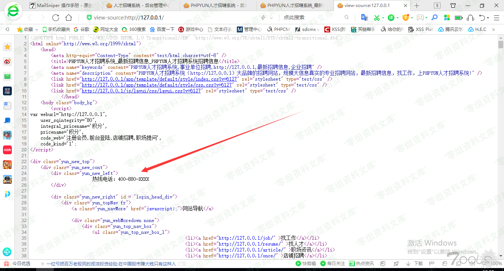
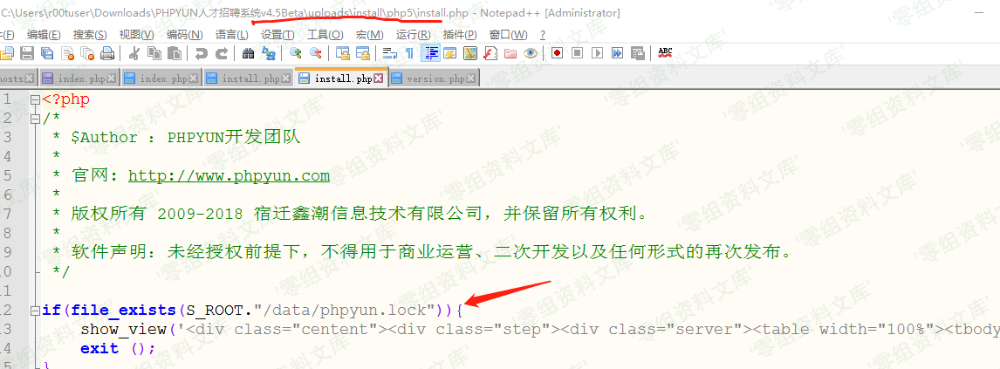

# PHPYun 后台模板生成文件执行

## 条目说明

- 对象与具体问题：PHPYun；后台模板生成文件执行
- 版本、配置及部署条件：5.0.1；后台写模板和生成功能权限
- 认证与权限前提：后台
- 核验边界：已完成原始 Markdown 的文本审阅；未执行 PoC、未访问目标、未视检截图。来源所述影响与复现结果不等于本库独立验证。

## 证据边界与更正

以下记录原始资料的证据边界。可以由原文确定的产品、编号及格式问题已在本条修订；没有原始证据的版本、响应和补丁信息仍待核实。

- include样例闭合标记用全角问号，代码不可按原样解析；info.txt内容未提供
- 关键生成入口、参数、过滤逻辑只有截图，文本不足核对
- 多图引用4.5/3.1/4.2不同文章资源疑串图，需核实；不要因Git树存在就认图正确
- ()被大写描述不合理，可能指关键字转大写，需原文/截图核；简介空

## 操作风险

现有材料未完整列明副作用；示例不保证只读或无状态变化。保留原示例供静态分析；仅可在明确授权的隔离测试环境验证，事先准备备份与回滚。

## 技术资料与来源记录

一、漏洞简介
------------

二、漏洞影响
------------

Phpyun v5.0.1

三、复现过程
------------

安装好本地环境,看了下系统功能,等等测试,最后查看前台index.php源码。

后台直接写入被过滤掉了。

又去翻了下后台功能,发下有个生成功能,并且没有后缀限制。

生存成功,但是发现()被大写,使用经典的include包含,随意找了一个模板下的info.txt文件,写入执行代码。

    <?php include'app/template/info.txt';？>

成功执行代码 代码分析：

对post的数据没有任何验证,直接代入

参考链接
--------

> <https://www.t00ls.net/thread-55040-1-1.html>
