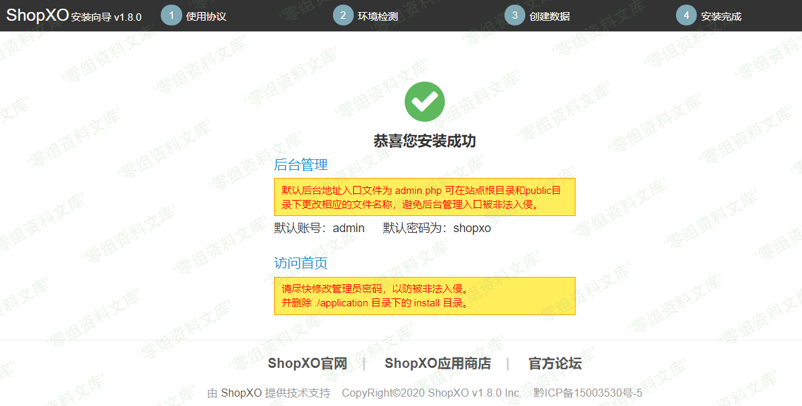
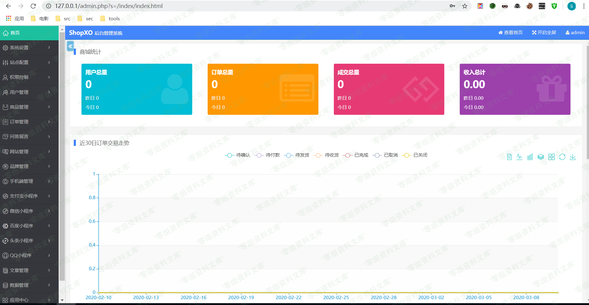
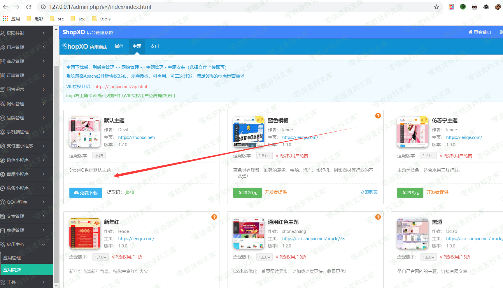
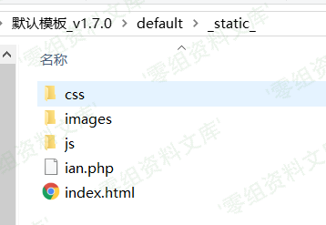
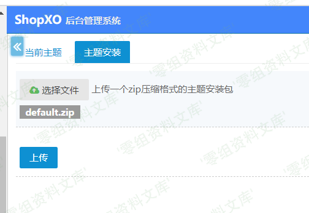
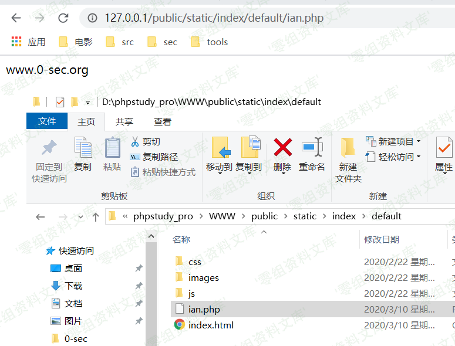

# ShopXO 后台主题上传PHP执行

## 条目说明

- 对象与具体问题：ShopXO；后台主题上传PHP执行
- 版本、配置及部署条件：题名1.8.0与正文<1.8.0边界冲突；public为运行根
- 认证与权限前提：管理员主题安装权限
- 核验边界：已完成原始 Markdown 的文本审阅；未执行 PoC、未访问目标、未视检截图。来源所述影响与复现结果不等于本库独立验证。

## 证据边界与更正

以下记录原始资料的证据边界。可以由原文确定的产品、编号及格式问题已在本条修订；没有原始证据的版本、响应和补丁信息仍待核实。

- 默认admin/shopxo只是示例，不应等同无需鉴权漏洞
- 需解释允许安装可执行主题与预期管理员权限边界；static PHP执行依赖服务器配置
- 只给放入shell和路径，无上传数据、源码/补丁；存在持久文件副作用
- 简介空，缺官方来源

## 操作风险

文件写入/上传示例可能留下文件、覆盖数据或触发脚本执行。保留原示例供静态分析；仅可在明确授权的隔离测试环境验证，事先准备备份与回滚。凭据示例如含星号，仅保留首尾用于说明，不能直接使用。

## 技术资料与来源记录

一、漏洞简介
------------

二、漏洞影响
------------

ShopXO 小于v1.8.0

三、复现过程
------------

默认后台密码admin shopxo

登入后台-》应用中心-》应用商店-》主题

随便下载一个主题

然后把下载下来的压缩包解压出来 把shell放入static目录

回到网站后台网站管理-》主题管理-》安装主题

shell地址

    http://www.0-sec.org/static/index/default/shell.php

> public是运行目录！！！
