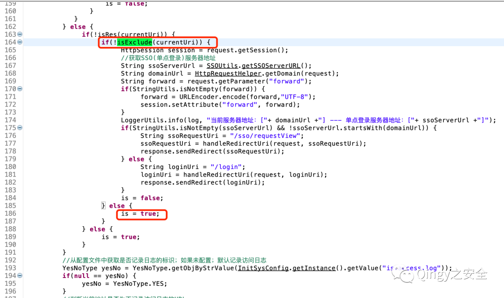
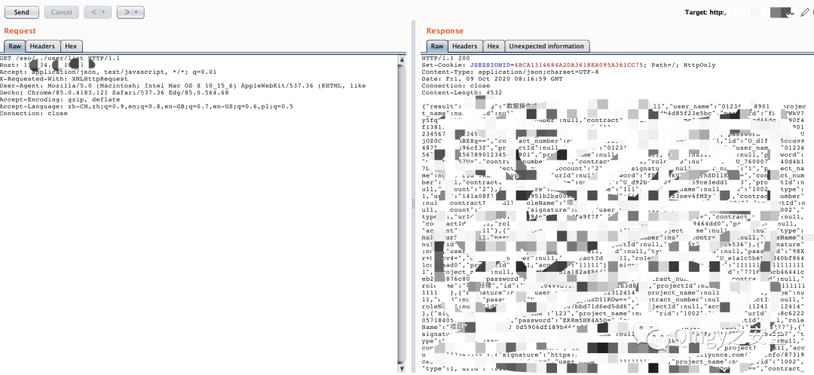

# smart-web2 OA sso前缀匹配与目录规范化认证绕过

## 条目说明

- 对象与具体问题：smart-web2 OA；sso前缀匹配与目录规范化认证绕过
- 版本、配置及部署条件：版本/提交未知；Servlet和代理规范化行为相关
- 认证与权限前提：匿名声称
- 核验边界：已完成原始 Markdown 的文本审阅；未执行 PoC、未访问目标、未视检截图。来源所述影响与复现结果不等于本库独立验证。

## 证据边界与更正

以下记录原始资料的证据边界。可以由原文确定的产品、编号及格式问题已在本条修订；没有原始证据的版本、响应和补丁信息仍待核实。

- ACLInterceptor和excludeMaps实际关键源码只有截图，若干文字代码块是说明非代码
- /sso/../user/list需保留路径原貌，浏览器/代理规范化可能改变结果；缺完整请求响应与补丁
- 删除公众号圈子争论/二维码，保留源链接

## 操作风险

请求可能删除/覆盖数据、修改账号或持久改变业务状态。保留原示例供静态分析；仅可在明确授权的隔离测试环境验证，事先准备备份与回滚。

## 技术资料与来源记录

> 本文由 [简悦 SimpRead](http://ksria.com/simpread/) 转码， 原文地址 [mp.weixin.qq.com](https://mp.weixin.qq.com/s/6yAq3HzFKc4qefiL0bE0PA)

**描述**

smart-web2 是一套相对简单的 OA 系统；包含了流程设计器，表单设计器，权限管理，简单报表管理等功能，经过代码审计发现其存在未授权漏洞。

  

  

  

  

  

**影响范围**

  

smart-web2

  

  

  

  

  

**漏洞复现**

  

1、漏洞代码位置

```
cn.com.smart.web.interceptor.ACLInterceptor 
```



```
smart-web2.src.main.resources.spring-web-config.xml
```

返回为 True，则会走到 else，走到 else 则不需用户进行身份认证。

```
http://x.x.x.x:8080/sso/../user/list
```

```
excludeMaps来源于：
```

```
smart-web2.src.main.resources.spring-web-config.xml
```

```
继续追踪，内容为：
```

```
我们可以确定如果uri开头为excludeMaps中的内容则不需要认证，例如
```

```
http://x.x.x.x:8080/sso/../user/list
```



最后再说一句：

现在的安全圈子歪风邪气越来越大，天天吃瓜，为了防止黑产份子非法利用漏洞，本号相关的 wiki.xypbk.com 站点将在后续进行权限控制，形式应该是账号密码访问限制，公众号留言获取或私聊单独授权，非邀请码注册类，永不割韭菜，永久免费检索，就用来小圈子授权使用了，坚决抵制安全圈的歪风邪气。

  


扫取二维码获取

更多精彩


Qingy 之安全  


点个在看你最好看

---

> 来源：MrWQ/vulnerability-paper（https://github.com/MrWQ/vulnerability-paper）
