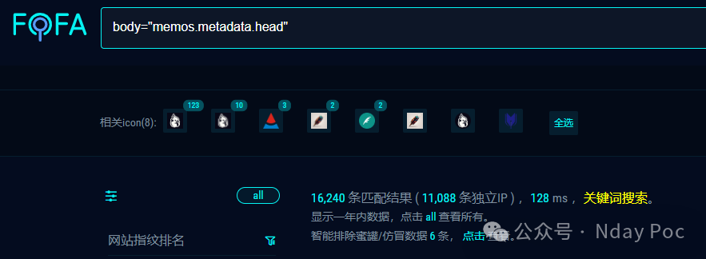
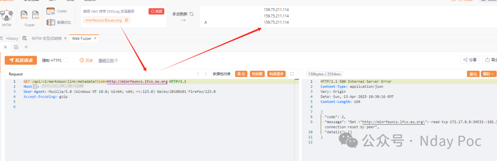
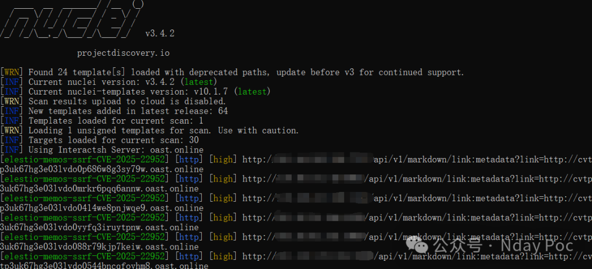
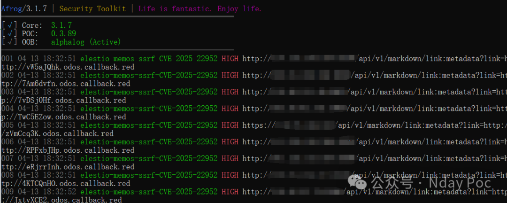
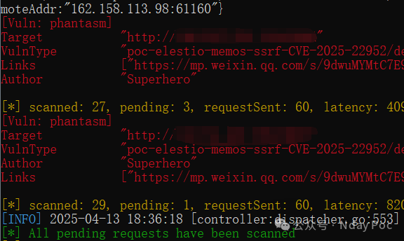

# Memos（neosmemo/elestio镜像） 22952 SSRF

## 条目说明

- 对象与具体问题：Memos（neosmemo/elestio镜像）；22952 SSRF
- 版本、配置及部署条件：仅latest动态标签，无版本/digest
- 认证与权限前提：鉴权未知
- 核验边界：已完成原始 Markdown 的文本审阅；未执行 PoC、未访问目标、未视检截图。来源所述影响与复现结果不等于本库独立验证。

## 证据边界与更正

以下记录原始资料的证据边界。可以由原文确定的产品、编号及格式问题已在本条修订；没有原始证据的版本、响应和补丁信息仍待核实。

- eleestio拼写与标题elestio不一致；upstream与发行镜像身份应区分
- 限制HTTP/HTTPS与还能访问localhost端口并不逻辑矛盾，不能称协议限制本身被绕过
- 声称任何内网资产过宽，受网络可达性/协议/权限限制
- 全部复现及工具结果截图，缺URL入口/返回、官方安全版本；删圈子宣传

## 操作风险

现有材料未完整列明副作用；示例不保证只读或无状态变化。保留原示例供静态分析；仅可在明确授权的隔离测试环境验证，事先准备备份与回滚。

## 技术资料与来源记录

Superhero  Nday Poc   2025-04-13 10:43  
  
  
  
  
  
  
  
内容仅用于学习交流自查使用，由于传播、利用本公众号所提供的  
POC  
信息及  
POC对应脚本  
而造成的任何直接或者间接的后果及损失，均由使用者本人负责，公众号Nday Poc及作者不为此承担任何责任，一旦造成后果请自行承担！  
  
  
**01**  
  
**漏洞概述**  
  
  
eleestio/memos：latest 和 neosmemo/memos：latest 都存在 SSRF 漏洞，攻击者可以访问内网 IP 地址和协议。尽管努力将访问协议限制为 HTTP 和 HTTPS，但攻击者仍然可以访问 localhost 上运行的其他端口。此漏洞使攻击者能够访问内部网络上的任何资产、嗅探内部网络上的 Web 服务、扫描内部网络上的主机，并可能访问薄弱的内部端点。该漏洞是由于对用户提供的 URL 验证不充分造成的，这些 URL 可能被用来执行 SSRF 攻击。  
**02******  
  
**搜索引擎**  
  
  
FOFA:  
```
body="memos.metadata.head"
```  
  
  
  
  
**03******  
  
**漏洞复现**  
  
  
  
  
**04**  
  
**自查工具**  
  
  
nuclei  
  
  
  
afrog  
  
  
  
xray  
  
  
  
  
**05******  
  
**修复建议**  
  
  
1、关闭互联网暴露面或接口设置访问权限  
  
2、升级至安全版本  
  
  
**06******  
  
**内部圈子介绍**  
  
  
【Nday漏洞实战圈】🛠️   
  
专注公开1day/Nday漏洞复现  
 · 工具链适配支持  
  
 ✧━━━━━━━━━━━━━━━━✧   
  
🔍 资源内容  
  
 ▫️ 整合全网公开  
1day/Nday  
漏洞POC详情  
  
 ▫️ 适配Xray/Afrog/Nuclei检测脚本  
  
 ▫️ 支持内置与自定义POC目录混合扫描   
  
🔄 更新计划   
  
▫️ 每周新增7-10个实用POC（来源公开平台）   
  
▫️ 所有脚本经过基础测试，降低调试成本   
  
🎯 适用场景   
  
▫️ 企业漏洞自查 ▫️ 渗透测试 ▫️ 红蓝对抗   
▫️ 安全运维  
  
✧━━━━━━━━━━━━━━━━✧   
  
⚠️ 声明：仅限合法授权测试，严禁违规使用！  
  
  
  
  


---

> 来源：gelusus/wxvl（微信公众号漏洞文章自动归档，原文见文首链接）
