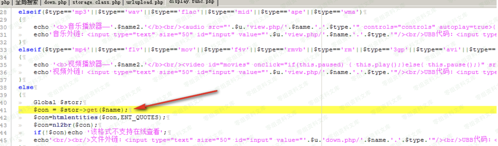
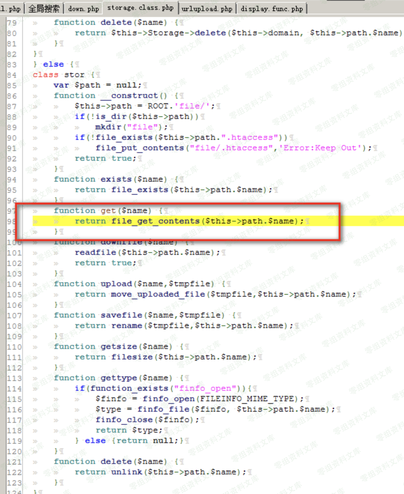
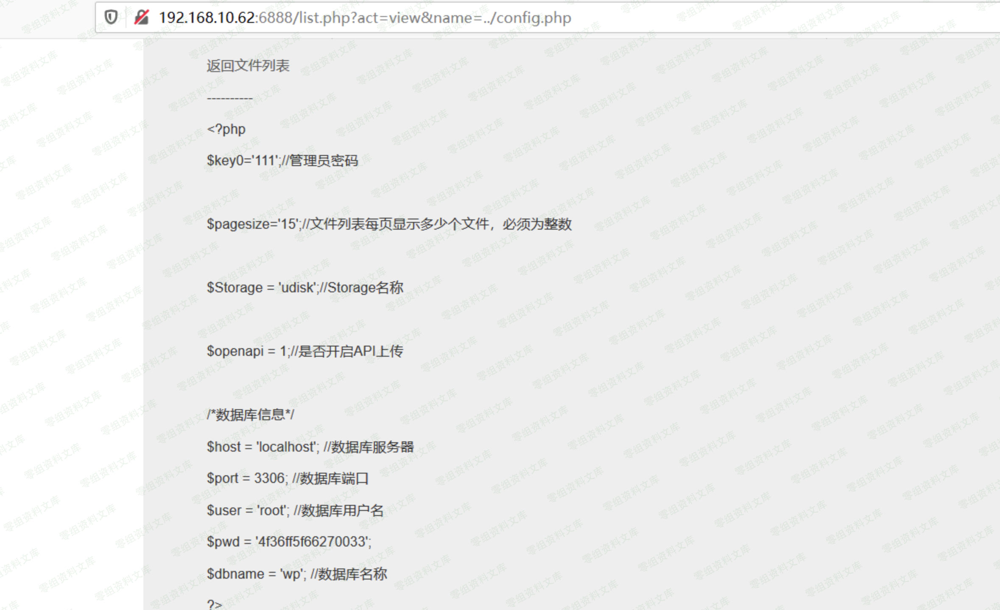

# 彩虹外链网盘 list/view storage get文件读取

## 条目说明

- 对象与具体问题：彩虹外链网盘；list/view storage get文件读取
- 版本、配置及部署条件：v4.0；PHP file_get_contents路径权限
- 认证与权限前提：未知
- 核验边界：已完成原始 Markdown 的文本审阅；未执行 PoC、未访问目标、未视检截图。来源所述影响与复现结果不等于本库独立验证。

## 证据边界与更正

以下记录原始资料的证据边界。可以由原文确定的产品、编号及格式问题已在本条修订；没有原始证据的版本、响应和补丁信息仍待核实。

- 和上面注入依赖上下文，应补341链接与实际act/name请求
- 关键代码和读取配置结果只图片；无真实参数、鉴权与修复
- 与342不同读取sink不可按标题一/二机械合并；共享资源路径可能串图需核
- 简介空及尺寸/路径转存噪声清理

## 操作风险

现有材料未完整列明副作用；示例不保证只读或无状态变化。保留原示例供静态分析；仅可在明确授权的隔离测试环境验证，事先准备备份与回滚。

## 技术资料与来源记录

一、漏洞简介
------------

二、漏洞影响
------------

彩虹外链网盘 v4.0

三、复现过程
------------

和上面注入在一个地方,list.php-\>display.func.php,然后调用了
`$stor->get($name)`

/media/rId24.png){width="5.833333333333333in"
height="1.718947944006999in"}

在storage.class.php中get方法调用了file\_get\_contents

/media/rId25.png){width="5.833333333333333in"
height="7.135921916010498in"}

在本地的宝塔环境成功读取配置文件管理员密码

/media/rId26.png){width="5.833333333333333in"
height="3.562340332458443in"}
