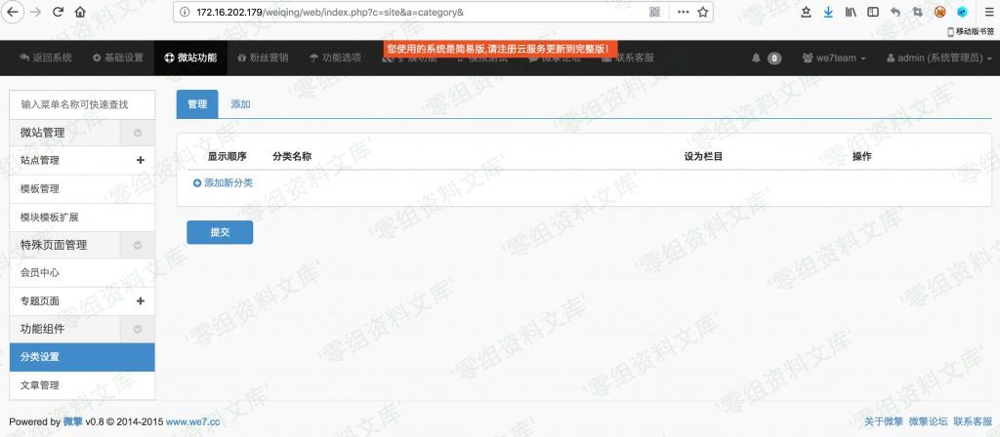

# 微擎WeEngine 后台分类iconfile二阶任意删除

## 条目说明

- 对象与具体问题：微擎WeEngine；后台分类iconfile二阶任意删除
- 版本、配置及部署条件：0.8；PHP删除权限与路径布局
- 认证与权限前提：后台分类管理权限
- 核验边界：已完成原始 Markdown 的文本审阅；未执行 PoC、未访问目标、未视检截图。来源所述影响与复现结果不等于本库独立验证。

## 证据边界与更正

以下记录原始资料的证据边界。可以由原文确定的产品、编号及格式问题已在本条修订；没有原始证据的版本、响应和补丁信息仍待核实。

- iconfile入site_nav再del分类传file_delete的二阶链描述清楚，保留流程
- 示例创建delete.txt进行验证比直接系统文件安全，应保留测试限定
- 核心代码多图片未视检，实际HTTP/token/后台角色权限缺失；无补丁来源
- 外部0-sec域名改示例，转义标题与错字清理

## 操作风险

请求可能删除/覆盖数据、修改账号或持久改变业务状态。保留原示例供静态分析；仅可在明确授权的隔离测试环境验证，事先准备备份与回滚。

## 技术资料与来源记录

一、漏洞简介
------------

二、漏洞影响
------------

微擎 0.8

三、复现过程
------------

漏洞入口文件为 web/source/site/category.ctrl.php ，我们可以看到下图 14行
处调用了 file\_delete
函数，而这是一个文件删除相关操作，我们可以看一下该函数的具体定义。下图是入口文件代码：

file\_delete 这一函数可以在 framework/function/file.func.php
文件中找到，该方法功能用于检测文件是否存在，如果存在，则删除文件。但是查看上下文发现，程序并没有对文件名
\$file 变量进行过滤，所以文件名就可以存在类似 ../
这种字符，这样也就引发任意文件删除漏洞，file\_delete 函数代码如下：

现在我们在回溯回去，看看 \$file 变量从何处来。实际上，上图的 \$file
变量对应的是 \$row\[\'icon\'\] 的值，也就是说如果我们可以控制
\$row\[\'icon\'\] 的值，就可以删除任意文件。那么我们来看看 \$row
变量从何而来。该变量就在我们刚刚分析的第一张图片中(
web/source/site/category.ctrl.php 文件)，该值为变量 \$navs
中的元素值，具体代码如下：

我们再往上看，即可找到 \$navs 变量的取值情况。可以看到 \$navs
变量的是是重数据库 site\_nav 表中取出的，包含了 icon 和 id
两个字段，具体代码如下：

    $navs = pdo_fetchall("SELECT icon, id FROM ".tablename('site_nav')." WHERE id IN (SELECT nid FROM ".tablename('site_category')." WHERE id = {$id} OR parentid = '$id')", array(), 'id');

现在我们要做的，就是找找看数据库中的这两个字段是否可以被用户控制。我们继续往前查找，发现了如下代码：

site\_nav 表中的数据，对应的是 \$nav 变量。我们继续往上寻找 \$nav
变量，发现 \$nav\[\'icon\'\] 变量是从 \$\_GPC\[\'iconfile\'\]
来的，即可被用户控制( 下图 第21行 )。这里的 \$nav\[\'icon\'\]
变量，其实就是我们文章开头分析的传入 file\_delete
函数的参数，具体代码如下：

由于 \$nav\[\'icon\'\]
变量可被用户控制，程序有没有对其进行消毒处理，直接就传入了 file\_delete
函数，最终导致了文件删除漏洞。至此，我们分析完了整个漏洞的发生过程，接下看看如何进行攻击。

\#\#漏洞验证

访问url，点击管理公众号：

    http://www.0-sec.org/web/index.php?c=account&a=display

找到分类设置，点击添加文章分类。这里对应的url为：http://www.0-sec.org/web/index.php?c=site&a=category，实际上表示
site 控制器的 category 模块，即对应 category.ctrl.php 文件。

选择对应的内容，进入 if(\$isnav) 判断：

在上传图标位置输入要删除文件的路径

我们建立 delete.txt 文件，用于测试任意文件删除：

我们点击删除时，就会调用 file\_delete
函数，同时就会删除掉我们插入到数据库中的图片名：

这个类型任意文件删除有点类似于二次注入，在添加分类时先把要删除的文件名称插入到数据库中，然后点击删除分类时，会从数据库中取出要删除的文件名。
