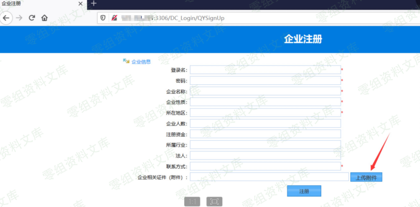
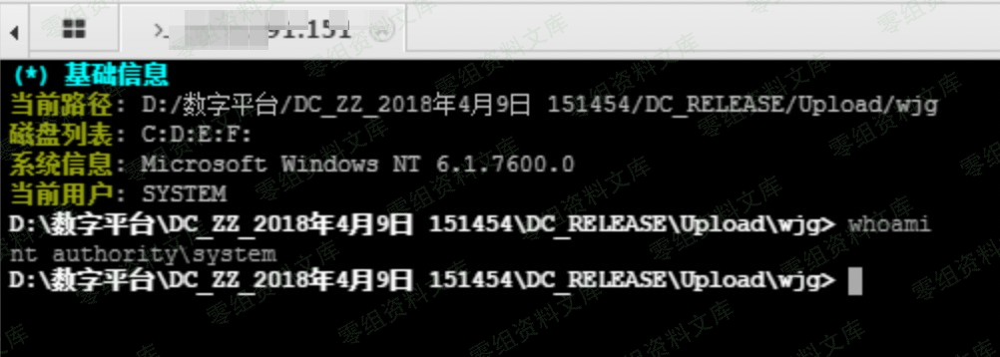

# 数字化校园综合管理系统（厂商未知） QYSignUp企业注册上传ASPX

## 条目说明

- 对象与具体问题：数字化校园综合管理系统（厂商未知）；QYSignUp企业注册上传ASPX
- 版本、配置及部署条件：版本未知；IIS解析及注册功能配置
- 认证与权限前提：注册公开入口，是否需会话未知
- 核验边界：已完成原始 Markdown 的文本审阅；未执行 PoC、未访问目标、未视检截图。来源所述影响与复现结果不等于本库独立验证。

## 证据边界与更正

以下记录原始资料的证据边界。可以由原文确定的产品、编号及格式问题已在本条修订；没有原始证据的版本、响应和补丁信息仍待核实。

- 只有UI步骤及结果图，实际上传URL/字段/载荷缺失，不能完整复现
- 公网0-sec.org:3306为样例Web端口，不能据3306当数据库协议或产品默认
- 管理员权限只截图断言，不泛化所有服务身份
- 简介/范围空，补发行方/响应/修复和文件清理

## 操作风险

文件写入/上传示例可能留下文件、覆盖数据或触发脚本执行。保留原示例供静态分析；仅可在明确授权的隔离测试环境验证，事先准备备份与回滚。凭据示例如含星号，仅保留首尾用于说明，不能直接使用。

## 技术资料与来源记录

一、漏洞简介
------------

二、漏洞影响
------------

三、复现过程
------------

访问 企业用户注册：`https://www.0-sec.org:3306/DC_Login/QYSignUp`

上传 aspx一句话，发现系统没有进行判断，可以直接getshell

shell地址：`https://www.0-sec.org:3306/Upload/wjg/20202203022247_637215205678224938_test.aspx`

管理员权限

