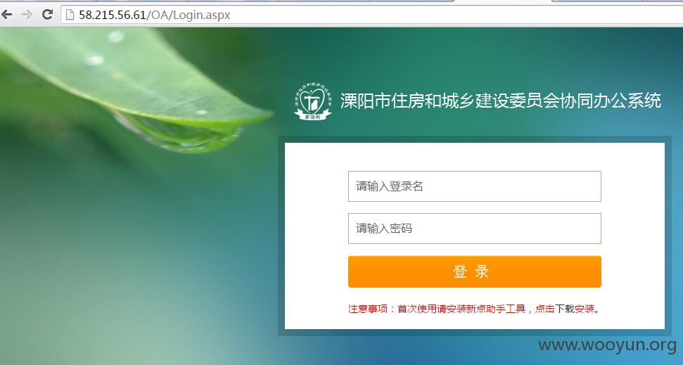
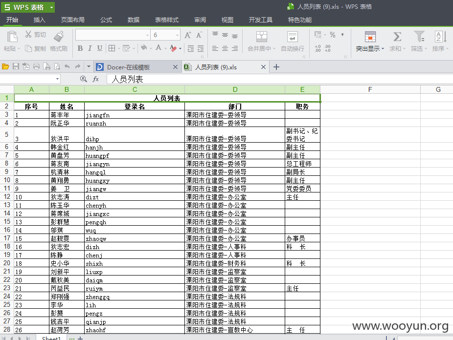
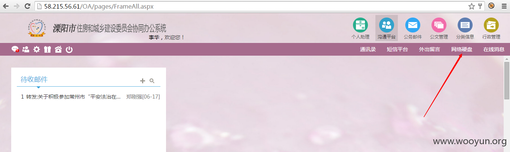
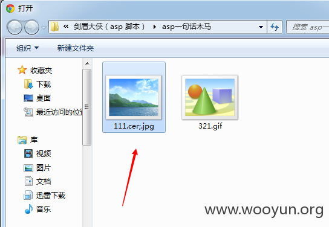
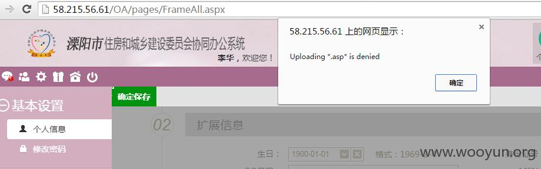
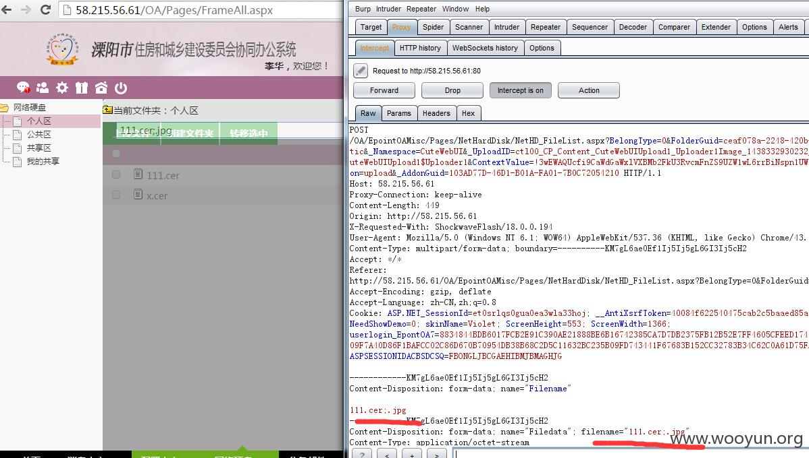
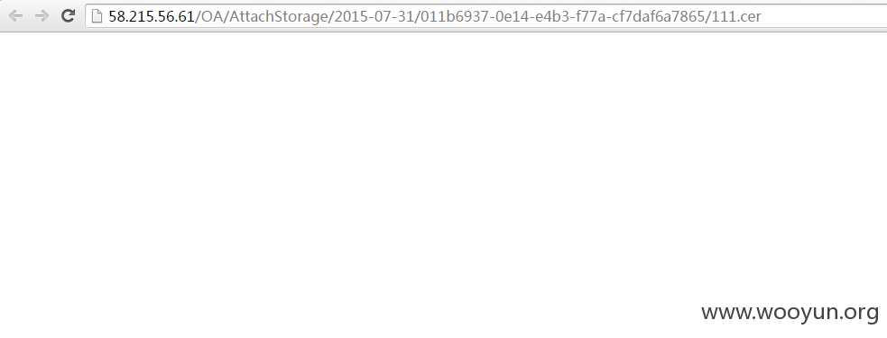
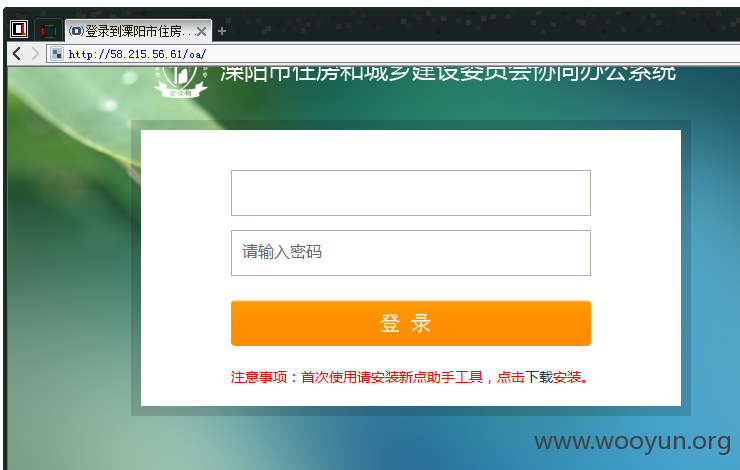
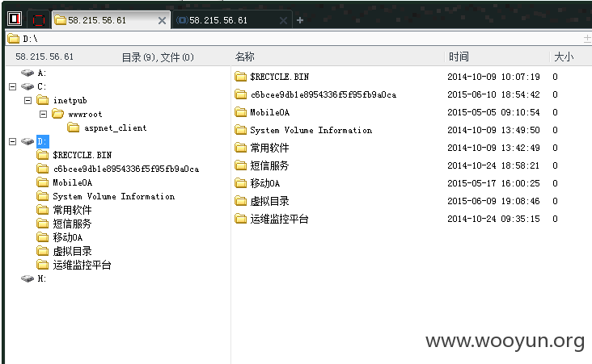
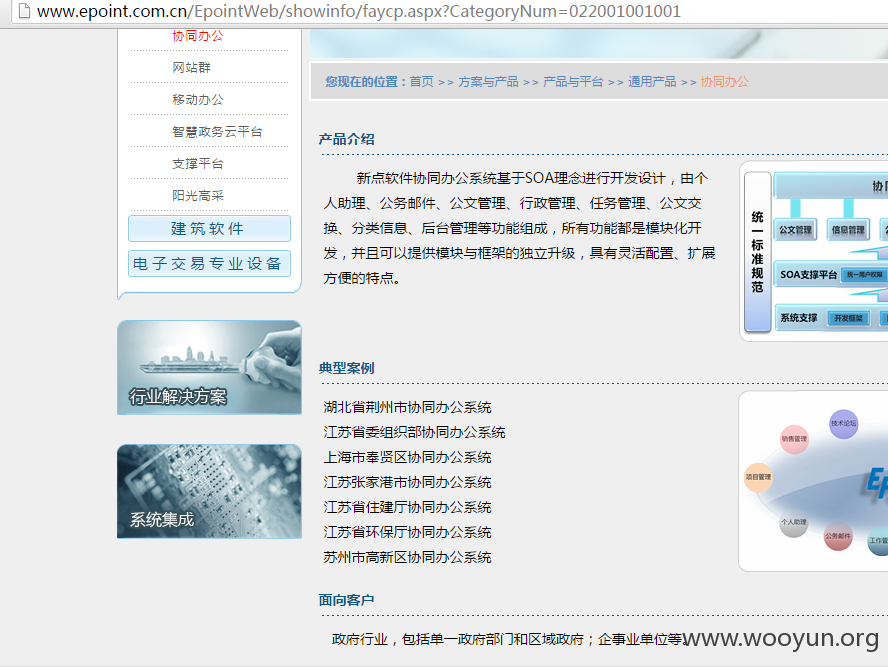

# 新点OA 用户列表泄露+弱账号+后缀上传执行链

## 条目说明

- 对象与具体问题：新点OA；用户列表泄露+弱账号+后缀上传执行链
- 版本、配置及部署条件：V7/V8示例，IIS .cer脚本映射条件未知
- 认证与权限前提：先用户泄露再有效账号登录；文件访问仍需会话
- 核验边界：已完成原始 Markdown 的文本审阅；未执行 PoC、未访问目标、未视检截图。来源所述影响与复现结果不等于本库独立验证。

## 证据边界与更正

以下记录原始资料的证据边界。可以由原文确定的产品、编号及格式问题已在本条修订；没有原始证据的版本、响应和补丁信息仍待核实。

- 旧乌云风格案例仅镜像图链接无原始报告编号
- 原文邀请验证其他公网网站不可作为审计授权；不执行访问
- .cer执行依赖IIS处理映射，7/8版本不自动都同环境；关键上传URL/两处改名均只截图
- 厂商没修复是历史时点说法，无发布日期/补丁；需拆三前置与副作用

## 操作风险

文件写入/上传示例可能留下文件、覆盖数据或触发脚本执行。保留原示例供静态分析；仅可在明确授权的隔离测试环境验证，事先准备备份与回滚。

## 技术资料与来源记录

### 漏洞利用

案例：溧阳市住房和城乡建设协同办公系统 8.0
登录地址：
http://58.215.56.61/OA/Login.aspx

（原外链图片暂未找回，点击查看已存本地图；原链接：` http://wooyun.laolisafe.com/upload/201508/01013610801d2d2008577bddf5757379b3c71cce.jpg `）

获取所有用户列表（厂商没修复）：
http://58.215.56.61/OA/ExcelExport/%E4%BA%BA%E5%91%98%E5%88%97%E8%A1%A8.xls

（原外链图片暂未找回，点击查看已存本地图；原链接：` http://wooyun.laolisafe.com/upload/201508/01013700988533cf95ff182144e9ff9a16b97b06.png `）

使用burp，可以很轻易的跑出密码。
我们使用用户：lih 密码：11111登录。
然后找到如下上传地址：

（原外链图片暂未找回，点击查看已存本地图；原链接：` http://wooyun.laolisafe.com/upload/201508/0101375166edbcb7bca2ff9c8b1e8d3aee3d63c4.png `）

当然，7.0的也是在同样这个地方。
上传jpg后缀的asp一句话马，格式如下（注意看格式）：

（原外链图片暂未找回，点击查看已存本地图；原链接：` http://wooyun.laolisafe.com/upload/201508/0101393210e0097fcbff11bb1fbbf0cb7d1260e0.png `）

因为其他格式上传有可能遭到拦截，如图：

（原外链图片暂未找回，点击查看已存本地图；原链接：` http://wooyun.laolisafe.com/upload/201508/010140061ee7a4ef9182be1349a6ac55a9ef4be4.jpg `）

再使用burp抓包，修改后缀为cer（注意，要修改2处地方）：

（原外链图片暂未找回，点击查看已存本地图；原链接：` http://wooyun.laolisafe.com/upload/201508/01014116d872c31807a0accc5145dd075d649daf.jpg `）

上传成功后，直接打开shell文件，即可看到地址。

（原外链图片暂未找回，点击查看已存本地图；原链接：` http://wooyun.laolisafe.com/upload/201508/01014215519a24dec8e5b482d120fce11305147f.png `）

要成功连接shell，需要先用菜刀内置的浏览器登录一下系统，然后在连接，密码前面给过了。

（原外链图片暂未找回，点击查看已存本地图；原链接：` http://wooyun.laolisafe.com/upload/201508/01014409dd6fcb58dc3322197913b65404cff23c.png `）

（原外链图片暂未找回，点击查看已存本地图；原链接：` http://wooyun.laolisafe.com/upload/201508/0101433423d92b926ff9cf8b4f85a789a6109335.png `）

原文列出的历史目标（不构成当前测试授权，禁止直接验证）：
http://61.183.36.24/oa8/ 8.0版本
http://61.132.114.180:8080/mail/login.aspx?loginid=%B0%AE%B5%C4&password=ad+&tj=%B5%C7+%C2%BD 7.0版本

（原外链图片暂未找回，点击查看已存本地图；原链接：` http://wooyun.laolisafe.com/upload/201508/010144487305199ba79e822bf79934a03cb3a57e.png `）
