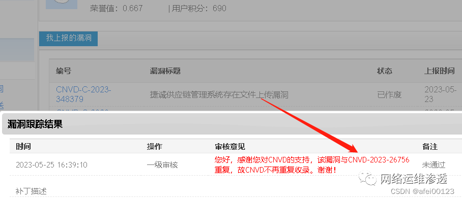
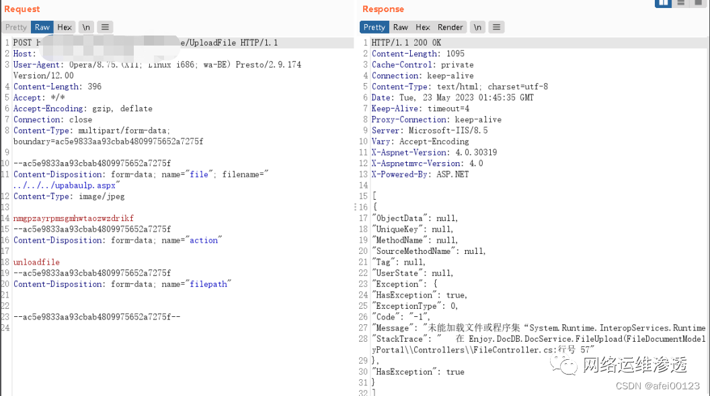
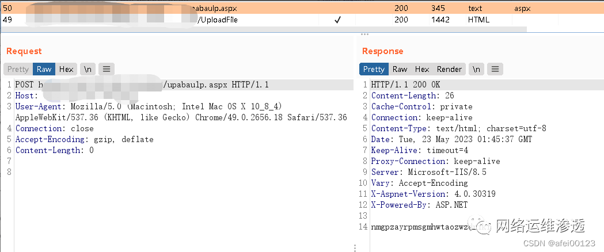
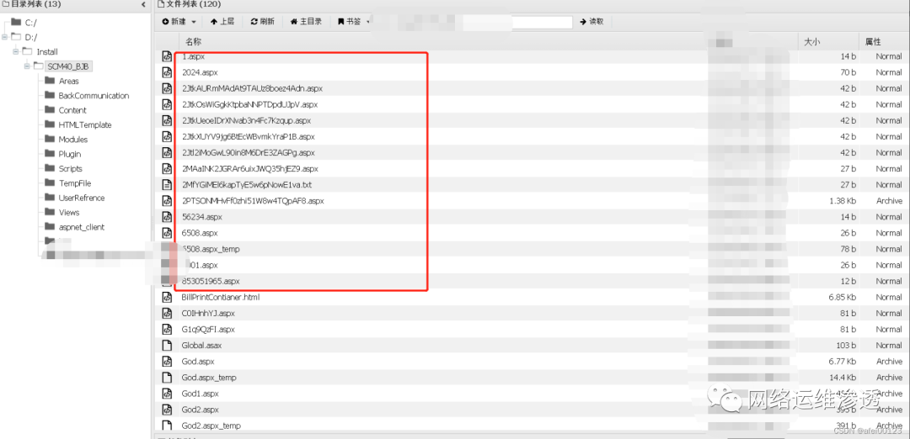
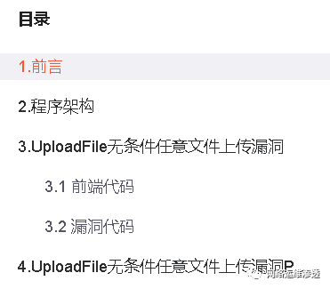
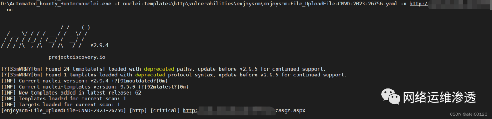
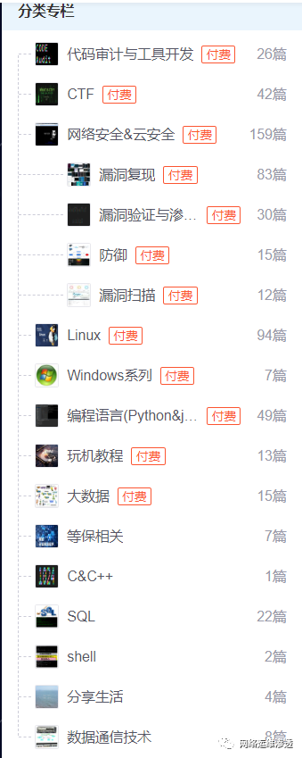

# 昂捷捷诚SCM 任意文件上传报告

## 条目说明

- 对象与具体问题：昂捷捷诚SCM；任意文件上传报告
- 版本、配置及部署条件：SCM4，精确build未知；2023-05-26时点
- 认证与权限前提：匿名声称
- 核验边界：已完成原始 Markdown 的文本审阅；未执行 PoC、未访问目标、未视检截图。来源所述影响与复现结果不等于本库独立验证。

## 证据边界与更正

以下记录原始资料的证据边界。可以由原文确定的产品、编号及格式问题已在本条修订；没有原始证据的版本、响应和补丁信息仍待核实。

- CNVD26756作者明确没有官方链接，需核编号归属；CVSS9.8无向量/来源
- 作者主动省略详细请求，全部技术步骤为图，不能标完整复现或公开Nuclei模板
- 发现众多webshell为个人观察，无样本/时间统计，不能升级成全网在野事实
- Nuclei已入私有工具说明不是可用PoC；去课程销售及编辑残词，保留署名/分析链接

## 操作风险

文件写入/上传示例可能留下文件、覆盖数据或触发脚本执行。保留原示例供静态分析；仅可在明确授权的隔离测试环境验证，事先准备备份与回滚。

## 技术资料与来源记录

> 本文由 [简悦 SimpRead](http://ksria.com/simpread/) 转码， 原文地址 [mp.weixin.qq.com](https://mp.weixin.qq.com/s/W6cp7hGt1s70f-NVscuzlQ)

 **目录**

1. 漏洞概述

2. 影响版本

3. 漏洞等级

4. 漏洞复现

5.Nuclei 自动化扫描 POC

5. 修复建议

**1. 漏洞概述**
-----------

        深圳市昂捷信息技术股份有限公司是一家以软件开发为核心, 为零售企业提供全面整合的信息系统解决方案和服务的创新型企业。昂捷捷诚供应链管理系统存在未授权任意文件上传漏洞，攻击者可利用该漏洞获取服务器权限。

                               CNVD 编号：CNVD-2023-26756（没有 CNVD 链接）

        因为漏洞截止 20230526 未公开，你问我那我怎么知道的，那是撞出来的。 

编辑

2. 影响版本
-------

        
        SCM4

3. 漏洞等级
-------

        严重  
        CVSSv3 Score: 9.8

4. 漏洞复现
-------

**POC：**

编辑

 编辑

        可以看到文件写入成功。攻击者可上传 WEBshell，并且笔者发现互联网众多资产被上上传 WEBshell。

        以防止 APT 组织利用，这里不会公开详细数据包。

编辑

 本人上传的 WEBshell 已删除。

昂捷捷诚供应链管理系统任意文件上传漏洞分析：https://blog.csdn.net/qq_41490561/article/details/130894357
=================================================================================

5.Nuclei 自动化扫描 POC
------------------

        已加入到 Automated_bounty_Hunter

编辑

5. 修复建议
-------

        建议做好访问控制权限，检验文件后缀。

My gihub：ltfafei (afei00123) · GitHub

**更多文章请前往：**https://blog.csdn.net/qq_41490561

在这打个广告哈，想学 Linux、Linux 运维、Linux 安全运维、考 RHCSA / 考 RHCE 的朋友，不要去报啥子培训班！不要去报啥子培训班！不要去报啥子培训班！买我的 Linux 专栏就够了。不要 999，不要 499，只要 99 ！  

想学网络安全的朋友哈，不要去报啥子培训班！不要去报啥子培训班！不要去报啥子培训班！买我的网络安全 & 云安全专栏就够了。不要 999，不要 499，只要 99 ！  

  

  

My github：https://github.com/ltfafei/

**更多文章请前往：**https://blog.csdn.net/qq_41490561

  

更多精彩内容请关注我们

**往期推荐**

[警惕！不法分子利用《2023 补贴》声明进行钓鱼诈骗分析](https://mp.weixin.qq.com/s?__biz=MzA3MjMxODUwNg==&mid=2247485873&idx=1&sn=14d756863386581f52b722bd5144e913&chksm=9f2162f4a856ebe265fe7a7a8f1141241fd643f9e366d31b01fd1583be61074fde9cbf22006d&scene=21#wechat_redirect)

[Automated_bounty_Hunter 使用场景二—单域名全扫描](https://mp.weixin.qq.com/s?__biz=MzA3MjMxODUwNg==&mid=2247485830&idx=1&sn=661573dc7c946dbab048052f9c6c394c&chksm=9f2162c3a856ebd59ac4330f9cd47744613a5a50aa20ea0796937d9f79d8b728f2defc1601fa&scene=21#wechat_redirect)

[某靶场自动化 FUZZ 文件上传接口 + Bypass 文件上传](https://mp.weixin.qq.com/s?__biz=MzA3MjMxODUwNg==&mid=2247485722&idx=1&sn=c383b0e69e576ae6537bff5230ce2a1b&chksm=9f21625fa856eb497295e8d166508178f293ab4a5abb126996da4a4d1eac9ef2937df0c3671d&scene=21#wechat_redirect)

---

> 来源：MrWQ/vulnerability-paper（https://github.com/MrWQ/vulnerability-paper）
