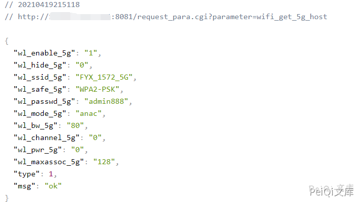
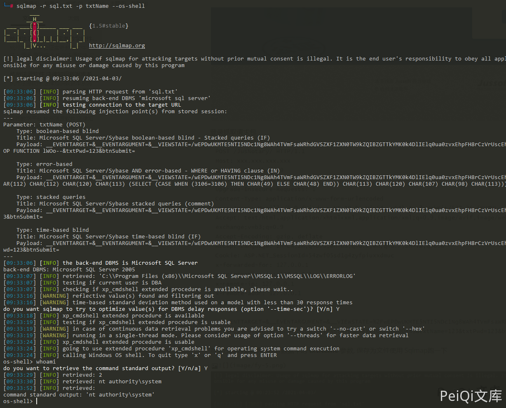

# 杭州法源公证实务教学软件 登录txtName SQL注入声称

## 条目说明

- 对象与具体问题：杭州法源公证实务教学软件；登录txtName SQL注入声称
- 版本、配置及部署条件：WebForms状态/版本未知
- 认证与权限前提：登录前会话，四回环IP头作用未知
- 核验边界：已完成原始 Markdown 的文本审阅；未执行 PoC、未访问目标、未视检截图。来源所述影响与复现结果不等于本库独立验证。

## 证据边界与更正

以下记录原始资料的证据边界。可以由原文确定的产品、编号及格式问题已在本条修订；没有原始证据的版本、响应和补丁信息仍待核实。

- 仅正常用户名密码请求和工具结果图，未给注入payload/实际返回，需补证
- 固定VIEWSTATE需先取状态，回环头必要性未解释
- FOFA暂未收录是时间性评论不是指纹，不能写fofa结构字段；version产品名
- 缺具体版本/修复和来源审计代码

## 操作风险

现有材料未完整列明副作用；示例不保证只读或无状态变化。保留原示例供静态分析；仅可在明确授权的隔离测试环境验证，事先准备备份与回滚。

## 技术资料与来源记录

### 漏洞描述

杭州法源软件 公证实务教学软件 存在SQL注入漏洞

### 漏洞影响

```
杭州法源软件 公证实务教学软件
```

### 网络测绘

FOFA暂时未收录任何网站

### 漏洞复现

登录页面如下




登录抓取请求包


```http
POST /JusNotary/ HTTP/1.1
Host: xxx.xxx.xxx.xxx
Content-Length: 219
Cache-Control: max-age=0
Upgrade-Insecure-Requests: 1
Content-Type: application/x-www-form-urlencoded
User-Agent: Mozilla/5.0 (Windows NT 10.0; Win64; x64) AppleWebKit/537.36 (KHTML, like Gecko) Chrome/89.0.4389.114 Safari/537.36
Accept: text/html,application/xhtml+xml,application/xml;q=0.9,image/avif,image/webp,image/apng,*/*;q=0.8,application/signed-exchange;v=b3;q=0.9
Accept-Encoding: gzip, deflate
Accept-Language: zh-CN,zh;q=0.9,en-US;q=0.8,en;q=0.7,zh-TW;q=0.6
Cookie: ASP.NET_SessionId=54zwf05sd1g4zyfpiuxxdmuc
x-forwarded-for: 127.0.0.1
x-originating-ip: 127.0.0.1
x-remote-ip: 127.0.0.1
x-remote-addr: 127.0.0.1
Connection: close

__EVENTTARGET=&__EVENTARGUMENT=&__VIEWSTATE=%2FwEPDwUKMTE5NTI5NDc1Ng8WAh4TVmFsaWRhdGVSZXF1ZXN0TW9kZQIBZGTTkYMK0k4DlIElq0ua0zvxEhpFH8rCzVrUscEhlVc9pw%3D%3D&__VIEWSTATEGENERATOR=1B0004A3&txtName=123&txtPwd=123&btnSubmit=+
```

> 请求长度说明：原资料 Content-Length 为 219；保留原始标头；其数值未据实际请求体重新计算或验证。


其中注入的参数为 POST数据中的 **txtName** 参数, 保存为文件使用 Sqlmap跑一下





---

> 来源：Threekiii/Vulnerability-Wiki（https://github.com/Threekiii/Vulnerability-Wiki）
