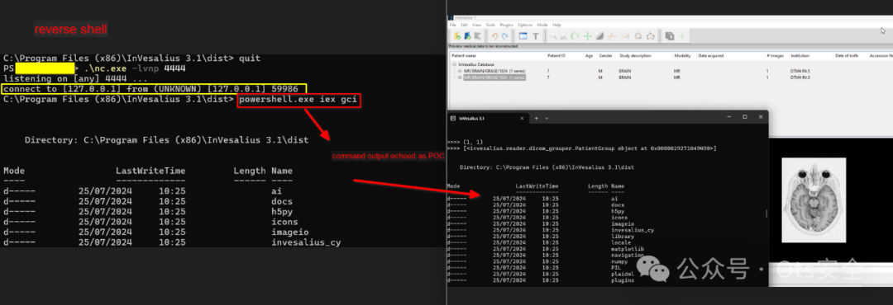

# InVesalius DICOM ImagePosition eval代码执行报道

## 条目说明

- 对象与具体问题：InVesalius；DICOM ImagePosition eval代码执行报道
- 版本、配置及部署条件：3.1笼统；称最新已修无版本/commit
- 认证与权限前提：需受害者导入恶意DICOM，不是监听端口匿名RCE
- 核验边界：已完成原始 Markdown 的文本审阅；未执行 PoC、未访问目标、未视检截图。来源所述影响与复现结果不等于本库独立验证。

## 证据边界与更正

以下记录原始资料的证据边界。可以由原文确定的产品、编号及格式问题已在本条修订；没有原始证据的版本、响应和补丁信息仍待核实。

- 文中声称提供pydicom代码和具体方法，实际全是摘要无任何代码/原始研究链接，阅读原文也无目标
- 坐标格式DS与eval漏洞联系需实际调用点/版本，简单追加代码不保证标准解析接受
- Manufacturer/InstitutionName是可变元数据，不能作为可靠恶意签名判断
- 补主CVE官方公告/修复版本、用户交互/运行权限边界，迁医学影像客户端类，删推广

## 操作风险

命令/代码执行示例可能改变主机状态。保留原示例供静态分析；仅可在明确授权的隔离测试环境验证，事先准备备份与回滚。

## 技术资料与来源记录

 Ots安全   2024-12-16 06:15  
  
  
  
这篇博文主要讨论了一个存在于开源医学成像工具（InVesalius 3.1）中的 远程代码执行漏洞，该漏洞通过恶意篡改 DICOM 文件来实现攻击，导致应用程序执行恶意的 Python 代码。  
  
  
  
以下是文章的主要内容和技术背景解析：  
  
**1. 漏洞概述：**  
  
远程代码执行漏洞：攻击者可以通过修改 DICOM 文件中的 Image Position (Patient) 标签（标签号：(0020, 0032)），将恶意的 Python 代码注入到该标签中。该标签原本保存了图像的位置坐标数据（x, y, z），但由于应用程序使用了 eval() 函数来解析这些数据，攻击者可以通过特定的格式（如在坐标值后添加 Python 代码）触发代码执行。  
  
漏洞的核心是 eval() 函数，它会执行其输入的字符串内容。如果攻击者能够修改 DICOM 文件中的坐标值，使其包含恶意 Python 代码，就可能导致远程代码执行。  
  
**2. 漏洞利用方式：**  
  
构造恶意 DICOM 文件：攻击者首先需要修改 DICOM 文件中的 Image Position (Patient) 标签（(0020, 0032)）。该标签保存的是一个包含三个坐标值（x、y、z）的字符串（例如：['-25.000995', '-23.842384', '32.496709']）。攻击者可以在这些坐标后追加恶意代码，例如通过 eval() 触发执行。  
  
文章通过 Python 代码示例，说明了如何利用 pydicom 库来修改 DICOM 文件中的数据，向其注入恶意载荷。恶意代码通过 base64 编码的方式嵌入，且在文件加载时被解码并执行。  
  
**3. 漏洞修复：**  
  
开发团队已经修复了这个漏洞，并且该修复已经包含在 InVesalius 的最新版本中。  
  
修复的方式通常是改进数据处理逻辑，避免直接使用 eval() 函数，并采取更安全的数据解析方式。  
  
**4. DICOM 文件和相关标准：**  
  
DICOM（数字成像和通信）是用于存储和传输医学影像数据的国际标准。它不仅保存图像数据，还保存关于图像的元数据，例如患者信息、扫描参数、图像位置等。DICOM 文件通常包含大量敏感的个人健康数据，因此对其进行安全处理尤为重要。  
  
DICOM 文件中的每个标签都有特定的值表示（VR），例如位置数据使用 DS（Decimal String）格式，表示浮动数值。如果标签的值被篡改，可能会导致应用程序行为异常。  
  
**5. 安全性分析和防御建议：**  
  
静态分析：为了检测恶意 DICOM 文件，可以进行静态分析，检查标签数据的完整性和一致性。例如，(0020, 0032) 标签应该只包含三个浮点数（x, y, z），如果有更多的值或格式异常，则可能是恶意修改。  
  
签名检测：通过检查文件中的特定元数据（例如 Manufacturer 和 Institution Name 标签），可以帮助识别潜在的恶意 DICOM 文件。  
  
**6. 动机与目的：**  
  
作者强调了该研究的重要性，并解释了自己进行此类研究的原因：为开源工具和医疗应用程序提供更多的安全性，确保医学等关键领域不受安全漏洞的影响。虽然攻击者可以利用漏洞进行恶意行为，但也为开发者提供了修复漏洞的机会，增强了整个社区的安全防护能力。  
  
**总结：**  
  
该博文通过详细分析 DICOM 文件的结构和 eval() 漏洞，向读者展示了如何通过篡改文件中的标签数据来实现远程代码执行攻击，并提供了如何利用该漏洞的具体方法。同时，作者也强调了检测和修复此类漏洞的重要性，特别是在医学领域，保护患者数据的安全至关重要。  
  
全部文章-点击阅读原文即可跳转原文  
  
  
  
感谢您抽出  
  
  
  
.  
  
  
  
.  
  
  
  
来阅读本文  
  
  
  
**点它，分享点赞在看都在这里**  
  

---

> 来源：gelusus/wxvl（微信公众号漏洞文章自动归档，原文见文首链接）
