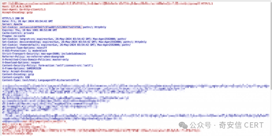
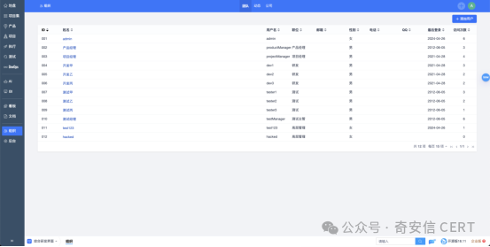
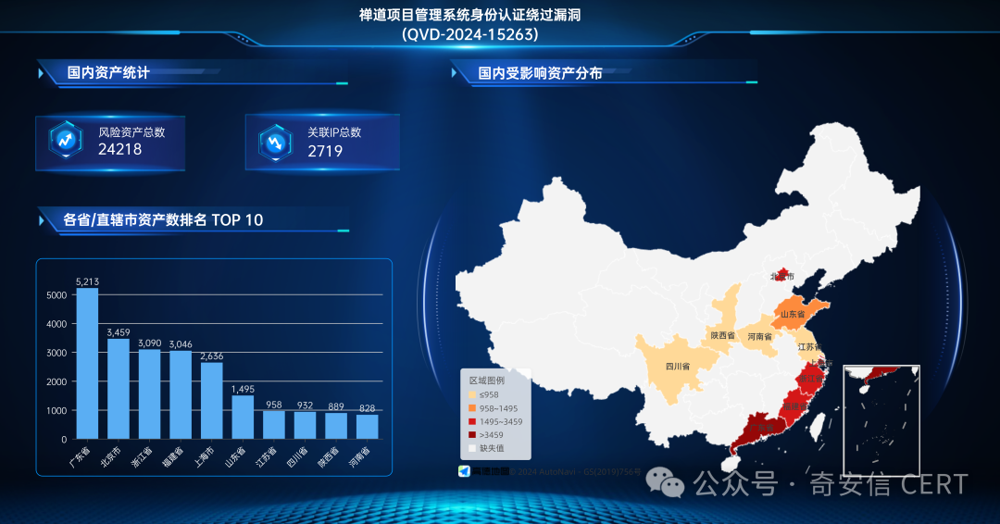

# 禅道ZenTao QVD15263 API认证绕过

## 条目说明

- 对象与具体问题：禅道ZenTao；QVD15263 API认证绕过
- 版本、配置及部署条件：开源16.x–<18.12/企业6.x–<8.12/旗舰3.x–<4.12
- 认证与权限前提：匿名伪会话创建用户/改密
- 核验边界：已完成原始 Markdown 的文本审阅；未执行 PoC、未访问目标、未视检截图。来源所述影响与复现结果不等于本库独立验证。

## 证据边界与更正

以下记录原始资料的证据边界。可以由原文确定的产品、编号及格式问题已在本条修订；没有原始证据的版本、响应和补丁信息仍待核实。

- 不要和2023 captcha链混合
- CVSS8.2无向量/资产24218对2719IP是当时测绘结果，不等于确认脆弱实例总数
- PoC已公开但无链接/正文，截图创建用户为状态更改；RCE需另漏洞
- 规则更新日期20240430晚于4月26文章可能后改，需更新时间区分
- 保留官方commit与来源，去大段厂商检测服务广告

## 操作风险

请求可能删除/覆盖数据、修改账号或持久改变业务状态；命令/代码执行示例可能改变主机状态。保留原示例供静态分析；仅可在明确授权的隔离测试环境验证，事先准备备份与回滚。

## 技术资料与来源记录

 奇安信 CERT   2024-04-26 16:12  
  
●   
点击↑蓝字关注我们，获取更多安全风险通告  
  
  
<table><tbody style="outline: 0px;visibility: visible;"><tr style="outline: 0px;visibility: visible;"><td valign="middle" align="center" rowspan="1" colspan="4" style="outline: 0px;word-break: break-all;hyphens: auto;border-color: rgb(70, 118, 217);background-color: rgb(70, 118, 217);visibility: visible;">
<strong style="outline: 0px;visibility: visible;">漏洞概述</strong> 
</td></tr><tr style="outline: 0px;visibility: visible;"><td valign="middle" align="left" width="136" style="outline: 0px;word-break: break-all;hyphens: auto;border-color: rgb(70, 118, 217);visibility: visible;">
<strong style="outline: 0px;visibility: visible;">漏洞名称</strong>
</td><td valign="middle" align="left" rowspan="1" colspan="3" style="outline: 0px;word-break: break-all;hyphens: auto;border-color: rgb(70, 118, 217);visibility: visible;">
禅道项目管理系统身份认证绕过漏洞
</td></tr><tr style="outline: 0px;visibility: visible;"><td valign="middle" align="left" rowspan="1" colspan="1" width="136" style="outline: 0px;word-break: break-all;hyphens: auto;border-color: rgb(70, 118, 217);visibility: visible;">
<strong style="outline: 0px;visibility: visible;">漏洞编号</strong>
</td><td valign="middle" align="left" rowspan="1" colspan="3" style="outline: 0px;word-break: break-all;hyphens: auto;border-color: rgb(70, 118, 217);visibility: visible;">
QVD-2024-15263
</td></tr><tr style="outline: 0px;visibility: visible;"><td valign="middle" align="left" width="136" style="outline: 0px;word-break: break-all;hyphens: auto;border-color: rgb(70, 118, 217);visibility: visible;">
<strong style="outline: 0px;visibility: visible;">公开时间</strong>
</td><td valign="middle" align="left" width="157" style="outline: 0px;word-break: break-all;hyphens: auto;border-color: rgb(70, 118, 217);visibility: visible;">
2024-04-12
</td><td valign="middle" align="left" width="169" style="outline: 0px;word-break: break-all;hyphens: auto;border-color: rgb(70, 118, 217);visibility: visible;">
<strong style="outline: 0px;visibility: visible;">影响量级</strong>
</td><td valign="middle" align="left" width="95" style="outline: 0px;word-break: break-all;hyphens: auto;border-color: rgb(70, 118, 217);visibility: visible;">
万级
</td></tr><tr style="outline: 0px;visibility: visible;"><td valign="middle" align="left" width="136" style="outline: 0px;word-break: break-all;hyphens: auto;border-color: rgb(70, 118, 217);visibility: visible;">
<strong style="outline: 0px;visibility: visible;">奇安信评级</strong>
</td><td valign="middle" align="left" width="157" style="outline: 0px;word-break: break-all;hyphens: auto;border-color: rgb(70, 118, 217);visibility: visible;">
<strong style="cursor: text;color: rgb(0, 0, 0);caret-color: rgb(255, 0, 0);font-family: 微软雅黑, &#34;Microsoft YaHei&#34;, sans-serif;visibility: visible;max-inline-size: 100%;outline: none 0px !important;">高危</strong>
</td><td valign="middle" align="left" width="169" style="outline: 0px;word-break: break-all;hyphens: auto;border-color: rgb(70, 118, 217);visibility: visible;">
<strong style="outline: 0px;visibility: visible;"><strong style="cursor: text;color: rgb(0, 0, 0);caret-color: rgb(255, 0, 0);font-family: 微软雅黑, &#34;Microsoft YaHei&#34;, sans-serif;visibility: visible;max-inline-size: 100%;outline: none 0px !important;">CVSS 3.1分数</strong></strong>
</td><td valign="middle" align="left" width="95" style="outline: 0px;word-break: break-all;hyphens: auto;border-color: rgb(70, 118, 217);visibility: visible;">
<strong style="outline: 0px;visibility: visible;">8.2</strong>
</td></tr><tr style="outline: 0px;visibility: visible;"><td valign="middle" align="left" width="136" style="outline: 0px;word-break: break-all;hyphens: auto;border-color: rgb(70, 118, 217);visibility: visible;">
<strong style="outline: 0px;visibility: visible;">威胁类型</strong><strong style="outline: 0px;visibility: visible;"></strong>
</td><td valign="middle" align="left" width="157" style="outline: 0px;word-break: break-all;hyphens: auto;border-color: rgb(70, 118, 217);visibility: visible;">
身份认证绕过
</td><td valign="middle" align="left" width="169" style="outline: 0px;word-break: break-all;hyphens: auto;border-color: rgb(70, 118, 217);visibility: visible;">
<strong style="outline: 0px;visibility: visible;">利用可能性</strong>
</td><td valign="middle" align="left" width="95" style="outline: 0px;word-break: break-all;hyphens: auto;border-color: rgb(70, 118, 217);visibility: visible;">
<strong style="outline: 0px;visibility: visible;">高</strong>
</td></tr><tr style="outline: 0px;visibility: visible;"><td valign="middle" colspan="1" rowspan="1" align="left" width="136" style="outline: 0px;word-break: break-all;hyphens: auto;border-color: rgb(70, 118, 217);visibility: visible;">
<strong style="outline: 0px;visibility: visible;">POC状态</strong>
</td><td valign="middle" colspan="1" rowspan="1" align="left" width="157" style="outline: 0px;word-break: break-all;hyphens: auto;border-color: rgb(70, 118, 217);visibility: visible;">
<strong style="outline: 0px;color: rgb(0, 0, 0);font-size: 13px;letter-spacing: 0.544px;text-align: -webkit-left;text-wrap: wrap;background-color: rgb(255, 255, 255);font-family: system-ui, -apple-system, BlinkMacSystemFont, &#34;Helvetica Neue&#34;, &#34;PingFang SC&#34;, &#34;Hiragino Sans GB&#34;, &#34;Microsoft YaHei UI&#34;, &#34;Microsoft YaHei&#34;, Arial, sans-serif;visibility: visible;">已公开</strong><strong style="outline: 0px;letter-spacing: 0.544px;font-family: system-ui, -apple-system, BlinkMacSystemFont, &#34;Helvetica Neue&#34;, &#34;PingFang SC&#34;, &#34;Hiragino Sans GB&#34;, &#34;Microsoft YaHei UI&#34;, &#34;Microsoft YaHei&#34;, Arial, sans-serif;visibility: visible;"></strong>
</td><td valign="middle" colspan="1" rowspan="1" align="left" width="169" style="outline: 0px;word-break: break-all;hyphens: auto;border-color: rgb(70, 118, 217);visibility: visible;">
<strong style="outline: 0px;visibility: visible;">在野利用状态</strong>
</td><td valign="middle" colspan="1" rowspan="1" align="left" width="95" style="outline: 0px;word-break: break-all;hyphens: auto;border-color: rgb(70, 118, 217);visibility: visible;">
未发现
</td></tr><tr style="outline: 0px;visibility: visible;"><td valign="middle" colspan="1" rowspan="1" align="left" width="136" style="outline: 0px;word-break: break-all;hyphens: auto;border-color: rgb(70, 118, 217);visibility: visible;">
<strong style="outline: 0px;visibility: visible;">EXP状态</strong>
</td><td valign="middle" colspan="1" rowspan="1" align="left" width="157" style="outline: 0px;word-break: break-all;hyphens: auto;border-color: rgb(70, 118, 217);visibility: visible;">
未公开
</td><td valign="middle" colspan="1" rowspan="1" align="left" width="169" style="outline: 0px;word-break: break-all;hyphens: auto;border-color: rgb(70, 118, 217);visibility: visible;">
<strong style="outline: 0px;visibility: visible;">技术细节状态</strong>
</td><td valign="middle" colspan="1" rowspan="1" align="left" width="95" style="outline: 0px;word-break: break-all;hyphens: auto;border-color: rgb(70, 118, 217);visibility: visible;">
未公开<strong style="outline: 0px;letter-spacing: 0.544px;font-family: system-ui, -apple-system, BlinkMacSystemFont, &#34;Helvetica Neue&#34;, &#34;PingFang SC&#34;, &#34;Hiragino Sans GB&#34;, &#34;Microsoft YaHei UI&#34;, &#34;Microsoft YaHei&#34;, Arial, sans-serif;visibility: visible;"></strong><strong style="outline: 0px;visibility: visible;"></strong>
</td></tr><tr style="outline: 0px;visibility: visible;"><td valign="middle" colspan="4" rowspan="1" align="left" style="outline: 0px;word-break: break-all;hyphens: auto;border-color: rgb(70, 118, 217);visibility: visible;">
<strong style="outline: 0px;visibility: visible;">危害描述：</strong>远程攻击者利用该漏洞可以绕过身份认证。
</td></tr></tbody></table>  
  
  
**0****1**  
  
**漏洞详情**  
  
**>**  
**>**  
**>**  
**>**  
  
**影响组件**  
  
禅道项目管理软件是国产的开源项目管理软件，专注研发项目管理，内置需求管理、任务管理、bug管理、缺陷管理、用例管理、计划发布等功能，完整覆盖了研发项目管理的核心流程。  
  
**>**  
**>**  
**>**  
**>**  
  
**漏洞描述**  
  
近日，奇安信CERT监测到**禅道项目管理系统身份认证绕过漏洞(QVD-2024-15263)**在互联网上公开。禅道项目管理系统存在身份认证绕过漏洞，远程攻击者利用该漏洞可以绕过身份认证，调用任意API接口并修改管理员用户的密码，并以管理员用户登录该系统，配合其他漏洞进一步利用后，可以实现完全接管服务器。**奇安信CERT分析并复现此漏洞，**  
**鉴于该漏洞利用难度较低、影响范围较大，建议客户尽快做好自查及防护。**  
  
  
**02**  
  
**影响范围**  
  
**>**  
**>**  
**>**  
**>**  
  
**影响版本**  
  
16.x <= 禅道项目管理系统< 18.12（开源版）  
  
6.x <= 禅道项目管理系统< 8.12（企业版）  
  
3.x <= 禅道项目管理系统< 4.12（旗舰版）  
  
**>**  
**>**  
**>**  
**>**  
  
**其他受影响组件**  
  
基于禅道二次开发的系统  
  
  
**03**  
  
**复现情况**  
  
目前，奇安信威胁情报中心安全研究员已成功复现**禅道项目管理系统身份认证绕过漏洞(QVD-2024-15263)******  
，截图如下：  
  
伪造session  
  
  
  
利用伪造的session创建任意用户  
  
  
  
  
  
**04**  
  
**受影响资产情况**  
  
奇安信鹰图资产测绘平台数据显示，**禅道项目管理系统身份认证绕过漏洞(QVD-2024-15263)**关联的国内风险资产总数为24218个，关联IP总数为2719个。国内风险资产分布情况如下：  
  
  
  
  
  
**05**  
  
**处置建议**  
  
**>**  
**>**  
**>**  
**>**  
  
**安全更新**  
  
目前官方已有可更新版本，建议受影响的用户尽快升级至安全版本：  
  
https://www.zentao.net/download/  
  
**>**  
**>**  
**>**  
**>**  
  
**产品解决方案******  
  
**奇安信网站应用安全云防护系统已更新防护特征库**  
  
奇安信网神网站应用安全云防护系统已全局更新所有云端防护节点的防护规则，支持对禅道项目管理系统身份认证绕过漏洞(QVD-2024-15263)的防护。  
  
  
**奇安信网神网络数据传感器系统产品检测方案**  
  
奇安信网神网络数据传感器（NDS5000/7000/9000系列）产品，已具备该漏洞的检测能力。规则ID为：8048，建议用户尽快升级检测规则库至2404261400以上；  
  
  
**奇安信自动化渗透测试系统检测方案**  
  
奇安信自动化渗透测试系统已经能够有效检测针对该漏洞的攻击，请将插件版本和指纹版本升级到202404302600以上版本。规则名称：禅道项目管理系统身份认证绕过漏洞。奇安信自动化渗透测试系统规则升级方法：系统管理->升级管理->插件升级（指纹升级），选择“网络升级”或“本地升级”。  
  
  
**06**  
  
**参考资料**  
  
[1]https://github.com/easysoft/zentaopms  
  
[2]https://github.com/easysoft/zentaopms/commit/d13ba70016ca981b08f27e08fb934bf1f23a4135  
  
[3]https://github.com/easysoft/zentaopms/commit/695055c6b1d2e6a8c944bdbc38308c06820c40ce  
  
  
  
**07**  
  
**时间线**  
  
2024年4月26日，奇安信 CERT发布安全风险通告。  
  
  
  
**08**  
  
**漏洞情报服务**  
  
奇安信ALPH  
A威胁分析平台已支持漏洞情报订阅服务：  
  
  
  
  
  
  
  
  
  
  
**奇安信 CERT**  
  
**致力于**  
第一时间为企业级用户提供**权威**漏洞情报和**有效**  
解决方案。  
  
  
点击↓**阅读原文**，到**ALPHA威胁分析平台**  
订阅更多漏洞信息。  
  

---

> 来源：gelusus/wxvl（微信公众号漏洞文章自动归档，原文见文首链接）
