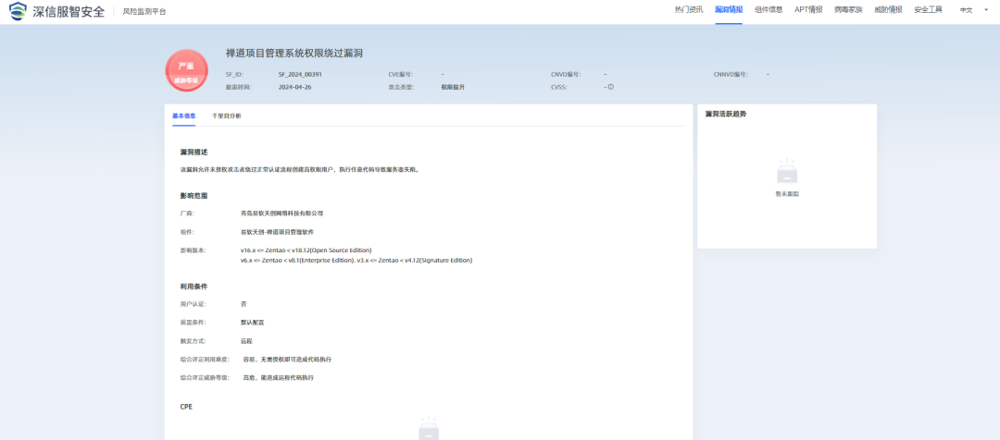

# 禅道ZenTao 2024 API权限绕过通告

## 条目说明

- 对象与具体问题：禅道ZenTao；2024 API权限绕过通告
- 版本、配置及部署条件：开源16.x–<18.12/企业6.x–<8.12/旗舰3.x–<4.12默认配置
- 认证与权限前提：匿名创建高权用户声称
- 核验边界：已完成原始 Markdown 的文本审阅；未执行 PoC、未访问目标、未视检截图。来源所述影响与复现结果不等于本库独立验证。

## 证据边界与更正

以下记录原始资料的证据边界。可以由原文确定的产品、编号及格式问题已在本条修订；没有原始证据的版本、响应和补丁信息仍待核实。

- 标题权限提升/认证绕过分类应统一并保留越权影响
- 高危与正文严重评级不一致，未给评分；无需授权即可代码执行省略另后台漏洞前提
- 无技术复现/编号/补丁直接链接，所有防护发布计划为2024历史时间，不当当前支持结论
- 可压缩大段产品矩阵营销，保留机构来源与观察时间

## 操作风险

命令/代码执行示例可能改变主机状态。保留原示例供静态分析；仅可在明确授权的隔离测试环境验证，事先准备备份与回滚。

## 技术资料与来源记录

深瞳漏洞实验室  深信服千里目安全技术中心   2024-04-26 16:22  
  
  
  
**漏洞名称：**  
  
禅道项目管理系统权限绕过漏洞  
  
**组件名称：**  
  
易软天创-禅道项目管理软件  
  
**影响范围：**  
  
v16.x ≤ 禅道 ＜ v18.12 （开源版）  
  
v6.x ≤ 禅道 ＜ v8.12 （企业版）  
  
v3.x ≤ 禅道 ＜ v4.12 （旗舰版）  
  
**漏洞类型：**  
  
权限提升  
  
**利用条件：**  
  
1、用户认证：否  
  
2、前置条件：默认配置  
  
3、触发方式：远程  
  
**综合评价：**  
  
<综合评定利用难度>：容易，无需授权即可造成代码执行。  
  
<综合评定威胁等级>：高危，能造成远程代码执行。  
  
**官方解决方案：**  
  
已发布  
  
  
  
  
  
**漏洞分析**  
  
  
  
**组件介绍**  
  
禅道是一款开源的全生命周期项目管理软件，基于敏捷和CMMI管理理念进行设计，集产品管理、项目管理、质量管理、文档管理、组织管理和事务管理于一体，完整地覆盖了项目管理的核心流程。  
  
  
  
**漏洞简介**  
  
2024年4月26日，深瞳漏洞实验室监测到一则易软天创-禅道项目管理软件组件存在权限提升漏洞的信息，漏洞威胁等级：严重。**该漏洞允许未授权攻击者绕过正常认证流程创建高权限用户，执行任意代码导致服务器失陷。**  
  
  
**影响范围**  
  
目前受影响的易软天创-禅道项目管理软件版本：  
  
v16.x ≤ 禅道 ＜ v18.12 （开源版）  
  
v6.x ≤ 禅道 ＜ v8.12 （企业版）  
  
v3.x ≤ 禅道 ＜ v4.12 （旗舰版）  
  
  
**解决方案**  
  
  
  
**官方修复建议**  
  
  
官方已发布新版本修复漏洞，建议尽快访问官网或联系官方售后支持获取新版本安装包，升级至不受影响的安全版本。  
  
链接如下：https://www.zentao.net/  
  
  
  
**深信服解决方案**  
  
  
**1.风险资产发现**  
  
支持对易软天创-禅道项目管理软件的主动检测，可**批量检出**业务场景中该事件的**受影响资产**情况，相关产品如下：  
  
**【深信服主机安全检测响应平台CWPP】**已发布资产检测方案。  
  
**【深信服云镜YJ】**已发布资产检测方案。  
  
  
**2.漏洞主动检测**  
  
支持对禅道项目管理系统权限绕过漏洞的主动检测，可**批量快速**检出业务场景中是否存在**漏洞风险**，相关产品如下：  
  
**【深信服云镜YJ】**预计2024年4月28日发布检测方案。  
  
**【深信服漏洞评估工具TSS】**预2024年5月9日发布检测方案。  
  
**【深信服安全托管服务MSS】**预计2024年5月9日发布检测方案（需要具备**TSS或CWPP**组件能力）。  
  
**【深信服安全检测与响应平台XDR】**预计2024年4月28日发布检测方案（需要具备**云镜或CWPP**组件能力）。  
  
  
**3.漏洞安全监测**  
  
支持对禅道项目管理系统权限绕过漏洞的监测，可依据流量收集**实时监控**业务场景中的**受影响资产情况，快速检查受影响范围**，相关产品及服务如下：  
  
**【深信服安全感知管理平台SIP】**预计2024年05月07日发布检测方案。  
  
**【深信服安全托管服务MSS】**预计2024年05月07日发布检测方案（需要具备SIP组件能力）。  
  
**【深信服安全检测与响应平台XDR】**预计2024年05月07日发布检测方案。  
  
  
**4.漏洞安全防护**  
  
支持对禅道项目管理系统权限绕过漏洞的防御，**可阻断攻击者针对该事件的入侵行为**，相关产品及服务如下：  
  
**【深信服下一代防火墙AF】**预计2024年05月07日发布检测方案。  
  
**【深信服终端安全管理系统aES】**预计2024年05月07日发布检测方案。  
  
**【深信服Web应用防火墙WAF】**预计2024年05月07日发布检测方案。  
  
**【深信服安全托管服务MSS】**预计2024年05月07日发布检测方案（需要具备AF组件能力）。  
  
**【深信服安全检测与响应平台XDR】**预计2024年05月07日发布检测方案（需要具备AF组件能力）。  
  
  
  
**参考链接**  
  
  
https://github.com/easysoft/zentaopms  
  
  
**时间轴**  
  
  
  
**2024/4/26**  
  
深瞳漏洞实验室监测到禅道项目管理系统权限绕过漏洞信息。  
  
  
**2024/4/26**  
  
深瞳漏洞实验室发布漏洞通告。  
  
  
点击**阅读原文**，及时关注并登录深信服**智安全平台**，可轻松查询漏洞相关解决方案。  
  
  
  
  
  
  
  

---

> 来源：gelusus/wxvl（微信公众号漏洞文章自动归档，原文见文首链接）
