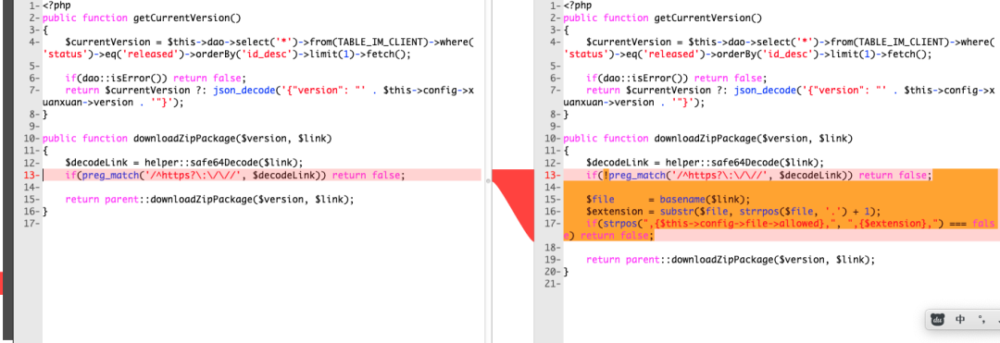
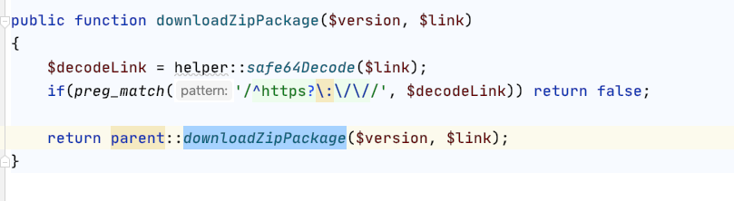
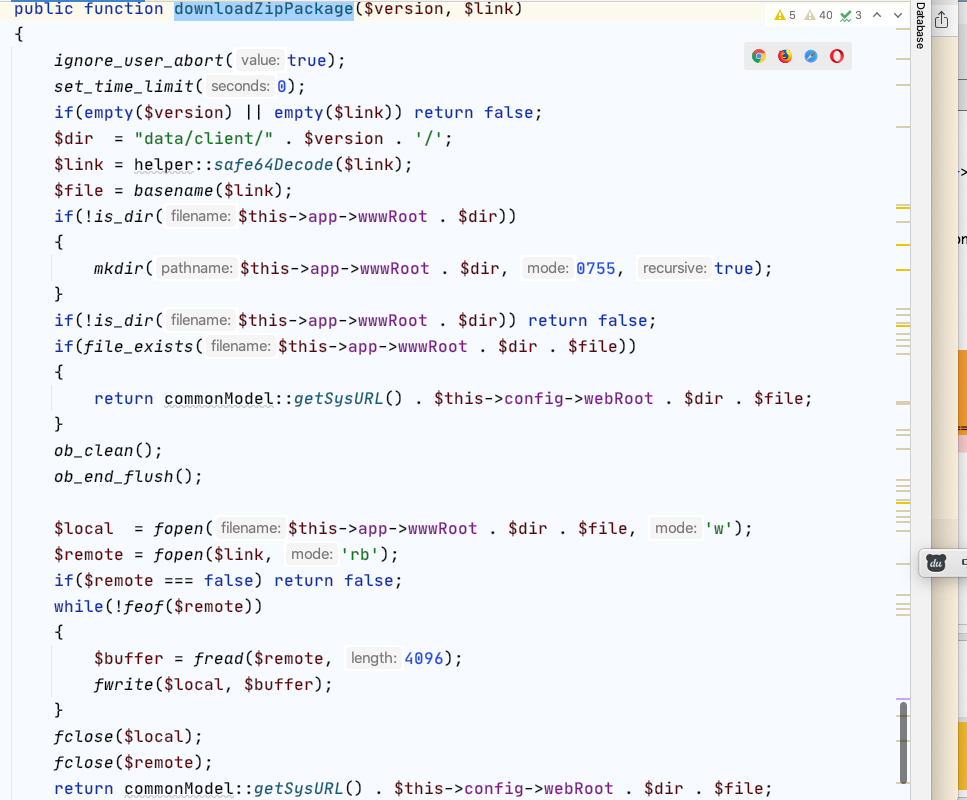
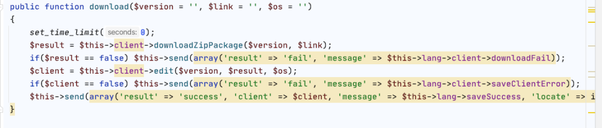
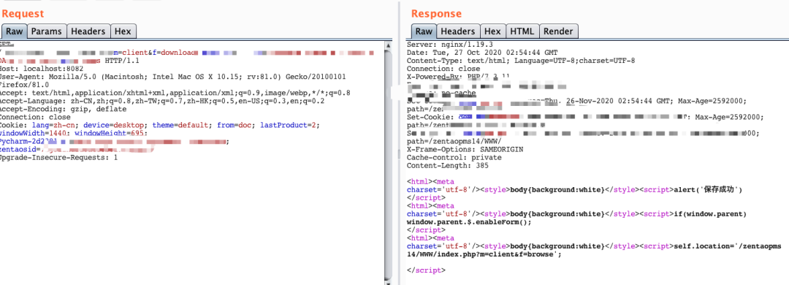
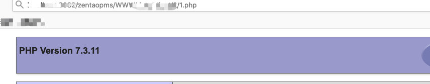

# 禅道ZenTao client downloadZipPackage认证后任意读取/写入

## 条目说明

- 对象与具体问题：禅道ZenTao；client downloadZipPackage认证后任意读取/写入
- 版本、配置及部署条件：≤12.4.2，修复12.4.3声称
- 认证与权限前提：后台权限
- 核验边界：已完成原始 Markdown 的文本审阅；未执行 PoC、未访问目标、未视检截图。来源所述影响与复现结果不等于本库独立验证。

## 证据边界与更正

以下记录原始资料的证据边界。可以由原文确定的产品、编号及格式问题已在本条修订；没有原始证据的版本、响应和补丁信息仍待核实。

- 正文主编号CNVD-C-2020-121325
- 判断http/https则不通过与下载业务可能反转/补丁前后混淆，源码只有图片需核准确条件
- base64是编码，大写协议绕过是否PHP流支持依环境；版本/路径、后台角色需明确
- 有官方12.4.3下载链接可溯源；后台也可高影响，不应仅登录前提就泛评风险较低
- 删推广/推荐，补完整请求/响应/写文件副作用

## 操作风险

现有材料未完整列明副作用；示例不保证只读或无状态变化。保留原示例供静态分析；仅可在明确授权的隔离测试环境验证，事先准备备份与回滚。

## 技术资料与来源记录

\> 本文由 \[简悦 SimpRead\](http://ksria.com/simpread/) 转码， 原文地址 \[mp.weixin.qq.com\](https://mp.weixin.qq.com/s/iSX7JFbuE5bJIxkRfZE69Q)

****
------------------------------------------------------------------------------------------------------------------------------------------------

**1、前言**

**百度云安全团队监测到禅道官方发布了文件上传漏洞的风险通告，该漏洞编号为 CNVD-C-2020-121325，漏洞影响禅道 <=12.4.2 版本。**登陆管理后台的恶意攻击者可以通过 fopen/fread/fwrite 方法读取或上传任意文件，成功利用此漏洞可以读取目标系统敏感文件或获得系统管理权限。我们对漏洞进行了复现和分析，由于需要登录后台才可以利用，实际风险相对较低，建议受影响的禅道用户尽快升级到最新版。

**2、漏洞分析**

下载 12.4.3 版本和 12.4.2 版本源代码进行对比，发现 module/client/ext/model/xuanxuan.php 新增了如下代码：

分析 downloadZipPackage 方法, 该方法传入版本参数和 link 地址，将 link 地址 base64 解码，判断是否为 http 或者 https 协议，如果是则不通过，这里可以将 link 大写并进行 base64 编码来绕过，代码片段如图：

跟进 parent::downloadZipPackage 方法，文件 module/client/model.php 中，获取 link 传入的文件名，通过 fopen 打开该文件，写入禅道目录 www/data/client/version 参数 /，如图：

  

后续找到 / module/client/control.php 文件中的 download 调用了漏洞方法，如图：

综合以上分析，可以构造利用请求获取 webshell，如图所示：

访问上传文件的地址，如图：

**3、修复建议**

升级到 12.4.3 版本，安全版本下载地址：

https://www.zentao.net/download/zentaopms12.4.3-80272.html

百度高级威胁感知系统，以及智能安全防护溯源产品已支持对该漏洞的检测和防御，有需要的用户可以访问 anquan.baidu.com 联系我们。

**推荐阅读**

**[通达 OA 11.5 版本某处 SQL 注入漏洞复现分析](http://mp.weixin.qq.com/s?__biz=MjM5MTAwNzUzNQ==&mid=2650494316&idx=1&sn=bdbf4281f9d0b9cedd8659c93a1dd86e&chksm=beb3e32c89c46a3a5691ce5cbb13b4f6b94ed2c3b5e7fbd6e44b2dd633042dfbbabf4b8d08f8&scene=21#wechat_redirect)  
**

**[从 CVE-2020-8816 聊聊 shell 参数扩展](http://mp.weixin.qq.com/s?__biz=MjM5MTAwNzUzNQ==&mid=2650493205&idx=1&sn=1e3d4ccba11cc2b708f0fdec82d72587&chksm=beb3e75589c46e43271ec0c997d53ffabcdc8596476718d2aff510fc55b6c01040b5c481fe8b&scene=21#wechat_redirect)  
**

**[Shiro rememberMe 反序列化攻击检测思路](http://mp.weixin.qq.com/s?__biz=MjM5MTAwNzUzNQ==&mid=2650493186&idx=1&sn=39b99df8a3d82534cb9fd255f9e0059d&chksm=beb3e74289c46e5455698fd3c1758b865dbd10fd7b513b3e9f19cce4c5b62d5b0887fcd028b0&scene=21#wechat_redirect)  
**

**[Spring Boot + H2 JNDI 注入漏洞复现分析](http://mp.weixin.qq.com/s?__biz=MjM5MTAwNzUzNQ==&mid=2650492993&idx=2&sn=0b27352db1d34ba1b077ae397d1f08a5&chksm=beb3e60189c46f17b60ee16fd1460679986064211caaeace1e0f6fbfde2a629b17aa43434fe6&scene=21#wechat_redirect)  
**

  

---

> 来源：MrWQ/vulnerability-paper（https://github.com/MrWQ/vulnerability-paper）
